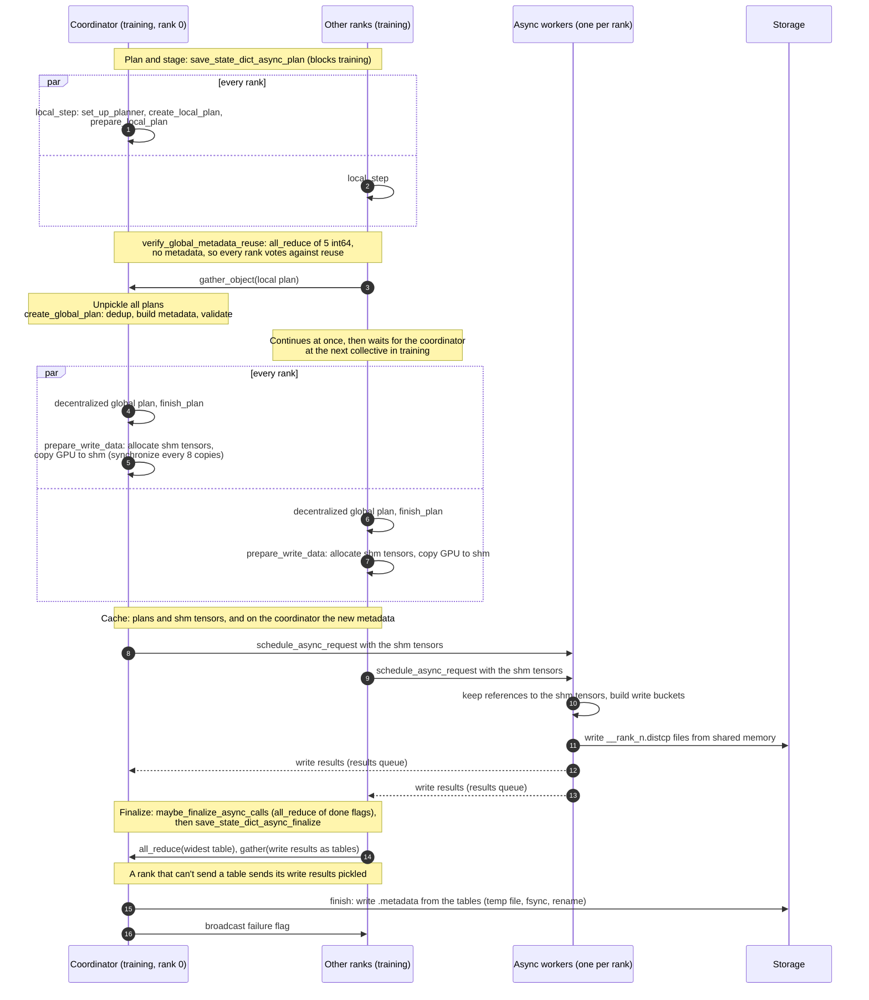
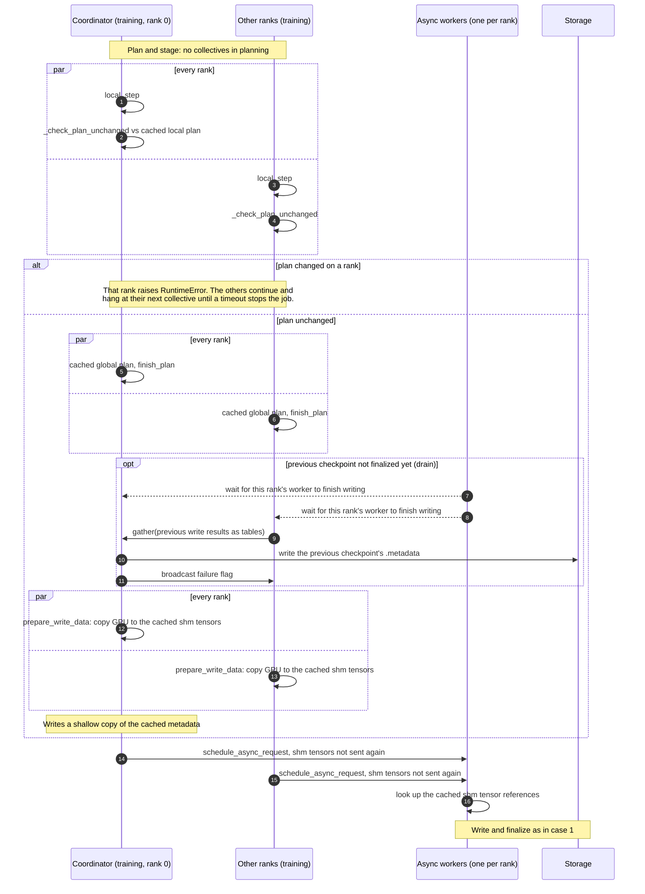
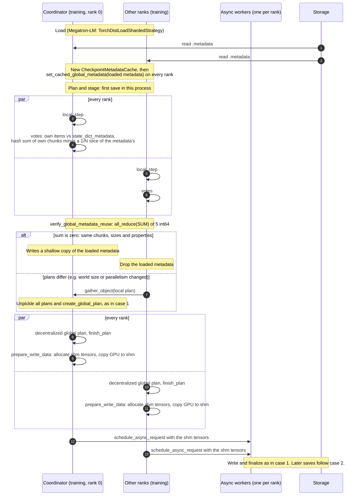

# Async Checkpoint Save: Planning, Staging and Global Metadata Reuse

How a torch DCP checkpoint is saved through NVRx on the decentralized planning path with CPU shared-memory staging, and how the global metadata and staging buffers are reused between saves.

Scope:

- The planner and the storage writer both set `can_run_decentralized_global_plan` (Megatron-LM's `MCoreSavePlanner` with `FileSystemWriterAsync`).
- `enable_cache=True` and `use_cached_data_structure=True` (Megatron-LM: `--ckpt-assume-constant-structure`).
- CPU shared-memory staging: `FileSystemWriterAsync(use_cpu_shm_for_gpu_tensors=True)` and a persistent `AsyncCallsQueue(cpu_shm_mode=True)` (Megatron-LM: `--async-ckpt-use-cpu-shm`).

## Terms

| Term            | Meaning                                                                                                                                                                                                                    |
| --------------- | -------------------------------------------------------------------------------------------------------------------------------------------------------------------------------------------------------------------------- |
| Local plan      | A rank's `SavePlan` from `planner.create_local_plan()`: one `WriteItem` per tensor chunk or bytes entry the rank writes.                                                                                                   |
| Global plan     | A rank's local plan after `create_decentralized_global_plan` and `prepare_decentralized_global_plan`; the writer adds the file prefix `__<rank>_`. Each rank makes its own; on this path the coordinator does not.         |
| Global metadata | The `Metadata` written to `.metadata`. `state_dict_metadata` is built from the write items of all ranks' local plans; `storage_data` (file, offset, length of each chunk) is built from the write results at finalization. |
| Coordinator     | The planning rank that builds the global metadata and writes `.metadata` (rank 0 in Megatron-LM).                                                                                                                          |
| Shm tensor      | A CPU tensor in shared memory (`share_memory_()`), one per tensor the rank saves, holding the values being written.                                                                                                        |
| Async worker    | The persistent process per rank that writes the files. In CPU shared-memory mode it never initializes CUDA.                                                                                                                |

## Phases of a save

1. **Plan and stage**, in the training process, blocking training: `save_state_dict_async_plan` in `state_dict_saver.py` plans the save, then `FileSystemWriterAsync.prepare_write_data` copies every tensor into its shm tensor.
2. **Write**, in the async worker: the shm tensors are written to `__<rank>_<n>.distcp` files; no device-to-host copy is left to do.
3. **Finalize**, in the training process: `save_state_dict_async_finalize` gathers the write results on the coordinator, which writes `.metadata`. It runs from `AsyncCallsQueue.maybe_finalize_async_calls` once all ranks' workers are done, or at the latest at the next save, before its staging overwrites the shm tensors.

## State kept between saves

`CheckpointMetadataCache`, one per training process, kept by the caller across saves (Megatron-LM: in the save strategy):

| Field             | Rank        | Content                                                                                                                 |
| ----------------- | ----------- | ----------------------------------------------------------------------------------------------------------------------- |
| `global_metadata` | all ranks   | Loaded checkpoint's global metadata without its `storage_data`, from `set_cached_global_metadata` until the first save. |
|                   | coordinator | Global metadata of the previous save, built or reused.                                                                  |
| `local_plan`      | all ranks   | This rank's local plan of the previous save; `None` before the first save in the process.                               |
| `central_plan`    | all ranks   | This rank's global plan of the previous save.                                                                           |

On every save the coordinator hands `finish` a shallow copy of the cached metadata, so the save's `storage_data` is dropped once written. Kept in the cache, it would stay alive on the coordinator and slow down every full garbage collection there, which its data-parallel peers wait for at the next save.

Staging buffers, keyed by a hash of the rank's tensor write items:

| Cache                                       | Process  | Content                                                                       |
| ------------------------------------------- | -------- | ----------------------------------------------------------------------------- |
| `FileSystemWriterAsync._shm_tensor_cache`   | training | The shm tensors, reused by later saves with the same items.                   |
| `FileSystemWriterAsync._cached_identifiers` | training | Keys whose shm tensors the worker already holds.                              |
| `PersistentAsyncCaller._worker_data_cache`  | worker   | References to the same shm tensors, so they are sent to the worker only once. |

Both are empty in a new process. `FileSystemWriterAsync.cleanup_tensor_caches` clears the training-side caches when the worker restarts.

## 1. First checkpoint of a job

No checkpoint was loaded, so there is no metadata to reuse. Every rank still takes part in the reuse vote, which keeps the collectives the same on all ranks. The shm tensors are allocated and sent to the worker.

## 2. Later checkpoints in the same job

`enable_cache` promises that the checkpoint structure doesn't change between saves, so the previous save's plans and metadata are reused without any communication during planning. Each rank still creates its local plan and compares it with the previous one, so a broken promise raises an error instead of writing a checkpoint whose `.metadata` doesn't match its data.

Staging copies the new values into the same shm tensors. If the previous checkpoint hasn't been finalized yet, its worker may still be reading them, so it is finalized first (`maybe_finalize_async_calls(blocking=True, no_dist=True)`, registered by `AsyncCallsQueue`). All ranks reach this point in the same save, so the finalization's collectives match.

## 3. First checkpoint after a restart

Every rank reads `.metadata` when loading the checkpoint, and the caller passes it to `set_cached_global_metadata` on every rank. The first save checks whether the new local plans write exactly the chunks this metadata lists. That decides with one `all_reduce` whether the gather and `create_global_plan` can be skipped; nothing beyond the ordinary `.metadata` is stored for it. The staging caches are empty in the new processes, so the shm tensors are allocated and sent as in case 1.

### Why the check is sufficient

- On this path the global metadata's `state_dict_metadata` is a function of the write items alone (`create_default_global_save_plan` concatenates them). Each item maps to a metadata entry with its fqn, type, global size, properties and chunk (offsets, sizes).
- Each rank checks that its tensor items' entries have the same global size and properties, compared with `==`.
- A 128-bit hash of each chunk covers its fqn, bytes or tensor, offsets and sizes. Each rank adds up the hashes of its own items and subtracts those of its 1/N slice of the metadata's chunks. The sum over all ranks is zero if, and (up to 2^-127) only if, the chunks written now are those the metadata lists, each exactly once. Missing, extra and duplicated chunks all leave a non-zero sum.
- Which rank writes a chunk doesn't matter: the metadata doesn't record it, and `storage_data` is rebuilt from this save's write results. Chunks may move between ranks.
- Plan validation (torch's `_validate_global_plan`, Megatron-LM's `validate_global_plan`) depends only on `state_dict_metadata`, which equals that of a checkpoint that passed validation when it was written.
- Reuse is refused if the plans or the metadata carry planner data, which isn't checked, or if torch's `ChunkStorageMetadata` has fields other than `offsets` and `sizes`.

## Other transfer path

Without CPU shared memory (`use_cpu_shm_for_gpu_tensors=False`, the `FileSystemWriterAsync` default), `prepare_write_data` hands the GPU tensors to the worker through CUDA IPC, and the worker copies them to host memory in `preload_tensors`. Planning and metadata reuse are the same.

## Code map

| What                                          | Where (`src/nvidia_resiliency_ext/checkpointing/async_ckpt/`)                                                                           |
| --------------------------------------------- | --------------------------------------------------------------------------------------------------------------------------------------- |
| Planning, cache, reuse decision               | `state_dict_saver.py`: `save_state_dict_async_plan`, `CheckpointMetadataCache`, `verify_global_metadata_reuse`, `_check_plan_unchanged` |
| Reuse check against loaded metadata           | `_metadata_reuse.py`                                                                                                                    |
| Finalization                                  | `state_dict_saver.py`: `save_state_dict_async_finalize`                                                                                 |
| Staging into shared memory, `.metadata`       | `filesystem_async.py`: `FileSystemWriterAsync` (`prepare_write_data`, `finish`)                                                         |
| Writing in the worker                         | `filesystem_async.py`: `preload_tensors`, `write_preloaded_data_*`                                                                      |
| `.metadata` pickler                           | `_metadata_pickler/`                                                                                                                    |
| Async workers, finalize scheduling, shm drain | `core.py`: `AsyncCallsQueue`, `PersistentAsyncCaller`                                                                                   |
