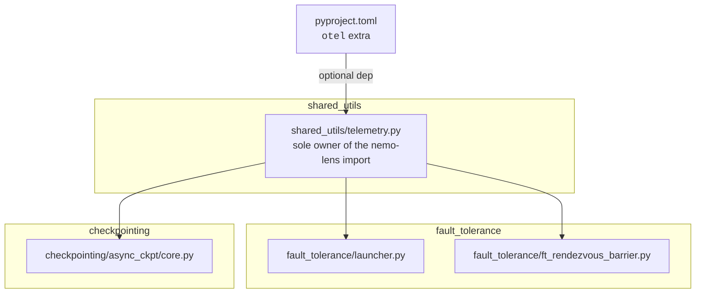
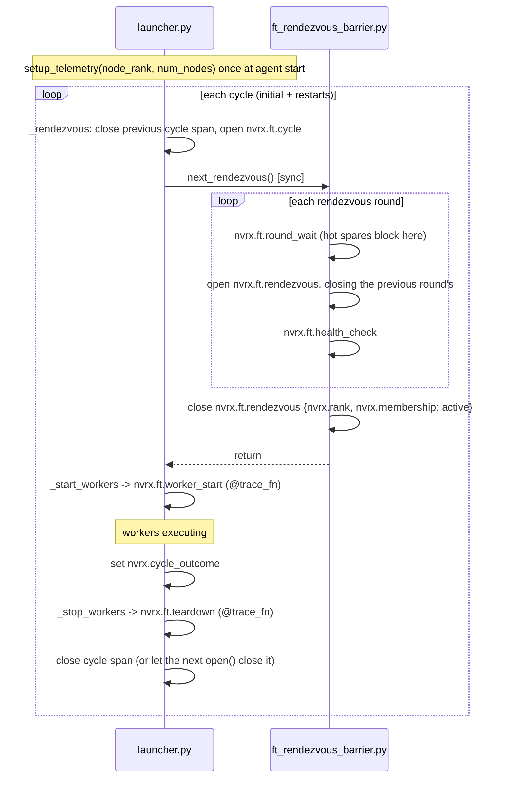
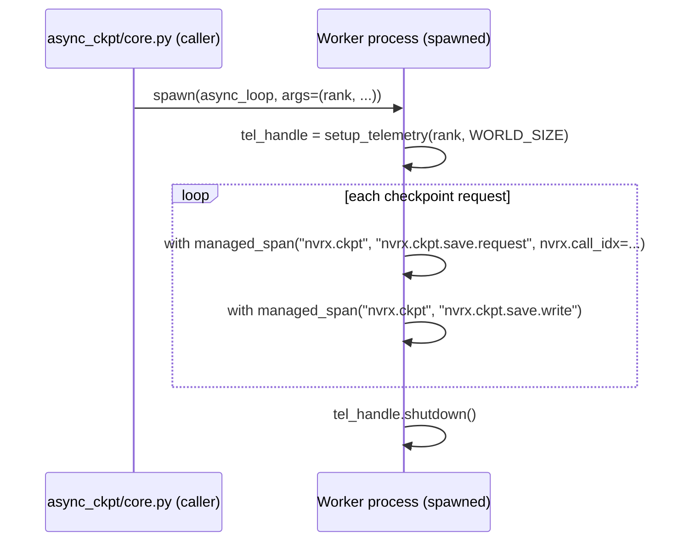

# nemo-lens Telemetry Integration

Optional [nemo-lens](https://github.com/nvidia-nemo/lens) OTel instrumentation for NVRx fault tolerance and async checkpointing. Telemetry is enabled and configured entirely through nemo-lens env vars (`NEMO_LENS_ENABLED`, `NEMO_LENS_SPAN_GROUPS`, etc.); NVRx adds no additional gates.

## Scope

1. **Fault tolerance restart cycle** — `fault_tolerance/launcher.py` and `fault_tolerance/ft_rendezvous_barrier.py`
2. **Async checkpoint worker** — `checkpointing/async_ckpt/core.py`

When nemo-lens is absent or disabled, all instrumentation is a silent no-op with no behavioral change.

## Module Structure

`fault_tolerance` and `checkpointing` have no knowledge of nemo-lens. The shim is the only file with a nemo-lens import.

## `shared_utils/telemetry.py`

Exports `managed_span`, `trace_fn`, `ManualSpan`, `mark`, `setup_telemetry`, `shutdown`, `flush`, and `set_span_attributes`.

### Exports

`managed_span` and `trace_fn` are re-exports of the nemo-lens functions of the same name, deliberately not renamed so that a search for either finds every use across nemo-lens and its consumers. Both are gated on their span group and no-op when it is off — which includes before `setup_telemetry` runs, since span groups default to empty. The shim defines fallbacks for them only for the case where nemo-lens is not installed.

`set_span_attributes` writes to the current span, for use inside a `@trace_fn` function, which owns its span but does not hand it to the caller.

`ManualSpan` covers the case where a span's open and close cross code block boundaries. It owns the `ExitStack` bookkeeping and no-ops while nothing is open, so callers need no guards; `open()` closes whatever the handle already had open. It knows nothing about fault tolerance — the caller supplies the group, name, and every attribute key.

### NVRxSpanGroup

nemo-lens's base `SpanGroup.resolve()` only recognises its built-in groups. Without a subclass, `"nvrx.ft"` or `"nvrx.ckpt"` in `NEMO_LENS_SPAN_GROUPS` raises `ValueError`, and the stock presets emit no NVRx spans even with `NEMO_LENS_ENABLED=1`. `_NVRxSpanGroup` adds the NVRx groups to **every** preset, so `NEMO_LENS_ENABLED=1` alone is sufficient; the extra `nvrx` preset selects them alone.

### Export identity

`setup_telemetry(rank, world_size)` sets `dl.rank`, `dl.world_size`, and `service.instance.id` on the OTel resource, so these must differ per emitter or a backend cannot tell the processes apart.

Every launcher agent exports. Each node runs its own collector and we want per-node visibility, so the shim defaults `export_strategy` to `all_ranks` rather than relying on nemo-lens's `single_rank` default. An explicit `NEMO_LENS_EXPORT_STRATEGY` still wins, so volume stays tunable.

The launcher's identity is resolved before rendezvous, where no elastic rank exists yet: `get_infrastructure_rank()` (NVRx's stable node identity) and `SLURM_NNODES`, each falling back to `0` / `1`. The elastic `group_rank` is set on the cycle span once rendezvous assigns it.

## Fault Tolerance Span Lifecycle

### Span mechanisms

OTel propagates the active span implicitly via `contextvars`. Because `next_rendezvous()` is called synchronously from the launcher's main thread, spans opened inside `ft_rendezvous_barrier.py` nest under the launcher's open `cycle` span with no reference passing.

Each span uses the cheapest mechanism that fits its shape:

| Shape                                 | Mechanism                | Spans                                           |
| ------------------------------------- | ------------------------ | ----------------------------------------------- |
| The span _is_ a method                | `@trace_fn` decorator    | `worker_start`, `teardown`                      |
| The span is a block                   | `with managed_span(...)` | `round_wait`, `health_check`, both `ckpt` spans |
| Open and close cross block boundaries | `ManualSpan`             | `cycle`, `rendezvous`, `run`, `attribution`     |
| An instant, with no duration          | `mark(...)`              | `fault`                                         |

Using `@trace_fn` for the first group leaves the instrumented method bodies untouched.

A `cycle` opens at rendezvous and closes after teardown. A `rendezvous` round opens once the round is open — excluding the hot-spare wait, which would otherwise dominate the measurement — and closes when the node is assigned an active rank, or when the next round begins. `run` opens in the `_initialize_workers` override, which every cycle passes through, and closes on whichever path ends the run.

`fault` is an instant rather than a duration. `teardown` only starts once the restart decision has been made, so without it the interval between detecting a failure and deciding what to do about it is unmeasured.

`attribution` is the exception to the nesting rule. It is driven from the attribution poller's own thread, and OTel context is per-thread, so it cannot be a child of the cycle span; it is emitted as a root span correlated by `nvrx.node`.

An exclusion needs no separate signal: the `UnhealthyNodeException` propagating out of the `health_check` span is recorded by nemo-lens as `StatusCode.ERROR` with the reason as the description, plus an `exception` event carrying the type and message.

### Initialization

Both emitting processes call `setup_telemetry` once at startup and `shutdown()` from the `finally` that already owns their teardown:

| Process           | Setup                                                         | Shutdown                |
| ----------------- | ------------------------------------------------------------- | ----------------------- |
| Launcher agent    | top of `LocalElasticAgent.run()`, before the first rendezvous | that method's `finally` |
| Checkpoint worker | top of `async_process_target`, after the spawn                | that method's `finally` |

Neither uses `atexit`, which runs at interpreter finalization after `sys.exit` has unwound, where a flush to an unreachable collector could stall exit. `shutdown()` is itself bounded: it flushes synchronously and can otherwise block for the exporter's entire retry budget against a collector that is gone, longer than the SIGTERM-to-SIGKILL grace a launcher gets.

Two points flush explicitly, because the process may be killed moments later and those spans would die in the batch processor's queue: a detected fault, and a health-check exclusion. Everywhere else the batch processor's own schedule is enough.

nemo-lens's `_OpenSpanCloser` ends any span still open at shutdown and marks it `nemo.span.truncated`, which is how a cycle interrupted by a signal reaches the collector — without an `nvrx.cycle_outcome`.

### Lifecycle per cycle

The `cycle` span opens in the `_rendezvous` override and covers both the initial launch and every restart cycle. The rendezvous spans nest inside it.

### Goodput

`is_goodput_span` marks a span as resiliency overhead rather than training. Only spans that **partition** the cycle carry it, since a consumer summing marked durations would otherwise double-count:

| Span                                                   | `is_goodput_span`                                            |
| ------------------------------------------------------ | ------------------------------------------------------------ |
| `round_wait`, `rendezvous`, `worker_start`, `teardown` | `True`                                                       |
| `run`                                                  | `False` — the productive window                              |
| `cycle`                                                | _unset_ — the container; its children carry the partition    |
| `health_check`                                         | _unset_ — nested inside `rendezvous`                         |
| `fault`                                                | _unset_ — an instant                                         |
| `ckpt.save.request`                                    | `True`                                                       |
| `ckpt.save.write`                                      | `False` — overlaps training, would double-count against save |

### Cycle close paths

The outcome is always recorded before the span closes. Terminal paths call `close({CYCLE_OUTCOME: ...})` after teardown. On the restart path the outcome is set first and the span is left open, so that `_stop_workers` records its teardown _inside_ the cycle it belongs to; the next `open()` in `_rendezvous` closes it.

| Condition                                         | `cycle_outcome` | Closed by                                |
| ------------------------------------------------- | --------------- | ---------------------------------------- |
| `WorkerState.SUCCEEDED`                           | `succeeded`     | monitor loop                             |
| Local failure, restart granted                    | `failed`        | `_rendezvous`, when the next cycle opens |
| Local failure, restart budget exhausted           | `failed`        | monitor loop, after teardown             |
| Healthy node joins peer restart                   | `peer_restart`  | `_rendezvous`, when the next cycle opens |
| Health check exclusion (`UnhealthyNodeException`) | `excluded`      | `_rendezvous` exception handler          |
| Standby node: job ends                            | `standby`       | `_rendezvous` exception handler          |
| Attribution stop / peer no-restart                | `terminated`    | monitor loop, after teardown             |
| Signal                                            | _(none)_        | `_OpenSpanCloser` at shutdown            |

The exclusion and standby handlers live in `_rendezvous` itself, so they cover the first rendezvous as well as every restart.

## Span Attributes

| Attribute               | Type | Spans                    | Notes                                              |
| ----------------------- | ---- | ------------------------ | -------------------------------------------------- |
| `nvrx.cycle`            | int  | `cycle`, `worker_start`  | restart cycle counter                              |
| `nvrx.node`             | str  | `cycle`, `worker_start`  | node hostname                                      |
| `nvrx.rank`             | int  | `cycle`, `rendezvous`    | elastic group rank; set once rendezvous assigns it |
| `nvrx.group_world_size` | int  | `cycle`                  | number of active nodes; set after rendezvous       |
| `nvrx.failures`         | int  | `cycle`                  | set on the `failed` outcome                        |
| `nvrx.cycle_outcome`    | str  | `cycle`                  | see the close-path table above                     |
| `nvrx.round`            | int  | `rendezvous`             | rendezvous round number                            |
| `nvrx.membership`       | str  | `cycle`, `rendezvous`    | `active`, `standby`, or `late_joiner`              |
| `nvrx.max_restarts`     | int  | `cycle`                  | configured restart budget                          |
| `nvrx.remaining_restarts` | int | `cycle`                 | budget left when the round was joined              |
| `nvrx.rdzv_run_id`      | str  | `cycle`                  | rendezvous run id                                  |
| `nvrx.active_nodes`     | str  | `cycle`                  | roster: comma-separated active node addresses      |
| `nvrx.standby_nodes`    | str  | `cycle`                  | roster: comma-separated standby node addresses     |
| `nvrx.active_ranks`     | str  | `cycle`                  | roster: comma-separated active group ranks         |
| `is_goodput_span`       | bool | see the goodput table    | resiliency overhead rather than training           |
| `nvrx.call_idx`         | int  | `nvrx.ckpt.save.request` | checkpoint call index for cross-rank join          |

## Async Checkpoint Worker: Spawn Boundary

The persistent checkpoint worker is launched with `start_method="spawn"`. It inherits environment variables but no in-memory state, so it re-initializes telemetry at the top of `async_process_target` and calls `handle.shutdown()` in the `finally` block.

The worker's `rank` is already a parameter; `world_size` is read from the inherited `WORLD_SIZE` environment variable rather than threaded through the call chain. Environment inheritance is also what carries the nemo-lens configuration across the spawn, so `NemoLensConfig.from_env()` reads the same values in the worker as in the trainer.

The worker does not correlate with the launcher's OTel trace — it emits independent `nvrx.ckpt.*` spans identified by `nvrx.call_idx`.

## Spans

| Span                     | Group       | Source                        | Covers                                |
| ------------------------ | ----------- | ----------------------------- | ------------------------------------- |
| `nvrx.ft.cycle`          | `nvrx.ft`   | `launcher.py`                 | one full restart cycle                |
| `nvrx.ft.round_wait`     | `nvrx.ft`   | `ft_rendezvous_barrier.py`    | waiting for a round to open           |
| `nvrx.ft.rendezvous`     | `nvrx.ft`   | `ft_rendezvous_barrier.py`    | one rendezvous round, after it opened |
| `nvrx.ft.health_check`   | `nvrx.ft`   | `ft_rendezvous_barrier.py`    | `ensure_node_is_healthy`              |
| `nvrx.ft.worker_start`   | `nvrx.ft`   | `launcher.py`                 | `_start_workers`                      |
| `nvrx.ft.run`            | `nvrx.ft`   | `launcher.py`                 | workers up until the run ends           |
| `nvrx.ft.fault`          | `nvrx.ft`   | `launcher.py`                 | instant: a failure was detected         |
| `nvrx.ft.teardown`       | `nvrx.ft`   | `launcher.py`                 | `_stop_workers`                       |
| `nvrx.ft.attribution`    | `nvrx.ft`   | `health_check.py`             | an attribution lookup (root span)       |
| `nvrx.ckpt.save.request` | `nvrx.ckpt` | `async_ckpt/core.py` (worker) | preload + write for one request       |
| `nvrx.ckpt.save.write`   | `nvrx.ckpt` | `async_ckpt/core.py` (worker) | the write itself                      |

A hot spare produces one `round_wait` / `rendezvous` pair per round, so span volume tracks restart rounds rather than poll frequency. The `rendezvous` span for the round a node sits out is closed by the next round's, and `_perform_rendezvous` closes the last one in a `finally` so it can never outlive the enclosing `cycle` span.

## Worker Environment Handoff

`_start_workers` stamps each worker cohort's environment so a lens-instrumented trainer can place its own spans in the right restart cycle. The batch script's launch stamp is set once outside the `srun` and is stale for every restart, so a restarted trainer needs this cohort's own anchors.

| Variable                | Value                                             |
| ----------------------- | ------------------------------------------------- |
| `NVRX_CYCLE`            | restart cycle number                              |
| `NVRX_MEMBERSHIP`       | `active` — a launched worker is active this cycle |
| `NVRX_INFRA_RANK`       | this node's infrastructure rank                   |
| `NVRX_CYCLE_START_TIME` | when this cycle's rendezvous began                |
| `NVRX_LAUNCH_TIME`      | when this cohort was launched                     |

Nothing in NVRx reads these; they are a contract with the trainer.

## Out of Scope

- **`pre_startup` / `nvrx.cold_start`** — SLURM queue and prolog timing. NVRx does not own this; the batch script or a separate launcher wrapper should emit these spans.
- **Attribution result correlation** — the attribution client runs on a long-lived daemon thread and results can arrive cycles after the failure they describe, so correlating them needs a span reference captured at submission time. Not implemented.
