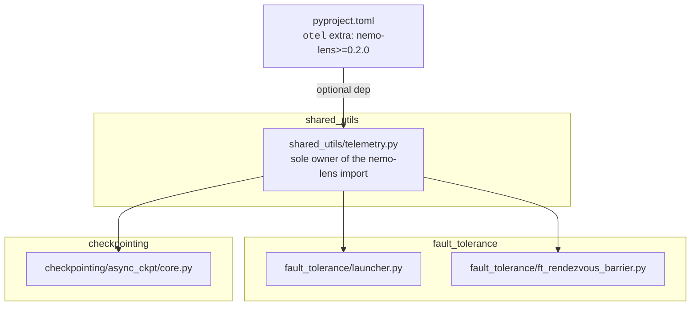
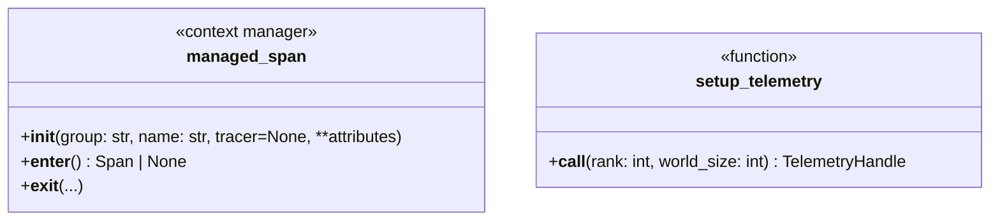
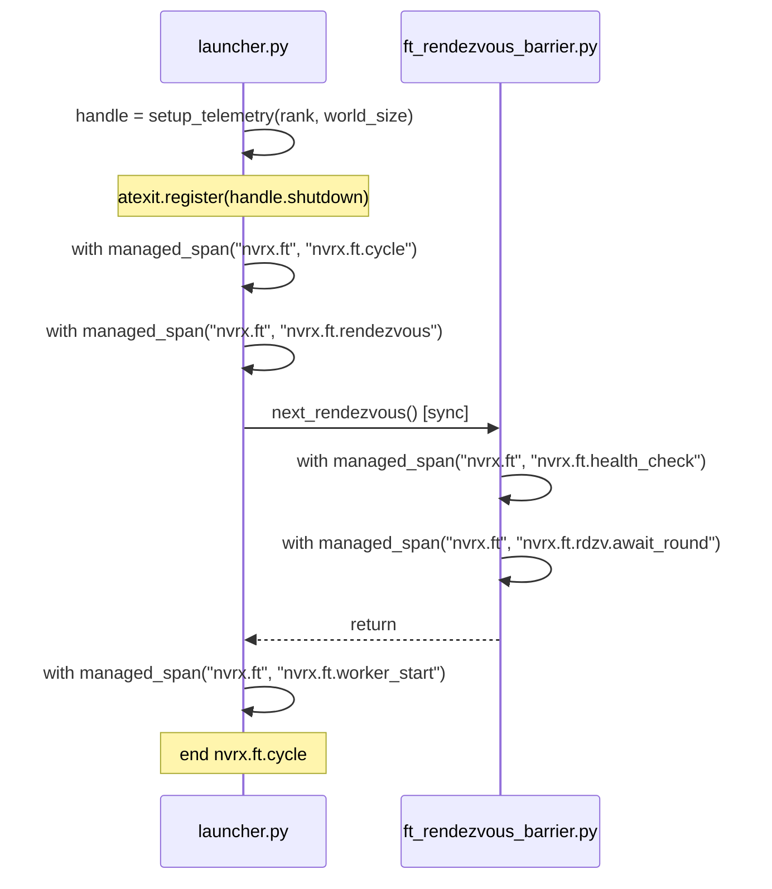
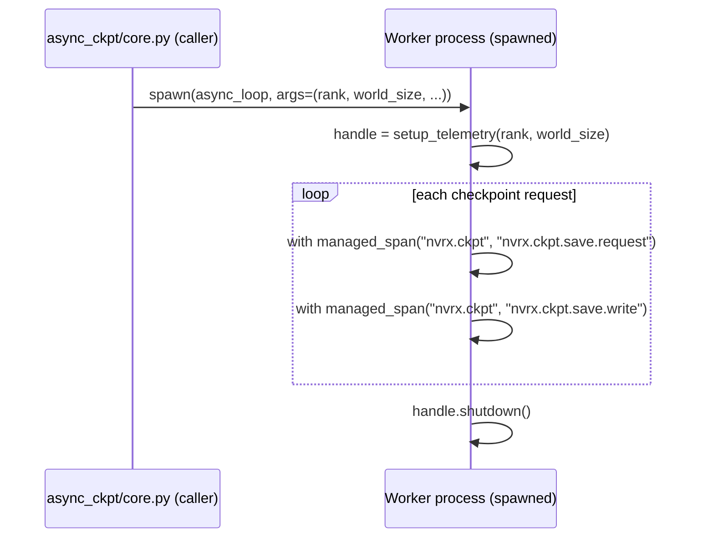

# nemo-lens Telemetry Integration

Optional [nemo-lens](https://pypi.org/project/nemo-lens/) OTel instrumentation for NVRx fault tolerance and async checkpointing.

## Scope

Two subsystems emit spans when `nemo-lens` is installed:

1. **Fault tolerance restart cycle** — `fault_tolerance/launcher.py` and `fault_tolerance/ft_rendezvous_barrier.py`
2. **Async checkpoint worker** — `checkpointing/async_ckpt/core.py`

`nemo-lens` is optional. When not installed, all instrumentation is a no-op with no behavioral change.

## Module Structure



`fault_tolerance` and `checkpointing` have no knowledge of nemo-lens. The shim is the only file with a nemo-lens import.

## `shared_utils/telemetry.py`

```python
try:
    from nemo.lens import NemoLensConfig as _NemoLensConfig
    from nemo.lens import managed_span
    from nemo.lens import setup_telemetry as _setup_telemetry

    def setup_telemetry(rank, world_size):
        return _setup_telemetry(_NemoLensConfig.from_env(), rank, world_size)

except ImportError:
    from contextlib import contextmanager

    @contextmanager
    def managed_span(group, name, tracer=None, **attributes):
        yield None

    class _NoOpHandle:
        def shutdown(self): pass

    def setup_telemetry(rank, world_size):
        return _NoOpHandle()
```

`NemoLensConfig` is an implementation detail of the shim. Callers never see it.



All call sites import from `shared_utils.telemetry`. Nothing in the codebase imports from `nemo.lens` directly.

`world_size` is required by the upstream `nemo.lens.setup_telemetry` API — it uses it to populate OTel resource attributes (e.g. `process.world_size`) on the tracer.

The `group` argument to `managed_span` is a string that gates whether the span is emitted. NVRx defines two groups: `"nvrx.ft"` for fault tolerance spans and `"nvrx.ckpt"` for checkpoint spans. Users enable them via the `NEMO_LENS_SPAN_GROUPS` environment variable (or equivalent `NemoLensConfig` field).

## Fault Tolerance Span Lifecycle

The FT restart cycle runs synchronously on the launcher's main thread. OTel propagates span context implicitly via `contextvars`, so spans opened inside synchronously-called functions (including `ft_rendezvous_barrier.py`) automatically nest under the current span with no explicit parent passing.

`setup_telemetry` is called once in `_invoke_run_with_any_failed_policy` after the first rendezvous completes (when `group_rank` and `group_world_size` are first known). Shutdown is registered via `atexit`.

The `nvrx.ft.cycle` span wraps `_restart_workers`; `nvrx.ft.rendezvous` wraps `super()._rendezvous()` in the `_rendezvous` override; `nvrx.ft.worker_start` wraps the body of `_start_workers`. Both `nvrx.ft.health_check` and `nvrx.ft.rdzv.await_round` live in `ft_rendezvous_barrier.py` where the health check and barrier wait execute.



## Async Checkpoint Worker: Spawn Boundary

The persistent checkpoint worker is launched with `start_method="spawn"`. A spawned process is a fresh interpreter — it inherits environment variables from the parent but no in-memory state — so it must re-initialize telemetry.

Spawned processes inherit environment variables, so `NemoLensConfig.from_env()` inside `setup_telemetry` reads the same configuration in the worker as in the parent. Nothing telemetry-related needs to cross the spawn boundary. `rank` and `world_size` are passed as normal arguments to `async_loop` and `async_loop_for_daemon_worker`. `warmup_persistent_caller(rank, world_size, ...)` also takes `world_size`.



`nvrx.ckpt.save.write` tracks write-only duration; `nvrx.ckpt.save.request` is the outer envelope including D2H preload and is the goodput metric.

## Spans

| Span                       | Group       | Source                        |
| -------------------------- | ----------- | ----------------------------- |
| `nvrx.ft.cycle`            | `nvrx.ft`   | `launcher.py`                 |
| `nvrx.ft.rendezvous`       | `nvrx.ft`   | `launcher.py`                 |
| `nvrx.ft.health_check`     | `nvrx.ft`   | `ft_rendezvous_barrier.py`    |
| `nvrx.ft.rdzv.await_round` | `nvrx.ft`   | `ft_rendezvous_barrier.py`    |
| `nvrx.ft.worker_start`     | `nvrx.ft`   | `launcher.py`                 |
| `nvrx.ckpt.save.request`   | `nvrx.ckpt` | `async_ckpt/core.py` (worker) |
| `nvrx.ckpt.save.write`     | `nvrx.ckpt` | `async_ckpt/core.py` (worker) |

## pyproject.toml

```toml
[tool.poetry.extras]
otel = ["nemo-lens"]

[tool.poetry.dependencies]
nemo-lens = {version = ">=0.2.0", extras = ["sdk"], optional = true}
```

## Future: Cross-Thread Span Parenting

When an attribution poller thread is added, capture the OTel context before thread creation and attach it inside the thread:

```python
import opentelemetry.context as otel_ctx

ctx = otel_ctx.get_current()
def _attribution_poller():
    token = otel_ctx.attach(ctx)
    try:
        with managed_span("nvrx.ft", "nvrx.ft.attribution_poll"):
            ...
    finally:
        otel_ctx.detach(token)

threading.Thread(target=_attribution_poller, daemon=True).start()
```
