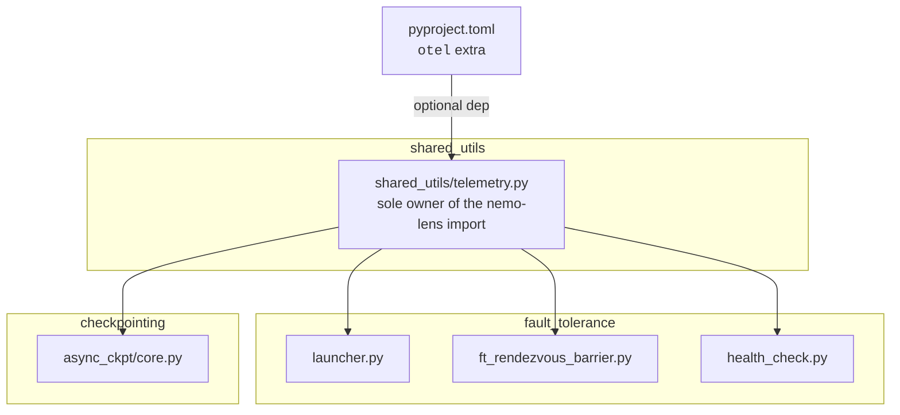
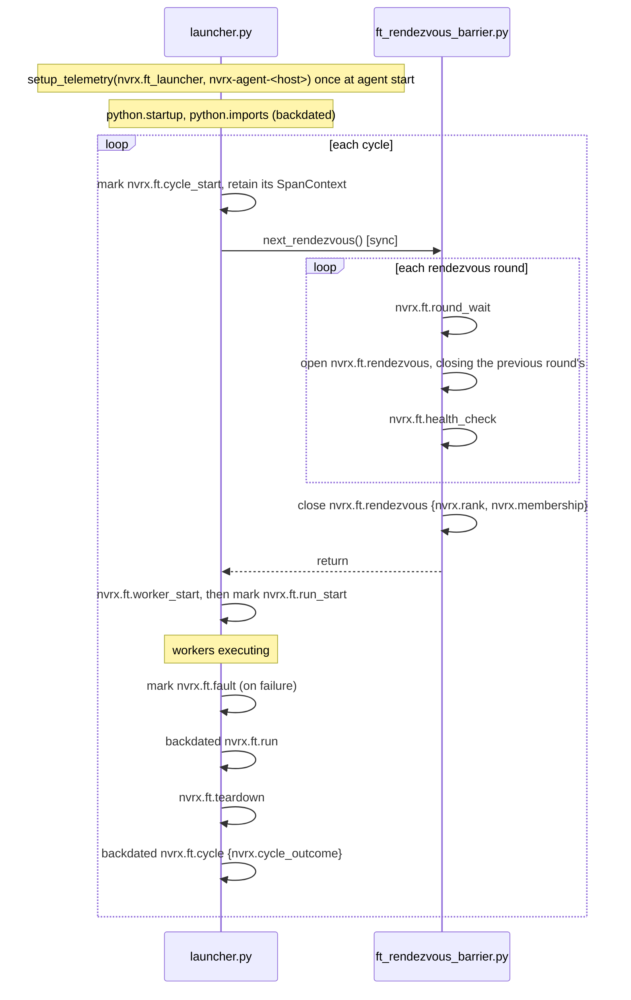

# NVRx Telemetry Contract

Optional [nemo-lens](https://github.com/nvidia-nemo/lens) OTel instrumentation for NVRx fault tolerance and async checkpointing. Enabled and configured entirely through nemo-lens env vars (`NEMO_LENS_ENABLED`, `NEMO_LENS_SPAN_GROUPS`, `NEMO_LENS_EXPORT_STRATEGY`); NVRx adds no gates of its own. With nemo-lens absent or disabled, every call site is a silent no-op.

## Rules

Three rules generate everything below.

1. **A span's meaning is complete within the emitting process.** `python.startup` means the same thing under Slurm, Kubernetes, or a bare `torchrun`. NVRx emits no span whose interpretation depends on a record kept somewhere else.
2. **A span ends promptly.** A span exports only when it ends, so nothing is held open across a window longer than the analysis that needs it. Anything longer is a start marker plus a backdated span at close.
3. **Correlation is by attribute, not by trace membership.** Every consumer query is a filter or a group-by over span records. Relationships a query needs are stamped at emit time.

## Scope

| Area                          | Files                                                                                                     |
| ----------------------------- | --------------------------------------------------------------------------------------------------------- |
| Fault tolerance restart cycle | `fault_tolerance/launcher.py`, `fault_tolerance/ft_rendezvous_barrier.py`, `shared_utils/health_check.py` |
| Async checkpointing           | `checkpointing/async_ckpt/core.py`                                                                        |



`shared_utils/telemetry.py` imports nemo-lens optionally: if the package is present it delegates to it, and if it is absent every export becomes a no-op. It is the only file in NVRx that imports nemo-lens, and the decision about whether telemetry exists at all is made once, there.

`fault_tolerance` and `checkpointing` call only `shared_utils.telemetry` APIs — never nemo-lens APIs directly, and never conditionally. Call sites carry no import guard, no availability check, and no fallback branch, because the shim already guarantees every export is safe to call whether or not nemo-lens is installed and whether or not `setup_telemetry` has run.

## `shared_utils/telemetry.py`

Exports, in three groups:

- **Spans** — `span`, `linked_span`, `trace_fn`, `ManualSpan`, `Phase`, `mark`, `backdated_span`, `set_span_attributes`, `record_process_startup`
- **Cross-process context** — `extended_resource_attributes`, `context_carrier`, `carrier_baggage`
- **Lifecycle** — `setup_telemetry`, `shutdown`, `flush`

### Where NVRx data lives in OTel

NVRx uses three of OTel's carriers, and which one a value belongs in follows from its lifetime and its cost.

| OTel carrier            | Describes                                | Set through                                                                                                     | Serialized            |
| ----------------------- | ---------------------------------------- | --------------------------------------------------------------------------------------------------------------- | --------------------- |
| **Resource attributes** | the emitting process, for its whole life | `OTEL_RESOURCE_ATTRIBUTES`, plus `setup_telemetry(resource_attributes=)` for what NVRx knows about itself       | once per export batch |
| **Span attributes**     | one span                                 | the dict passed to `span`, `linked_span`, `mark`, `backdated_span`, `ManualSpan`/`Phase`, `set_span_attributes` | once per span         |
| **Span links**          | a related span in another trace          | `AsyncRequest.telemetry_carrier` on enqueue — the only one                                                      | once per span         |

Baggage appears once. The trainer places `nvrx.iteration` in Baggage at the top of each training step. NVRx reads it out explicitly at enqueue and sets it on exactly two spans, `save.schedule` in the trainer and `save.request` in the worker — the two that have to join. It travels between them in the carrier NVRx already captures, so it costs one entry in an existing dict, once per checkpoint, and nothing per span.

### Which carrier for which value

A value's carrier follows from whether it is constant for the _emitting process's_ lifetime. OTel's Resource is built once when the TracerProvider is constructed and is immutable after, so anything that changes during a process cannot live there.

| Process           | Constant for its life → Resource                                           | Varies during its life → span attribute |
| ----------------- | -------------------------------------------------------------------------- | --------------------------------------- |
| ft-launcher agent | `service.name`, `service.instance.id`, `nvrx.node`, infrastructure rank    | `nvrx.cycle`, and every per-span value  |
| Trainer worker    | `nvrx.cycle`, `nvrx.membership`, `nvrx.infra_rank`, elastic rank           | `nvrx.iteration`                        |
| Checkpoint worker | same as the trainer, plus its own `service.name` and `service.instance.id` | `nvrx.call_idx`, `nvrx.iteration`       |

`nvrx.cycle` appears on both sides of that table, which is the clearest case. The agent outlives cycles, so its Resource cannot carry a cycle number and the value is a span attribute. A worker process is created fresh for each cycle, so the cycle is constant for its entire life and belongs in its Resource — which is why the agent appends it to `OTEL_RESOURCE_ATTRIBUTES` at launch rather than passing it some other way.

**Span attributes are a dict at every entry point.** nemo-lens's `managed_span` takes keyword arguments, and every NVRx attribute name is dotted — `nvrx.cycle`, `nvrx.call_idx` — which cannot be a Python keyword. A dict is the only shape that carries these names, so it is the shape everywhere.

NVRx names live under the `nvrx.` prefix. `service.name` does not make the prefix redundant, because `service.name` identifies the _process_, not the attribute namespace: NVRx checkpoint spans emitted inside the trainer share the trainer's Resource, so their `service.name` is the trainer's. The prefix is the only thing separating NVRx's keys from the trainer's in the same span stream. It also keeps NVRx clear of names the OTel semantic conventions may define later; NVRx redefines no semconv name, and `service.name`, `service.instance.id`, and the rest keep their standard meanings.

Values are restricted to OTel's attribute types — string, bool, int, double, or a homogeneous array of those — so nothing nested is passed.

Everything is gated on its span group and no-ops when the group is off, which includes before any process in the interpreter runs `setup_telemetry`, since the enabled set is empty until then.

| Mechanism               | Shape                                                                                  | Used by                                         |
| ----------------------- | -------------------------------------------------------------------------------------- | ----------------------------------------------- |
| `@trace_fn`             | the span _is_ a method                                                                 | `worker_start`, `teardown`                      |
| `with span(...)`        | the span is a block                                                                    | `round_wait`, `health_check`, most `ckpt` spans |
| `with linked_span(...)` | a block, linking to a span in another process                                          | `ckpt.save.request`                             |
| `ManualSpan`            | open and close cross block boundaries, bounded duration                                | `rendezvous`, `attribution`                     |
| `mark(...)`             | an instant; returns its `SpanContext`                                                  | `cycle_start`, `run_start`, `fault`             |
| `backdated_span(...)`   | already elapsed, reconstructed from two timestamps; accepts an explicit parent context | `python.startup`, `python.imports`              |
| `Phase`                 | a window too long to hold a span open: a start mark now, a backdated span at close     | `cycle`, `run`                                  |

`ManualSpan` owns the `ExitStack` bookkeeping and no-ops while nothing is open, so callers need no guards. It knows nothing about fault tolerance — the caller supplies group, name, and every attribute key.

`Phase` is `ManualSpan`'s grouping without its lifetime. `open()` marks `<name>_start` and makes that mark's `SpanContext` the active context; `close()` emits `<name>`, backdated to the mark. Spans opened in between still nest under the phase, but nothing is held open, so a phase that never closes leaves its mark and all of its children rather than nothing at all. Both share the `contextvars` ordering contract: open and close on one thread, and anything opened inside closes first.

### Span groups

A **span group** is a nemo-lens concept, not an OTel one. Every call site names a group; a span whose group is not enabled is never created. It is a static on/off switch for a family of instrumentation, distinct from OTel sampling, which decides per span at runtime after the span exists, and from attributes, which filter after export.

nemo-lens ships no group names of its own. A consuming library declares what it emits with `SpanRegistry.register()`, and `NEMO_LENS_SPAN_GROUPS` selects from what the process has registered. NVRx registers under the `nvrx` namespace **at import of `shared_utils/telemetry.py`**, not inside `setup_telemetry` — the trainer process emits NVRx checkpoint spans and never calls `setup_telemetry`, because the training framework owns that call. Registering there would leave exactly the spans that need it unselectable.

| Group              | Contents                                                                                                   |
| ------------------ | ---------------------------------------------------------------------------------------------------------- |
| `nvrx.job`         | `python.startup`, `python.imports`                                                                         |
| `nvrx.ft`          | every fault-tolerance span: cycle, run, rendezvous, health check, fault, teardown, attribution             |
| `nvrx.ckpt`        | a checkpoint request from the outside: `save.schedule`, `save.request`, `save.finalize`                    |
| `nvrx.ckpt.phases` | that request broken into stages: `stage_wait`, `shm_drain`, `stage`, `preload`, `write`, `completion_sync` |

| Preset      | Groups                             |
| ----------- | ---------------------------------- |
| `default`   | `nvrx.job`, `nvrx.ft`, `nvrx.ckpt` |
| `per_step`  | the above plus `nvrx.ckpt.phases`  |
| `profiling` | every NVRx group                   |

Presets **union across namespaces**, so `NEMO_LENS_SPAN_GROUPS=default` in a job running both Megatron and NVRx means both libraries' idea of `default`. The built-in `all` means every group registered in the process.

The checkpoint split is a drill-down. `nvrx.ckpt` is one span per request per side, bounded by checkpoint count, so it stays on. `nvrx.ckpt.phases` is what you turn on once a checkpoint is already known to be slow and the question is _where_.

A `NEMO_LENS_SPAN_GROUPS` entry naming nothing the process registered is reported and ignored, never raised — a spec is job-wide while a registry is per process, and an agent that never imports Megatron will legitimately see Megatron group names it cannot resolve. That leniency is right for a spec and wrong for a call site, where an unregistered group is a typo that costs those spans silently and forever, so `tests/shared_utils/test_telemetry.py` walks the source for group literals at call sites and fails on any NVRx does not register.

## Identity

### Resource attributes

`OTEL_RESOURCE_ATTRIBUTES` carries job context as comma-separated `key=value` pairs, with values percent-encoded. The SDK reads it into the Resource with no code, it is inherited across every process spawn, and it costs nothing per span — OTLP serializes a Resource once per export batch.

**NVRx reads the variable, but never parses it.** It is an opaque string that NVRx appends to and passes on. NVRx looks up no key in it and contains no code naming `slurm.job_id`, `job.uid`, `cluster`, or anything else a launching environment might put there. Whatever is in it rides through untouched, and NVRx behaves identically whether it holds nothing or twenty keys from a Kubernetes operator.

That is the distinction that keeps NVRx portable: reading a string to extend it creates no coupling, while branching on a key in it would.

Three rules for extending it:

- **Append to the value inherited at agent start, not to the last extended value.** Otherwise each restart appends another `nvrx.cycle=N` and the string grows without bound across cycles.
- **Percent-encode values.** NVRx's own values are integers and a fixed enum, so they are safe as-is, but the encoding is what makes that a property rather than luck.
- **Emit no duplicate keys.** Which occurrence wins is not something to depend on.

nemo-lens merges `setup_telemetry(resource_attributes=)` over the env-derived Resource, so what NVRx sets in code wins over the same key in the environment.

The agent appends cycle information to the _worker's_ copy of the variable, not its own. The purpose is that a lens-instrumented trainer picks it up into its own Resource with no code and no knowledge of NVRx, so every span the trainer emits — including ones NVRx never sees — carries the restart cycle it belongs to.

NVRx sets only what describes itself:

| Attribute             | Value                                                                                              |
| --------------------- | -------------------------------------------------------------------------------------------------- |
| `service.name`        | `nvrx.ft_launcher`, or `nvrx.ckpt_worker` in the checkpoint worker                                 |
| `service.instance.id` | unique per emitting process — the agent, the trainer, and the checkpoint worker must never collide |
| `nvrx.node`           | this node's identity                                                                               |

`setup_telemetry(service_name, instance_id=None)` always names the kind of process, because `OTEL_SERVICE_NAME` names the workload a launching environment came to run and these processes are NVRx's own. Identity of the _individual_ process has to come from somewhere too, since the nemo-lens default is unusable here: nemo-lens derives `service.instance.id` from `dl.rank`, the agent has no rank at all, and the checkpoint worker shares one with the trainer it serves.

**A process is named by whoever placed it, not by itself.** Rank and instance id are facts about placement, known where the placing happened. So the trainer publishes the checkpoint worker's identity into `OTEL_RESOURCE_ATTRIBUTES` around the spawn and the worker passes no identity at all — it does not have to know how it was placed, and there is no argument to keep in sync when the placement changes. Only the fault-tolerance agent supplies its own, because nothing upstream could have: it is launched by the cluster, not by NVRx. It is keyed on its hostname and publishes no `dl.rank`, a node ordinal not being a rank; nemo-lens supports the absence given an explicit identity, and warns without one. The elastic `group_rank` is a span attribute, set once rendezvous assigns it.

Values published this way arrive in the child as strings, because that is what the encoding carries — `dl.rank` reaches a spawned worker's Resource as `"3"`, not `3`. Nothing reads it back as a number.

Export strategy is nemo-lens's default, set through `NEMO_LENS_EXPORT_STRATEGY`. NVRx overrides nothing: whether every node exports or only one depends on the collector topology the launching environment provides, which NVRx cannot know. A deployment running a collector per node sets `all_ranks` to get per-node visibility.

### Published to workers

`_start_workers` extends the worker cohort's environment with one variable, additively:

| Variable                   | Contents                                                         |
| -------------------------- | ---------------------------------------------------------------- |
| `OTEL_RESOURCE_ATTRIBUTES` | appended with `nvrx.cycle`, `nvrx.membership`, `nvrx.infra_rank` |

Cycle number is a **resource** attribute for a worker because a worker process is new each cycle, and a **span** attribute for the agent because the agent outlives cycles.

**No span reference crosses this boundary — not a parent, and not a link.** Belonging to a cycle is a property of the worker, not a relationship between two spans: it is constant for the worker's entire life, identical on every span it emits, and answers its queries as a `GROUP BY nvrx.cycle`.

## Fault tolerance

### Cycle lifecycle

A cycle opens with a `nvrx.ft.cycle_start` marker, which exports immediately and whose `SpanContext` is retained. Every span in the cycle is emitted with that context as its explicit parent, so the cycle shares one trace per node without anything being held open. At cycle end, a backdated `nvrx.ft.cycle` span carries the duration and outcome into the same trace. `nvrx.ft.run` follows the same pattern.

A cycle that never closes leaves its marker and every completed child. Absence of the backdated span is the signal.



Spans opened inside `ft_rendezvous_barrier.py` nest under the cycle context without reference passing, since `next_rendezvous()` is called synchronously from the launcher's main thread.

`nvrx.ft.attribution` is the exception. It runs on the attribution poller's own daemon thread, and OTel context is per-thread, so no ambient context reaches it and it is emitted as a root span.

What identifies it comes from two places. Resource attributes are free — the poller is in the agent process, so it shares the agent's Resource and every span carries `service.instance.id`, `nvrx.node`, and whatever the environment supplied. Anything that is a _span_ attribute on the agent has to be passed explicitly across the thread boundary: `node_id` is handed to `_start_get_profiling` when the span opens and retained as `_poll_node_id` for the close, and the cycle number must travel the same way, since a verdict can arrive cycles after the failure it describes. Only `_poll_once` drives the span, so the `ManualSpan` same-thread ordering contract holds without extra locking.

An exclusion needs no separate signal: `UnhealthyNodeException` propagating out of the `health_check` span is recorded as `StatusCode.ERROR` with the reason as description, plus an `exception` event.

### Spans

| Span                   | Group      | Source                     | Covers                                                   |
| ---------------------- | ---------- | -------------------------- | -------------------------------------------------------- |
| `python.startup`       | `nvrx.job` | `launcher.py`              | process create time to the entry point's first statement |
| `python.imports`       | `nvrx.job` | `launcher.py`              | the entry point's top-level imports                      |
| `nvrx.ft.cycle_start`  | `nvrx.ft`  | `launcher.py`              | instant: a cycle began                                   |
| `nvrx.ft.cycle`        | `nvrx.ft`  | `launcher.py`              | one full restart cycle, backdated at close               |
| `nvrx.ft.round_wait`   | `nvrx.ft`  | `ft_rendezvous_barrier.py` | waiting for a round to open                              |
| `nvrx.ft.rendezvous`   | `nvrx.ft`  | `ft_rendezvous_barrier.py` | one rendezvous round, after it opened                    |
| `nvrx.ft.health_check` | `nvrx.ft`  | `ft_rendezvous_barrier.py` | `ensure_node_is_healthy`                                 |
| `nvrx.ft.worker_start` | `nvrx.ft`  | `launcher.py`              | `_start_workers`                                         |
| `nvrx.ft.run_start`    | `nvrx.ft`  | `launcher.py`              | instant: workers are up                                  |
| `nvrx.ft.run`          | `nvrx.ft`  | `launcher.py`              | workers executing, backdated at close                    |
| `nvrx.ft.fault`        | `nvrx.ft`  | `launcher.py`              | instant: a failure was detected                          |
| `nvrx.ft.teardown`     | `nvrx.ft`  | `launcher.py`              | `_stop_workers`                                          |
| `nvrx.ft.attribution`  | `nvrx.ft`  | `health_check.py`          | an attribution lookup (root span)                        |

`python.startup` and `python.imports` carry no `nvrx.` prefix and are distinguished by `service.name`, so one query answers "how long did imports take" across every service that emits them. Both are measured entirely within this process — `psutil.Process().create_time()` and two `time.time()` stamps — and backdated once telemetry is up.

`fault` is an instant because `teardown` only starts once the restart decision is made; without it the interval between detecting a failure and deciding what to do is unmeasured.

A hot spare produces one `round_wait` / `rendezvous` pair per round, so volume tracks restart rounds rather than poll frequency.

### Cycle outcomes

`nvrx.cycle_outcome` is set on the backdated `nvrx.ft.cycle` span.

| Condition                                          | `cycle_outcome`                                    |
| -------------------------------------------------- | -------------------------------------------------- |
| `WorkerState.SUCCEEDED`                            | `succeeded`                                        |
| Local failure, restart granted or budget exhausted | `failed`                                           |
| Healthy node joins a peer restart                  | `peer_restart`                                     |
| Health check exclusion (`UnhealthyNodeException`)  | `excluded`                                         |
| Standby node, job ends                             | `standby`                                          |
| Attribution stop / peer no-restart                 | `terminated`                                       |
| Signal                                             | _(no cycle span emitted; the marker stands alone)_ |

The exclusion and standby handlers live in `_rendezvous`, so they cover the first rendezvous as well as every restart.

### Span attributes

Resource attributes are covered under Identity; everything here is per-span.

| Attribute                 | Type | Spans                 | Notes                                     |
| ------------------------- | ---- | --------------------- | ----------------------------------------- |
| `nvrx.cycle`              | int  | all agent spans       | restart cycle counter                     |
| `nvrx.node`               | str  | resource              | node identity                             |
| `nvrx.rank`               | int  | `cycle`, `rendezvous` | elastic group rank, once assigned         |
| `nvrx.group_world_size`   | int  | `cycle`               | active node count                         |
| `nvrx.failures`           | int  | `cycle`, `fault`      | failed worker count                       |
| `nvrx.state`              | str  | `fault`               | `WorkerState` at detection                |
| `nvrx.cycle_outcome`      | str  | `cycle`               | see above                                 |
| `nvrx.round`              | int  | `rendezvous`          | rendezvous round number                   |
| `nvrx.membership`         | str  | `cycle`, `rendezvous` | `active`, `standby`, `late_joiner`        |
| `nvrx.max_restarts`       | int  | `cycle`               | configured budget                         |
| `nvrx.remaining_restarts` | int  | `cycle`               | budget left when the round was joined     |
| `nvrx.rdzv_run_id`        | str  | `cycle`               | rendezvous run id                         |
| `nvrx.call_idx`           | int  | `ckpt.*`              | checkpoint call index; joins across ranks |
| `nvrx.iteration`          | int  | `ckpt.*`              | training iteration; joins across ranks    |
| `is_goodput_span`         | bool | see below             | label                                     |

No span carries a roster of the job's other nodes. Every node already emits its own `nvrx.membership` and `nvrx.rank` each cycle, so the membership of a cycle is a group-by over `job.uid` and `nvrx.cycle` — rule 3, applied. Emitting the full list from every node would write O(N²) bytes to say what N spans already say, and at large node counts each copy is a multi-kilobyte attribute that `OTEL_ATTRIBUTE_VALUE_LENGTH_LIMIT` may silently truncate.

### Labels

Spans carry labels so a collector config can filter and route on them without knowing NVRx span names. Any attribute works; `is_goodput_span` is the one NVRx sets everywhere, marking resiliency overhead rather than productive training.

It is set wherever the answer is **locally true of that span**, never inferred from what the span nests inside — NVRx is a library and its spans sit under callers' spans.

| Span                                                                                                                                      | Group                                    | `is_goodput_span` |
| ----------------------------------------------------------------------------------------------------------------------------------------- | ---------------------------------------- | ----------------- |
| `round_wait`, `rendezvous`, `health_check`, `worker_start`, `teardown`, `fault`, `attribution`                                            | `True`                                   |
| `run`                                                                                                                                     | `False` — training is executing          |
| `ckpt.save.schedule`, `ckpt.save.stage_wait`, `ckpt.save.shm_drain`, `ckpt.save.stage`, `ckpt.save.completion_sync`, `ckpt.save.finalize` | `True` — training is stopped             |
| `ckpt.save.request`, `ckpt.save.write`                                                                                                    | `False` — worker side, overlaps training |
| `ckpt.save.preload`                                                                                                                       | `False` — always worker side             |

## Checkpointing

`save.schedule` and `save.finalize` sit on `AsyncCallsQueue`, the entry point a trainer actually calls; `save.completion_sync` sits on the `AsyncCaller` base, so it covers every caller. Everything below them covers `PersistentAsyncCaller` only: `TemporalAsyncCaller` is deprecated and warns on use, so it is left uninstrumented rather than given spans that would have to be maintained until it is removed.

**Which process performs the device-to-host copy depends on `cpu_shm_mode`, and the two modes expose different work to training.** Spans are placed by process and by mode, not by name. In both, the trainer's blocking wait is its own span, because it is the only part that stops training.

### IPC mode (`cpu_shm_mode=False`, default)

The worker sets its CUDA device and initializes a CUDA context so it can receive IPC handles into the trainer's GPU memory. Staging therefore runs **in the worker**. The trainer enqueues, then blocks on `preload_q.join()` until the worker signals staging complete, and the write overlaps training from there.

| Span                             | Group              | Process | Covers                                   | `is_goodput_span`                             |
| -------------------------------- | ------------------ | ------- | ---------------------------------------- | --------------------------------------------- |
| `nvrx.ckpt.save.schedule`        | `nvrx.ckpt`        | trainer | `schedule_async_request` end to end      | `True`                                        |
| `nvrx.ckpt.save.stage_wait`      | `nvrx.ckpt.phases` | trainer | the `preload_q.join()` block             | `True` — training is stopped for exactly this |
| `nvrx.ckpt.save.request`         | `nvrx.ckpt`        | worker  | one request, end to end                  | `False`                                       |
| `nvrx.ckpt.save.preload`         | `nvrx.ckpt.phases` | worker  | D2H staging into host memory             | `False`                                       |
| `nvrx.ckpt.save.write`           | `nvrx.ckpt.phases` | worker  | the write itself                         | `False`                                       |
| `nvrx.ckpt.save.completion_sync` | `nvrx.ckpt.phases` | trainer | the all-reduce agreeing the save is done | `True` — once per poll                        |
| `nvrx.ckpt.save.finalize`        | `nvrx.ckpt`        | trainer | finalize callbacks, a later iteration    | `True`                                        |

`stage_wait` nests inside `schedule`. The worker's `preload` measures the same physical work from the other side, so the difference between them is queue and IPC overhead.

### CPU SHM mode (`cpu_shm_mode=True`)

The worker skips CUDA initialization entirely and needs no IPC handles. Staging runs **in the trainer**: `FileSystemWriterAsync.prepare_write_data` copies GPU tensors into a training-side shared-memory cache, and the worker writes from that memory.

Reusing those shm tensors introduces a second exposed wait that has no counterpart in IPC mode. Before the first `copy_()` into a reused tensor, `prepare_write_data` fires the drain that `AsyncCallsQueue` registers — `maybe_finalize_async_calls(blocking=True, no_dist=True)` — so any prior write still reading those tensors completes first. **This blocks the current checkpoint on the previous one's write**, which is the mode's characteristic stall and needs its own span to be visible at all.

| Span                             | Group              | Process | Covers                                     | `is_goodput_span`                             |
| -------------------------------- | ------------------ | ------- | ------------------------------------------ | --------------------------------------------- |
| `nvrx.ckpt.save.shm_drain`       | `nvrx.ckpt.phases` | trainer | the blocking drain in `prepare_write_data` | `True` — blocked on the _previous_ checkpoint |
| `nvrx.ckpt.save.stage`           | `nvrx.ckpt.phases` | trainer | GPU to shared memory copy                  | `True`                                        |
| `nvrx.ckpt.save.schedule`        | `nvrx.ckpt`        | trainer | `schedule_async_call`                      | `True`                                        |
| `nvrx.ckpt.save.stage_wait`      | `nvrx.ckpt.phases` | trainer | the `preload_q.join()` block               | `True` — short here, but not zero             |
| `nvrx.ckpt.save.request`         | `nvrx.ckpt`        | worker  | one request, end to end                    | `False`                                       |
| `nvrx.ckpt.save.preload`         | `nvrx.ckpt.phases` | worker  | bucket assembly over host memory           | `False`                                       |
| `nvrx.ckpt.save.write`           | `nvrx.ckpt.phases` | worker  | the write itself                           | `False`                                       |
| `nvrx.ckpt.save.completion_sync` | `nvrx.ckpt.phases` | trainer | the all-reduce agreeing the save is done   | `True` — once per poll                        |
| `nvrx.ckpt.save.finalize`        | `nvrx.ckpt`        | trainer | finalize callbacks, a later iteration      | `True`                                        |

`schedule` and `stage_wait` are the same spans as in IPC mode, because the code path is the same: a request always carries a `preload_fn`, and the trainer always waits on it. What differs is only what that work costs. In IPC mode the worker's `preload` is the D2H itself and the trainer's `stage_wait` covers all of it; in CPU SHM mode the D2H already happened on the trainer, so `preload` is bucket assembly over host memory and `stage_wait` is short. The mode is legible from the durations rather than from which spans exist.

`preload` therefore always names work in the worker, and always overlaps training. The trainer-side GPU-to-shm copy is `stage`, a different name for a different thing: it is exposed, it happens before the request is enqueued, and giving it `preload`'s name would put an exposed cost and an overlapped one in the same bucket.

`shm_drain` and `stage_wait` are likewise deliberately different names. Both are the trainer blocked, but `shm_drain` is blocked on the _previous_ checkpoint's write and `stage_wait` on this one's staging; conflating them would hide that a slow checkpoint in SHM mode is usually caused by the one before it.

`prepare_write_data` runs before `schedule_async_call`, so `shm_drain` and `stage` are siblings of `schedule`, not children.

### Trainer side

Checkpoint code called from the trainer runs on the trainer's thread and inherits its context, so trainer-side `nvrx.ckpt` spans nest under the trainer's active span with no reference passing.

At enqueue NVRx captures its own current context — it is already inside `save.schedule` — into `AsyncRequest.telemetry_carrier`, a defaulted field on the `NamedTuple` that leaves every existing call site unchanged. `AsyncCallsQueue` already rebuilds a request whose field count does not match, so the addition is compatible in both directions.

It is set on **both** copies of the request: the one dispatched to the worker, and the one retained in `async_calls` for finalization. The retained copy is what makes a link possible from the finalize, which runs an iteration or more later.

The carrier is a dict of W3C header strings, `traceparent` plus `baggage`, produced by the globally configured propagators. Headers rather than a live `SpanContext` because the request is pickled onto a multiprocessing queue; the configured propagators rather than a fixed two so that whatever a deployment sets up rides along. It is `None` when telemetry is off, and the worker then takes exactly the path it took before any of this existed.

### Completion polling

Finalizing is preceded by asking whether the save is done, and that question is a collective: `sync_all_async_calls` all-reduces one flag across every rank. It runs once per poll — every iteration, for as long as a checkpoint is outstanding — on the training critical path, so it is goodput.

Its duration is mostly not the all-reduce. It is how long this rank waits for the slowest rank to arrive, which makes `save.completion_sync` a **straggler signal** rather than a cost measurement: the rank still writing reports a short sync, and every rank blocked on it reports a long one. Comparing the span across ranks for one iteration names the laggard — the same query as "identify a rank where an operation took longer than the others", answered without a separate mechanism.

It carries no `nvrx.call_idx` and no link. It is a per-iteration cost of the trainer's own trace, not a phase of one request, and it is also the one place that has no request in hand.

### One request, three processes, three traces

An async save does not fit in a trace, and is not meant to. The trainer schedules it during one iteration; the worker writes it in its own process; the trainer finalizes it during some later iteration, by which time the trace that requested it is closed. Three traces, by construction.

They are tied together as a **star, with `save.schedule` at the centre**:

```
trace A (iteration N)     nvrx.ckpt.save.schedule  ◀──────┐
                                                          │ link
trace B (worker)          nvrx.ckpt.save.request  ────────┤
                                                          │ link
trace C (iteration N+k)   nvrx.ckpt.save.finalize ────────┘
```

Both links point **backwards**, and could not do otherwise: a link is supplied when a span starts, so it can only name something that already exists. `save.schedule` has ended before either of the others begins, so the later spans hold the references and the hub holds none.

`save.schedule` is the hub because it is the request's identity — the span that measures what the checkpoint cost the trainer. There is deliberately no link from the worker to the finalize: `nvrx.call_idx` is on all three, so the worker-finished-to-trainer-noticed interval is a subtraction rather than an edge, and making it an edge would mean carrying a context back through the completion queue.

### Worker side

The persistent worker is spawned with `start_method="spawn"`. It inherits the environment but no in-memory state, so it calls `setup_telemetry("nvrx.ckpt_worker")` at the top of `async_process_target` — the kind of process, and nothing else.

Its identity comes the other way. `_start_worker` wraps `Process.start()` in `publish_resource_attributes`, which sets `OTEL_RESOURCE_ATTRIBUTES` for the duration of the spawn and restores it after, adding `dl.rank` and a `service.instance.id` of `nvrx-ckpt<rank>` so the worker and the trainer it serves never claim the same identity. `multiprocessing.Process` has no `env` parameter, so this is not one option among several: the child inherits whatever `os.environ` held when `start()` ran, and there is no other channel. The same variable carries job and cycle context across the spawn with no code at all.

Restoring it matters. Left set, it would describe the trainer itself — and every later child of it — as the process that was spawned there.

Each request's span **links** to the trainer's `save.schedule`, so cause is navigable without the worker joining the trainer's trace. A link rather than a parent for three reasons: the write is not time-contained in `save.schedule`, which ends as soon as staging does, and parent-child implies containment in most tooling; sampling decisions are inherited by children, so parenting would drop the worker's spans whenever the training trace was sampled out; and the worker is persistent, serving requests from many traces. `nvrx.call_idx` and `nvrx.iteration` join the sides for any consumer that cannot follow links.

Each phase is its own span so a breakdown is a group-by rather than a subtraction.

## Initialization and shutdown

| Process           | Setup                                                         | Shutdown                |
| ----------------- | ------------------------------------------------------------- | ----------------------- |
| Launcher agent    | top of `LocalElasticAgent.run()`, before the first rendezvous | that method's `finally` |
| Checkpoint worker | top of `async_process_target`, after the spawn                | that method's `finally` |

The checkpoint worker reaches its `finally` because `_handle_sigterm` turns the parent's SIGTERM into a `SystemExit` — the same mechanism that releases its CUDA IPC handles.

`shutdown()` is bounded in both. It flushes synchronously and can otherwise block for the exporter's entire retry budget against a collector that is gone, which is longer than the SIGTERM-to-SIGKILL grace either process gets. Neither uses `atexit`, which runs at interpreter finalization after `sys.exit` has unwound.

Two points flush explicitly, because the process may be killed moments later and those spans would die in the batch processor's queue: a detected fault, and a health-check exclusion.
