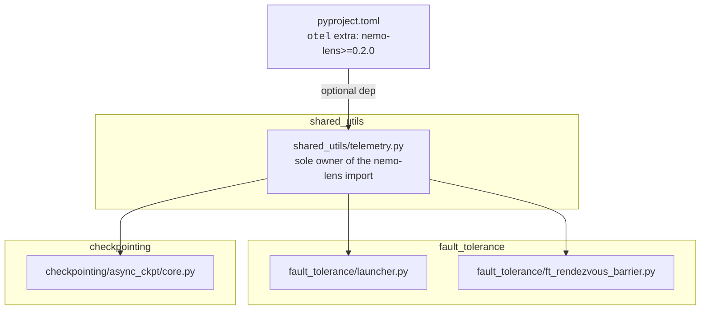
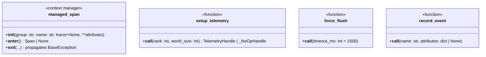
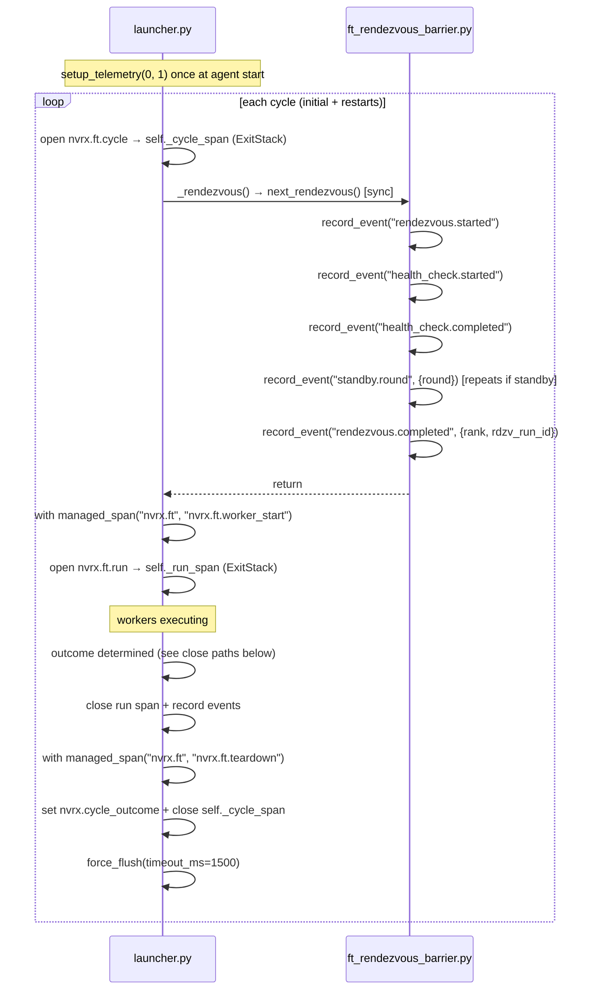
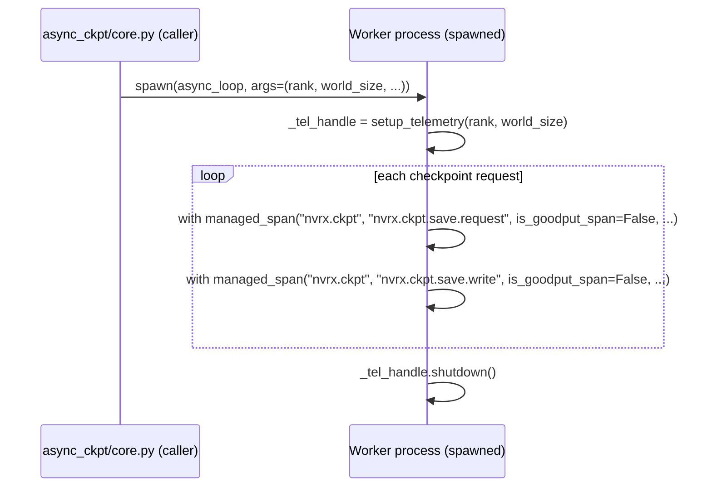

# nemo-lens Telemetry Integration

Optional [nemo-lens](https://pypi.org/project/nemo-lens/) OTel instrumentation for NVRx fault tolerance and async checkpointing. Telemetry is enabled and configured entirely through nemo-lens env vars (`NEMO_LENS_ENABLED`, `NEMO_LENS_SPAN_GROUPS`, etc.); NVRx adds no additional gates.

## Scope

1. **Fault tolerance restart cycle** — `fault_tolerance/launcher.py` and `fault_tolerance/ft_rendezvous_barrier.py`
2. **Async checkpoint worker** — `checkpointing/async_ckpt/core.py`

When nemo-lens is absent or disabled, all instrumentation is a silent no-op with no behavioral change.

## Module Structure



`fault_tolerance` and `checkpointing` have no knowledge of nemo-lens. The shim is the only file with a nemo-lens import.

## `shared_utils/telemetry.py`

Exports four names: `managed_span`, `setup_telemetry`, `force_flush`, `record_event`.

### NVRxSpanGroup

nemo-lens's base `SpanGroup.resolve()` only recognises its built-in groups. Without a subclass, `"nvrx.ft"` or `"nvrx.ckpt"` in `NEMO_LENS_SPAN_GROUPS` raises `ValueError`, and the base `"default"` preset emits no NVRx spans even with `NEMO_LENS_ENABLED=1`. `NVRxSpanGroup` adds FT and CKPT to the `"default"` preset so `NEMO_LENS_ENABLED=1` alone is sufficient.

### Implementation

The module-level `try/except` handles both the absent and the broken-install cases. `ModuleNotFoundError` (nemo-lens not installed) is silent. Any other import failure logs a warning.

`managed_span` suppresses exceptions from span entry and exit only. Exceptions from the instrumented body — including `SignalException`, `KeyboardInterrupt`, and `SystemExit` — always propagate via `raise`.

`force_flush` and `record_event` suppress telemetry errors so they never crash the workload. However, they must not swallow `SignalException` (which inherits from `Exception`). Both use a two-clause catch: re-raise signals, suppress everything else.

```python
import logging
from contextlib import contextmanager
from typing import ClassVar, Final

from torch.distributed.elastic.multiprocessing.errors import SignalException

logger = logging.getLogger(__name__)

try:
    from nemo.lens import NemoLensConfig as _NemoLensConfig
    from nemo.lens import SpanGroup as _SpanGroup
    from nemo.lens import managed_span as _real_managed_span
    from nemo.lens import setup_telemetry as _setup_telemetry

    class _NVRxSpanGroup(_SpanGroup):
        FT   = "nvrx.ft"
        CKPT = "nvrx.ckpt"
        ALL_GROUPS: Final[frozenset] = _SpanGroup.ALL_GROUPS | frozenset([FT, CKPT])
        _PRESETS: ClassVar[dict] = {
            **_SpanGroup._PRESETS,
            "default": _SpanGroup._PRESETS["default"] | frozenset([FT, CKPT]),
            "nvrx": frozenset([FT, CKPT]),
            "all": _SpanGroup.ALL_GROUPS | frozenset([FT, CKPT]),
        }

    _NEMO_LENS_AVAILABLE = True

except ModuleNotFoundError:
    _NEMO_LENS_AVAILABLE = False
    _real_managed_span = None

except Exception:
    logger.warning("nemo-lens import failed, continuing without telemetry", exc_info=True)
    _NEMO_LENS_AVAILABLE = False
    _real_managed_span = None


@contextmanager
def managed_span(group, name, tracer=None, **attributes):
    if _real_managed_span is None:
        yield None
        return
    try:
        cm = _real_managed_span(group, name, tracer=tracer, **attributes)
        span = cm.__enter__()
    except Exception:
        logger.debug("managed_span entry suppressed", exc_info=True)
        yield None
        return
    try:
        yield span
    except BaseException as exc:
        # Body exceptions (including signals) always propagate.
        try:
            cm.__exit__(type(exc), exc, exc.__traceback__)
        except Exception:
            logger.debug("managed_span exit suppressed", exc_info=True)
        raise
    else:
        try:
            cm.__exit__(None, None, None)
        except Exception:
            logger.debug("managed_span exit suppressed", exc_info=True)


class _NoOpHandle:
    def shutdown(self, timeout_ms: int = 5000): pass


def setup_telemetry(rank: int, world_size: int):
    if not _NEMO_LENS_AVAILABLE:
        return _NoOpHandle()
    try:
        return _setup_telemetry(
            _NemoLensConfig.from_env(span_group_cls=_NVRxSpanGroup),
            rank,
            world_size,
        )
    except Exception:
        logger.warning("nemo-lens init failed, continuing without telemetry", exc_info=True)
        return _NoOpHandle()


def force_flush(timeout_ms: int = 1500) -> None:
    """Flush pending spans without shutting down providers. Safe to call mid-run."""
    try:
        from opentelemetry import trace
        trace.get_tracer_provider().force_flush(timeout_millis=timeout_ms)
    except (SignalException, KeyboardInterrupt, SystemExit):
        raise
    except Exception:
        pass


def record_event(name: str, attributes: dict | None = None) -> None:
    """Add a timestamped event to the current active span."""
    try:
        from opentelemetry import trace
        trace.get_current_span().add_event(name, attributes or {})
    except (SignalException, KeyboardInterrupt, SystemExit):
        raise
    except Exception:
        pass
```

`world_size` is required by the upstream `nemo.lens.setup_telemetry` API for OTel resource attributes.



## Fault Tolerance Span Lifecycle

### Spans vs events

`next_rendezvous()` is a single blocking call that internally mixes standby retries, health check, barrier join, and rank assignment. Producing child spans from that boundary would require invasive callbacks into the barrier internals. Instead, the rendezvous internals use OTel **events** — timestamped points attached to the current active span via `record_event()`. Events have timestamps, so durations between them (e.g. `health_check.started` → `health_check.completed`) are available in backends that support event-based analytics.

OTel propagates the active span implicitly via `contextvars`. Because `next_rendezvous()` is called synchronously from the launcher's main thread, `record_event()` calls inside `ft_rendezvous_barrier.py` automatically attach to the open `cycle` span with no reference passing.

**Spans** are used only where there are clear, code-controlled start/end boundaries.

### Initialization

`setup_telemetry(rank=0, world_size=1)` is called once per launcher-agent process at the start of `_invoke_run_with_any_failed_policy`, before the first rendezvous. Each launcher agent is a distinct telemetry emitter with its own OTel resource identity. Elastic `group_rank` and `group_world_size` are set as span attributes after rendezvous assigns them.

`atexit.register(self._tel_handle.shutdown)` registers the terminal shutdown for clean process exits. nemo-lens PR #37's `_OpenSpanCloser` closes any spans still open at shutdown; it is a data-loss backstop, not the primary close path.

### Lifecycle per cycle

The `cycle` span opens at the start of the `_rendezvous` override, covering both the initial launch and all restart cycles. Standby-wait events attach to it naturally.



`force_flush` is called **after** the cycle span is closed so the exported data is complete. nemo-lens PR #37 handles any spans that escape explicit close (e.g. on SIGKILL), but explicit close is always preferred.

### Explicit cycle close paths

Every path that ends a cycle must close spans explicitly in this order: run span → events → teardown span → outcome attribute → cycle span → `force_flush`. nemo-lens PR #37 is the fallback, not the intended mechanism.

| Condition | `cycle_outcome` | Close sequence |
|---|---|---|
| `WorkerState.SUCCEEDED` | `succeeded` | close run → set outcome → close cycle → force_flush |
| Local failure (UNHEALTHY/FAILED) | `failed` | close run → `fault` event → teardown → set outcome → close cycle → force_flush |
| Healthy node joins peer restart | `peer_restart` | close run → `peer_restart` event → teardown → set outcome → close cycle → force_flush |
| Health check exclusion | `excluded` | `excluded` event → set outcome → close cycle → force_flush |
| Standby node: job ends (RendezvousClosedError) | `standby` | set outcome → close cycle → force_flush (in RendezvousClosedError handler) |
| Signal / terminal exception | `terminated` | close run (if open) → set outcome → close cycle (if open) → force_flush (in exception handler) |
| Restart budget exhausted | `failed` | same as local failure; `remaining_restarts=0` on span signals exhaustion |

The exclusion and standby paths close the cycle **before** returning to the monitor loop, not after. The signal/terminal path must execute in a `try/finally` or exception handler that wraps `_invoke_run_with_any_failed_policy`.

### Standby cycle closure

A standby node blocked in `next_rendezvous()` has its `cycle` span open until either it is selected (cycle continues) or the job ends with `RendezvousClosedError`. The `RendezvousClosedError` handler in `_rendezvous` must:

1. Set `nvrx.cycle_outcome = "standby"` on the open cycle span
2. Close the `ExitStack` (which ends the cycle span)
3. Call `force_flush(timeout_ms=1500)`
4. Re-raise the exception

This is the only way to produce a closed `standby` outcome cycle. Relying on PR #37 would export the span without an outcome attribute.

### Attribution

The attribution client runs on a long-lived daemon thread. A result may arrive cycles after the failure it describes. The span reference must be captured **at request submission time**, not at result delivery time:

```python
# In launcher, at the moment the attribution request is submitted (failure detected):
_attribution_span = self._cycle_span  # capture the failing cycle's span

# Pass _attribution_span into the attribution request or callback closure.
# When the result arrives (possibly cycles later):
if _attribution_span is not None:
    _attribution_span.add_event("attribution.result", {"outcome": result, ...})
```

Using the span reference directly (rather than OTel context attach/detach) avoids threading the OTel context. Capturing at submission time rather than reading `self._cycle_span` at delivery time avoids misattributing delayed results to a later cycle.

## Span Attributes

| Attribute | Type | Spans | Notes |
|---|---|---|---|
| `nvrx.cycle` | int | all FT spans | restart cycle counter |
| `nvrx.node` | str | all FT spans | node hostname |
| `nvrx.rank` | int | `cycle` | elastic group rank; set after rendezvous (initially absent) |
| `nvrx.membership` | str | `cycle`, `run` | `"active"` or `"standby"` |
| `nvrx.group_world_size` | int | `cycle` | number of active nodes; set after rendezvous |
| `nvrx.max_restarts` | int | `cycle` | configured restart budget |
| `nvrx.remaining_restarts` | int | `cycle` | set at close time |
| `nvrx.failures` | int | `cycle` | set at close time |
| `nvrx.active_nodes` | str | `cycle` | comma-separated active node addresses |
| `nvrx.standby_nodes` | str | `cycle` | comma-separated standby node addresses |
| `nvrx.cycle_outcome` | str | `cycle` | set before close; see outcomes below |
| `nvrx.call_idx` | int | `nvrx.ckpt.save.request` | checkpoint call index for cross-rank join |
| `is_goodput_span` | bool | all | see below |

### Cycle outcomes

| Value | Condition |
|---|---|
| `succeeded` | `WorkerState.SUCCEEDED` — clean exit |
| `failed` | failure detected on this node |
| `peer_restart` | healthy node joined a peer-triggered restart |
| `excluded` | this node failed health check |
| `standby` | job ended while this node was waiting as a hot spare |
| `terminated` | job terminated by policy (attribution stop, no-progress, signal) |
| `completed` | fallback for any other clean termination |

`remaining_restarts = 0` communicates budget exhaustion; there is no separate outcome for it.

### Events on the cycle span

Emitted via `record_event()` at the existing `ProfilingEvent` instrumentation points.

| Event name | Source | Attributes |
|---|---|---|
| `rendezvous.started` | `ft_rendezvous_barrier.py` | |
| `health_check.started` | `ft_rendezvous_barrier.py` | |
| `health_check.completed` | `ft_rendezvous_barrier.py` | elapsed_s |
| `standby.round` | `ft_rendezvous_barrier.py` | round |
| `excluded` | `ft_rendezvous_barrier.py` | reason |
| `rendezvous.completed` | `ft_rendezvous_barrier.py` | nvrx.rank, nvrx.rdzv_run_id |
| `fault` | `launcher.py` | nvrx.state, nvrx.failures |
| `peer_restart` | `launcher.py` | |
| `attribution.result` | attribution daemon (via captured span ref) | outcome, details |

### `is_goodput_span`

| Span | `is_goodput_span` | Rationale |
|---|---|---|
| `nvrx.ft.cycle` | `True` | restart/recovery overhead |
| `nvrx.ft.worker_start` | `True` | training blocked |
| `nvrx.ft.run` | `False` | training is executing |
| `nvrx.ft.teardown` | `True` | cleanup overhead |
| `nvrx.ckpt.save.request` | `False` | D2H occurs on training thread before async call; worker receives CPU tensors and writes in background |
| `nvrx.ckpt.save.write` | `False` | write overlaps with training |

## Async Checkpoint Worker: Spawn Boundary

The persistent checkpoint worker is launched with `start_method="spawn"`. It inherits environment variables but no in-memory state, so it re-initializes telemetry at the top of `async_process_target`. `handle.shutdown()` is called in the `finally` block.

`rank` and `world_size` are passed as positional arguments to `async_loop` and `async_loop_for_daemon_worker`. The worker does not correlate with the launcher's OTel trace — it emits independent `nvrx.ckpt.*` spans identified by `nvrx.call_idx`.

**`warmup_persistent_caller` world_size fallback** — may be called before `torch.distributed` is initialized. Resolved in order: explicit keyword argument → `torch.distributed.get_world_size()` if initialized → `int(os.environ["WORLD_SIZE"])` if set → `1`.

**Checkpoint bootstrap** — NVRx relies on environment variable inheritance for checkpoint worker telemetry configuration. This is a deliberate simplification: spawned processes inherit the parent's environment, so `NemoLensConfig.from_env()` reads the same configuration in the worker as in the trainer.



## Spans

| Span | Group | Source | `is_goodput_span` |
|---|---|---|---|
| `nvrx.ft.cycle` | `nvrx.ft` | `launcher.py` | `True` |
| `nvrx.ft.worker_start` | `nvrx.ft` | `launcher.py` | `True` |
| `nvrx.ft.run` | `nvrx.ft` | `launcher.py` | `False` |
| `nvrx.ft.teardown` | `nvrx.ft` | `launcher.py` | `True` |
| `nvrx.ckpt.save.request` | `nvrx.ckpt` | `async_ckpt/core.py` (worker) | `False` |
| `nvrx.ckpt.save.write` | `nvrx.ckpt` | `async_ckpt/core.py` (worker) | `False` |

## Worker Environment Variables

The launcher injects these into each restarted worker cohort's environment:

| Variable | Value | Purpose |
|---|---|---|
| `NVRX_CYCLE` | cycle counter (int) | correlates worker spans with launcher cycle |
| `NVRX_MEMBERSHIP` | `"active"` or `"standby"` | identifies hot-spare nodes |
| `NVRX_INFRA_RANK` | node infrastructure rank (int) | stable physical identity across rescheduling |
| `NVRX_CYCLE_START_TIME` | epoch seconds (float) | shared time anchor for cross-process correlation |
| `NVRX_LAUNCH_TIME` | epoch seconds (float) | cohort launch anchor |

## pyproject.toml

```toml
[tool.poetry.extras]
otel = ["nemo-lens"]

[tool.poetry.dependencies]
nemo-lens = {version = ">=0.2.0", extras = ["sdk"], optional = true}
```

`nemo-lens 0.2.0` is not yet on public PyPI (0.1.0 is the current release). The `otel` extra requires a private index or source install until 0.2.0 ships. The current nemo-lens source also requires Python ≥3.12; NVRx supports ≥3.10. Both must be resolved upstream before the extra is generally usable.

## Out of Scope

- **`pre_startup` / `nvrx.cold_start`** — SLURM queue and prolog timing. NVRx does not own this; the batch script or a separate launcher wrapper should emit these spans.
