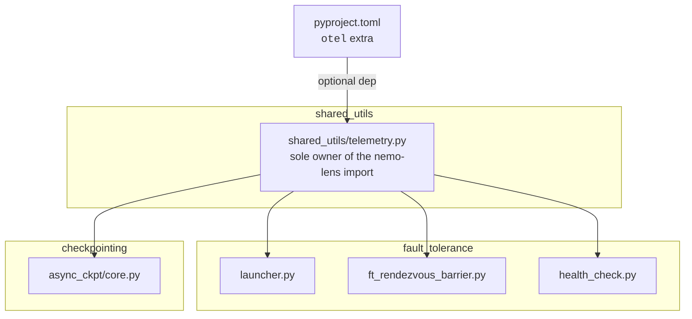
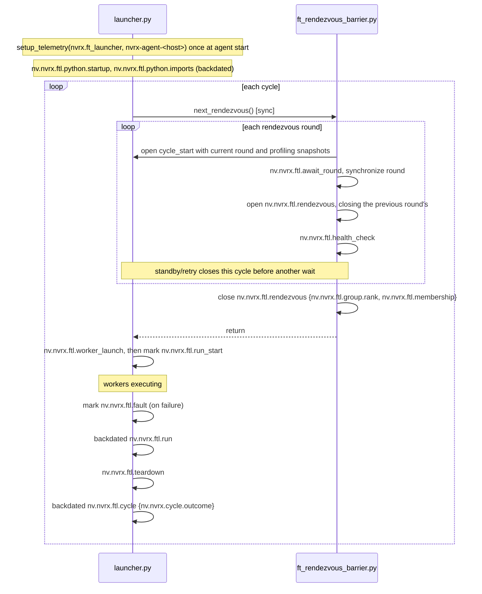

# NVRx Telemetry Contract

Optional [nemo-lens](https://github.com/nvidia-nemo/lens) OTel instrumentation for NVRx fault tolerance and async checkpointing. Enabled when the `otel` extra is installed, and controlled by nemo-lens' environment variables.

## Rules

Design rules for this implementation:

1. **No API changes solely for telemetry information:** The NVRX APIs must not change simply to pass additional data needed only for telemetry.
2. **Spans must be self-contained:** A span must lie entirely within one logical unit of code, wherever possible given the current code architecture.
3. **A span ends promptly:** A span must end promptly and not remain open. If a span covers a long-running task, e.g., a multi-iteration training run, we use a starting zero-duration span and emit a back-dated span at closing time.
4. **Correlation is by attributes:** Use span attributes to filter and group records from different processes. Within a process, spans retain their parent relationships, including relationships to phase start anchors.
5. **Telemetry is good-to-have, not mandatory:** Telemetry is completely optional. Missing packages should not cause a fatal error. Any misconfiguration in telemetry shouldn't cause a training job to fail.

## Scope

| Area                          | Files                                                                                                     |
| ----------------------------- | --------------------------------------------------------------------------------------------------------- |
| Fault tolerance restart cycle | `fault_tolerance/launcher.py`, `fault_tolerance/ft_rendezvous_barrier.py`, `shared_utils/health_check.py` |
| Async checkpointing           | `checkpointing/async_ckpt/core.py`                                                                        |



`shared_utils/telemetry.py` imports nemo-lens optionally: if the package is present it delegates to it, and if it is absent every export becomes a no-op. All other files in NVRX import telemetry, never anything from nemo-lens. This avoids any conditional checks for telemetry in NVRX logic.

## `shared_utils/telemetry.py`

Provides (for use in NVRX) three groups of functions:

- **Spans** — `span`, `trace_fn`, `ManualSpan`, `Phase`, `mark`, `backdated_span`, `record_process_startup`
- **Cross-process context** — `get_otel_resource_attributes`, `compose_attributes`, `extend_otel_resource_attributes`, `publish_otel_resource_attributes`
- **Lifecycle** — `setup_telemetry`, `shutdown`, `flush`

All three are nops if nemo-lens is not present.

### Where NVRx data lives in OTel

NVRx uses two of OTel's carriers, and which one a value belongs in follows from its lifetime and its cost.

| OTel carrier            | Describes                                | Set through                                                                                               | Serialized            |
| ----------------------- | ---------------------------------------- | --------------------------------------------------------------------------------------------------------- | --------------------- |
| **Resource attributes** | the emitting process, for its whole life | `OTEL_RESOURCE_ATTRIBUTES`, plus `setup_telemetry(resource_attributes=)` for what NVRx knows about itself | once per export batch |
| **Span attributes**     | one span                                 | the dict passed to `span`, `mark`, `backdated_span`, `ManualSpan`/`Phase`, or a `trace_fn` callback       | once per span         |

**No span reference crosses a process boundary in either direction.**

### Which carrier for which value

A value's carrier follows from whether it is constant for the _emitting process's_ lifetime. OTel's Resource is built once when the TracerProvider is constructed and is immutable after, so anything that changes during a process cannot live there.

| Process           | Resource attributes (constant for the process)                                                                      | Span attributes (vary during the process)                  |
| ----------------- | ------------------------------------------------------------------------------------------------------------------- | ---------------------------------------------------------- |
| FT launcher agent | `nv.dl.job.uuid`, `service.name`, `service.instance.id`, `nv.nvrx.ftl.node`                                         | rendezvous and profiling counter snapshots, other span values |
| Trainer worker    | `nv.nvrx.cycle.index`, `nv.nvrx.ftl.membership`, `nv.nvrx.ftl.infra.rank`, node-budget and segment keys (see below) | elastic rank                                               |
| Checkpoint worker | trainer attributes, with its own `service.name` and `service.instance.id`                                           | `nv.nvrx.ckpt.call_idx`                                    |

`nv.nvrx.cycle.index` is constant for the lifetime of a training process and remains in that process's Resource. The fault-tolerant launcher records the raw rendezvous and profiling counters on spans instead of inferring the worker's grouping index.

NVRx names follow the shared `nv.` schema: fault-tolerance names under `nv.nvrx.ftl.`, checkpoint names under `nv.nvrx.ckpt.`, and the cycle entity under `nv.nvrx.cycle.`. Eventually, these names will follow a semantic convention defined by nemo-lens.

Values are restricted to OTel's attribute types — string, bool, int, double, or a homogeneous array of those; python types are disallowed.

| Mechanism             | Shape                                                                                  | Used by                                                    |
| --------------------- | -------------------------------------------------------------------------------------- | ---------------------------------------------------------- |
| `@trace_fn`           | the span _is_ a method; an optional gated callback supplies entry attributes            | `worker_launch`, `teardown`, `completion_sync`             |
| `with span(...)`      | the span is a block                                                                    | `await_round`, `health_check`, most `ckpt` spans           |
| `ManualSpan`          | open and close cross block boundaries, bounded duration                                | `rendezvous`, `attribution`                                |
| `mark(...)`           | an instant; returns its `SpanContext`                                                  | `cycle_start`, `run_start`, `fault`                        |
| `backdated_span(...)` | already elapsed, reconstructed from two timestamps; accepts an explicit parent context | `nv.nvrx.ftl.python.startup`, `nv.nvrx.ftl.python.imports` |
| `Phase`               | a window too long to hold a span open: a start mark now, a backdated span at close     | `cycle`, `run`                                             |

`ManualSpan` owns the `ExitStack` bookkeeping and no-ops while nothing is open, so callers need no guards. For rendezvous, it enters a short attribute scope before the span and closes the span before restoring that scope. The nested health check therefore receives the rendezvous starting snapshot. Ideally, this mechanism should also be owned by nemo-lens.

`Phase` is used for telemetry with long-running tasks. `open()` creates a zero-duration start anchor `<name>_start` and makes it the active context for all child spans, while `close()` emits `<name>` as a duration summary from the saved start time. Opening attributes are retained for the summary, so later counter changes do not relabel it. If the process terminates unexpectedly, the duration summary can be missing, but the start anchor and recorded children remain.

### Span registry

`SpanRegistry` is nemo-lens's process-global record of what instrumentation a job can turn on. It is keyed by namespace, one per consuming library, and **it registers group names, not span names**:

```python
SpanRegistry.register("nvrx", {"nvrx.job", "nvrx.ft", "nvrx.ckpt", "nvrx.ckpt.phases"}, _PRESETS)
```

A span group is a family of spans. Each call site names its group. Nemo-lens checks if a span group is enabled before deciding to emit telemetry. A disabled span group should have minimal overhead in the nemo-lens architecture.

| Group              | Contents                                                                                                   |
| ------------------ | ---------------------------------------------------------------------------------------------------------- |
| `nvrx.job`         | `nv.nvrx.ftl.python.startup`, `nv.nvrx.ftl.python.imports`                                                 |
| `nvrx.ft`          | every fault-tolerance span: cycle, run, rendezvous, health check, fault, teardown, attribution             |
| `nvrx.ckpt`        | a checkpoint request from the outside: `save.schedule`, `save.request`, `save.finalize`                    |
| `nvrx.ckpt.phases` | that request broken into stages: `stage_wait`, `shm_drain`, `stage`, `preload`, `write`, `completion_sync` |

| Preset      | Groups                             |
| ----------- | ---------------------------------- |
| `default`   | `nvrx.job`, `nvrx.ft`, `nvrx.ckpt` |
| `per_step`  | the above plus `nvrx.ckpt.phases`  |
| `profiling` | every NVRx group                   |

Nemo-lens uses the union of span groups recorded for the enabled preset to determine which spans to record. This allows NVRX and the training framework to independently register their presets.

## Identity

### Resource attributes

`OTEL_RESOURCE_ATTRIBUTES` carries job context as comma-separated `key=value` pairs, with values percent-encoded. The SDK reads it into the Resource with no code, it is inherited across every process spawn, and it costs nothing per span — OTLP serializes a Resource once per export batch. NVRX exposes Lens's Resource carrier functions directly through its optional telemetry shim. Parsed values do not affect NVRx runtime decisions.

We do not emit duplicate keys in `OTEL_RESOURCE_ATTRIBUTES`. For any NVRX-specific keys, we always overwrite the values as NVRX is the source of truth (we also set attributes in `setup_telemetry()` which always win over environment variables). Do not encode any information you rely on using keys that NVRX may overwrite.

NVRX sets only what describes itself:

| Attribute             | Value                                                                                              |
| --------------------- | -------------------------------------------------------------------------------------------------- |
| `service.name`        | `nvrx.ft_launcher`, or `nvrx.ckpt_worker` in the checkpoint worker                                 |
| `service.instance.id` | unique per emitting process — the agent, the trainer, and the checkpoint worker must never collide |
| `nv.nvrx.ftl.node`    | this node's identity                                                                               |

The launching environment sets `OTEL_SERVICE_NAME`. Each NVRx service sets its own name with `setup_telemetry(service_name, instance_id)`. The parent process passes rank and instance ID through `OTEL_RESOURCE_ATTRIBUTES`.

Environment variables contain strings. When Lens builds the exported Resource, it converts supported integer fields, such as rank and world size, to integers. The general environment parser returns strings.

Every process and span group that is enabled will export telemetry. An OTel collector may route these spans to different consumers.

### Published to workers

`_start_workers` extends the worker's environment with the `OTEL_RESOURCE_ATTRIBUTES` variable if it is not already set, or updates it if it is already set. It adds or updates the following keys:

- `nv.nvrx.cycle.index`
- `nv.nvrx.ftl.membership`
- `nv.nvrx.ftl.infra.rank`
- `nv.dl.launch.nnodes.active`
- `nv.dl.launch.nnodes.spare`

and under `--ft-segment` also adds:

- `nv.nvrx.ftl.segment`
- `nv.nvrx.ftl.infra.cluster_uuid`

`nv.nvrx.cycle.index` is a legacy attempt field used as a Resource attribute for the training process. The launcher does not use it as a span grouping identity.

## Fault tolerance

### Cycle lifecycle

Before waiting for a round, the launcher snapshots both counters, emits a zero-duration `nv.nvrx.ftl.cycle_start` start anchor, and retains its `SpanContext`. The `await_round` span is its first child. Synchronization can change either counter during the wait, but the wait and the cycle records keep their starting values. Rendezvous and later operations take fresh snapshots at their own entry points.

The cycle's child spans retain their parent relationships and share one trace per node. At the end of the attempt, the launcher emits `nv.nvrx.ftl.cycle` with the recorded start and end times, the starting counter snapshot, and the outcome. This duration summary is a child of the cycle start anchor. No cycle span stays open for the duration of the attempt.

The run uses the same start-anchor and duration-summary pattern. `nv.nvrx.ftl.run_start` is a descendant of the cycle start anchor, and `nv.nvrx.ftl.run` is a child of the run start anchor. The run starts after worker initialization returns. It ends when the launcher observes completion or begins failure or restart handling. Its two records keep the counter snapshot taken when the run starts. Subtracting run duration from cycle duration gives the time spent on rendezvous, health checks, worker launch and teardown.

If a cycle ends without closing its phase, its duration span is missing. The start anchor and any child spans already emitted remain available.



`nv.nvrx.ftl.attribution` runs on the attribution poller's daemon thread. It therefore receives no context and emits its spans as root spans. `nv.nvrx.ftl.attribution.analyzed_cycle` carries the cycle the attribution is about, and may be used to join queries against the cycle.

### Spans

| Span                         | Group      | Source                     | Covers                                                   |
| ---------------------------- | ---------- | -------------------------- | -------------------------------------------------------- |
| `nv.nvrx.ftl.python.startup` | `nvrx.job` | `launcher.py`              | process create time to the entry point's first statement |
| `nv.nvrx.ftl.python.imports` | `nvrx.job` | `launcher.py`              | the entry point's top-level imports                      |
| `nv.nvrx.ftl.cycle_start`    | `nvrx.ft`  | `launcher.py`              | instant: a cycle began                                   |
| `nv.nvrx.ftl.cycle`          | `nvrx.ft`  | `launcher.py`              | one full restart cycle, backdated at close               |
| `nv.nvrx.ftl.await_round`    | `nvrx.ft`  | `ft_rendezvous_barrier.py` | waiting for a round to open                              |
| `nv.nvrx.ftl.rendezvous`     | `nvrx.ft`  | `ft_rendezvous_barrier.py` | one rendezvous round, after it opened                    |
| `nv.nvrx.ftl.health_check`   | `nvrx.ft`  | `ft_rendezvous_barrier.py` | `ensure_node_is_healthy`                                 |
| `nv.nvrx.ftl.worker_launch`  | `nvrx.ft`  | `launcher.py`              | `_start_workers`                                         |
| `nv.nvrx.ftl.run_start`      | `nvrx.ft`  | `launcher.py`              | instant: workers are up                                  |
| `nv.nvrx.ftl.run`            | `nvrx.ft`  | `launcher.py`              | workers executing, backdated at close                    |
| `nv.nvrx.ftl.fault`          | `nvrx.ft`  | `launcher.py`              | instant: a failure was detected                          |
| `nv.nvrx.ftl.teardown`       | `nvrx.ft`  | `launcher.py`              | `_stop_workers`                                          |
| `nv.nvrx.ftl.attribution`    | `nvrx.ft`  | `health_check.py`          | an attribution lookup (root span)                        |

Both `nv.nvrx.ftl.python.startup` and `nv.nvrx.ftl.python.imports` are measured within this process — using nemo-lens' `linux_process_create_time()` and `time.time()` stamps — and backdated once telemetry is up.

`fault` is an instant because `teardown` only starts once the restart decision is made; without it the interval between detecting a failure and deciding what to do is unmeasured.

A hot spare produces one `await_round` / `rendezvous` pair per round, so volume tracks restart rounds rather than poll frequency.

### Cycle outcomes

`nv.nvrx.cycle.outcome` is set on the backdated `nv.nvrx.ftl.cycle` span.

| Condition                                          | `cycle.outcome`                                    |
| -------------------------------------------------- | -------------------------------------------------- |
| `WorkerState.SUCCEEDED`                            | `completed`                                        |
| Local failure, restart granted or budget exhausted | `failed`                                           |
| Healthy node joins a peer restart                  | `peer_restart`                                     |
| Health check exclusion (`UnhealthyNodeException`)  | `excluded`                                         |
| Standby/late joiner leaves an attempted round       | `standby`                                          |
| Attribution stop / peer no-restart                 | `terminated`                                       |
| Signal                                             | _(cycle closed during final cleanup; outcome may be absent)_ |

The exclusion and standby handlers live in `_rendezvous`, so they cover the first rendezvous as well as every restart.

`nv.nvrx.ftl.cycle.state` and `nv.nvrx.ftl.cycle.failures` accompany a `failed` outcome. The `WorkerState` name is on the cycle span rather than on `nv.nvrx.ftl.fault`, because it describes how the cycle ended, and a consumer reading cycle outcomes should not have to join to a second span to get it.

### Placement and node budget

ft-launcher publishes additional keys into the worker's resource attributes, which are constant for the worker's lifetime

- `nv.nvrx.ftl.infra.rank` is the physical node ordinal.
- `nv.dl.launch.nnodes.active` and `nv.dl.launch.nnodes.spare` are the configured node budgets.
- `nv.nvrx.ftl.segment` and `nv.nvrx.ftl.infra.cluster_uuid` when `--ft-segment` is configured. The cluster UUID is parsed from `nvidia-smi` for segment-aware rank assignment.

### Span attributes

Resource attributes are covered under Identity; everything here is per-span.

| Attribute                                | Type | Spans                                      | Notes                                                        |
| ---------------------------------------- | ---- | ------------------------------------------ | ------------------------------------------------------------ |
| `nv.nvrx.ftl.rdzv.round`                 | int  | top-level fault-tolerance operations       | rendezvous round observed at operation entry                 |
| `nv.nvrx.ftl.profiling.cycle`            | int  | top-level fault-tolerance operations       | profiling count observed at operation entry                  |
| `nv.nvrx.ftl.node`                       | str  | resource, launcher spans                   | node identity                                                |
| `nv.nvrx.ftl.group.rank`                 | int  | active cycle, run, launch, fault, teardown | elastic group rank, once assigned                            |
| `nv.nvrx.ftl.group.world_size`           | int  | active cycle, run, launch, fault, teardown | active node count                                            |
| `nv.nvrx.ftl.cycle.failures`             | int  | `cycle`, `fault`                           | failed worker count                                          |
| `nv.nvrx.ftl.cycle.state`                | str  | `cycle`                                    | `WorkerState` at detection, on a `failed` outcome            |
| `nv.nvrx.cycle.outcome`                  | str  | `cycle`                                    | see above                                                    |
| `nv.nvrx.ftl.membership`                 | str  | cycle, run, rendezvous and worker operations | `active`, `unjoined`, `standby`, or `late_joiner`          |
| `nv.nvrx.ftl.max_restarts`               | int  | `cycle`                                    | configured budget                                            |
| `nv.nvrx.ftl.remaining_restarts`         | int  | `cycle`                                    | budget left when the round was joined                        |
| `nv.nvrx.ftl.rdzv.run_id`                | str  | `cycle`                                    | rendezvous run id                                            |
| `nv.nvrx.ftl.infra.rank`                 | int  | `cycle`, resource                          | physical node ordinal                                        |
| `nv.dl.launch.nnodes.active`             | int  | resource                                   | configured `min_nodes`                                       |
| `nv.dl.launch.nnodes.spare`              | int  | resource                                   | `max_nodes - min_nodes`                                      |
| `nv.nvrx.ftl.segment`                    | int  | resource                                   | under `--ft-segment` only                                    |
| `nv.nvrx.ftl.infra.cluster_uuid`         | str  | resource                                   | under `--ft-segment` only; NVLink domain                     |
| `nv.nvrx.ftl.attribution.analyzed_cycle` | int  | `attribution`                              | the cycle the verdict is about                               |
| `nv.nvrx.ckpt.call_idx`                  | int  | `ckpt.*`                                   | checkpoint call index; joins across ranks                    |

Spans do not carry a complete roster of the job's nodes. Each node emits its own membership and group rank. Post-processing reconstructs global attempt membership from the two counter snapshots, timestamps, parent relationships, worker Resource identity, and job identity supplied outside NVRx. Counter disagreement is retained as observed; instrumentation does not infer a grouping index.

## Checkpointing

Only `PersistentAsyncCaller` is instrumented, `TemporalAsyncCaller` is deprecated and will be removed in a future release, therefore it is not instrumented other than in methods it inherits from `AsyncCaller`.

`save.schedule` instruments the time to create and enqueue an async request to the async worker process. `save.finalize` instruments the time taken to execute finalize functions registered for execution after the checkpoint has been written to disk. `save.completion_sync` records the time spent checking for checkpoint completion across all ranks.

The device-to-host copy is done by either the worker process or the training process, depending on whether `cpu_shm_mode` is set. Depending on this, some spans may appear in one or the other process.

| Span                                | Group              | Process (`cpu_shm_mode=False`) | Process (`cpu_shm_mode=True`) | Covers                                                |
| :---------------------------------- | :----------------- | :----------------------------- | :---------------------------- | :---------------------------------------------------- |
| `nv.nvrx.ckpt.save.schedule`        | `nvrx.ckpt`        | training                       | training                      | `schedule_async_request` end to end                   |
| `nv.nvrx.ckpt.save.stage_wait`      | `nvrx.ckpt.phases` | training                       | training                      | `preload_q.join()` block                              |
| `nv.nvrx.ckpt.save.shm_drain`       | `nvrx.ckpt.phases` | N/A                            | training                      | blocking drain waiting for previous checkpoint        |
| `nv.nvrx.ckpt.save.stage`           | `nvrx.ckpt.phases` | N/A                            | training                      | D2H memory copy                                       |
| `nv.nvrx.ckpt.save.request`         | `nvrx.ckpt`        | worker                         | worker                        | one checkpoint request, end-to-end                    |
| `nv.nvrx.ckpt.save.preload`         | `nvrx.ckpt.phases` | worker                         | worker                        | assemble write buckets, includes D2H copy in IPC mode |
| `nv.nvrx.ckpt.save.write`           | `nvrx.ckpt.phases` | worker                         | worker                        | write to disk                                         |
| `nv.nvrx.ckpt.save.completion_sync` | `nvrx.ckpt.phases` | training                       | training                      | all-reduce between ranks agreeing that work is done   |
| `nv.nvrx.ckpt.save.finalize`        | `nvrx.ckpt`        | training                       | training                      | finalize callbacks, some iterations later             |

NVRX uses the `call_idx` field in `AsyncRequest` and stamps the same on spans in both training and worker processes. This allows us to correlate training and worker processes' spans for each checkpoint without sending any additional data over the IPC queue between the processes.

A single checkpoint save requires three traces to store:

- trace A (iteration N): training process' checkpoint spans
- trace B (worker, call_idx M): worker process' checkpoint spans
- trace C (iteration N+k): training process' checkpoint finalize

We do not use links between these traces as these would require additional data be carried across the IPC boundary. This would have been an API change purely for telemetry, which contravenes the no-API-changes-for-telemetry rule.

The persistent async worker inherits the trainer's current `OTEL_RESOURCE_ATTRIBUTES` when `Process.start()` runs. This includes attributes that the trainer published after NVRx was imported. The worker keeps the trainer's rank, including an explicitly empty value; `defaults={"nv.dl.rank": rank}` supplies a rank only when the key is absent. NVRx sets the worker's role to `ckpt_worker` and its instance ID to `nvrx-ckpt{rank}`. Other trainer attributes are retained without interpretation.

Checkpoint startup makes current-environment selection and composition explicit:

```python
with telemetry.publish_otel_resource_attributes(
    telemetry.compose_attributes(
        telemetry.get_otel_resource_attributes(),
        defaults={"nv.dl.rank": rank},
        overrides={
            "nv.dl.role": "ckpt_worker",
            "service.instance.id": f"nvrx-ckpt{rank}",
        },
    )
):
    self.process.start()
```

Lens publishes that exact map and restores the exact previous environment when the scope ends, including if process start fails. The launcher separately calls `extend_otel_resource_attributes` with the environment captured when NVRx was imported, so later environment changes do not alter its worker defaults. The extend operation returns a child carrier string without changing the environment. Publication scopes can be nested in one thread. They must not overlap across threads because threads share the process environment.

Without Lens, publication leaves the environment unchanged. Extension returns the selected original attribute string without adding values.

## What NVRX expects of the training framework

NVRx assigns each checkpoint request a call index. The index can repeat across worker attempts, so queries must also use the job identity and `nv.nvrx.cycle.index` to match scheduling, worker execution and finalization. The framework records the assigned index under the shared `CKPT_CALL_IDX` key (`nv.nvrx.ckpt.call_idx`). The worker queue carries no additional span parent or link data.

NVRX provides `shared_utils/semconv.py` as a placeholder for shared keys between NVRX and the training framework. At this time, only the `CKPT_CALL_IDX` string is exported – this is what is used to correlate training and worker process' checkpoints.

```python
from nvidia_resiliency_ext.shared_utils.semconv import CKPT_CALL_IDX
```

## Initialization and shutdown

| Process           | Setup                                                         | Shutdown                |
| ----------------- | ------------------------------------------------------------- | ----------------------- |
| Launcher agent    | top of `LocalElasticAgent.run()`, before the first rendezvous | that method's `finally` |
| Checkpoint worker | top of `async_process_target`, after the spawn                | that method's `finally` |

The checkpoint worker reaches its `finally` because `_handle_sigterm` turns the parent's SIGTERM into a `SystemExit` — the same mechanism that releases its CUDA IPC handles.

Only a detected fault warrants an immediate flush, as the process may be killed moments later and the span would be lost.
