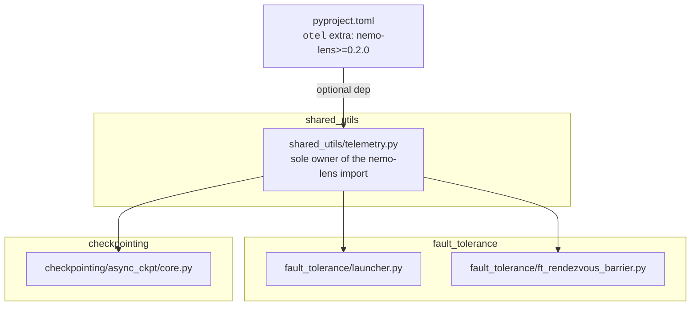
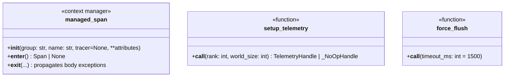
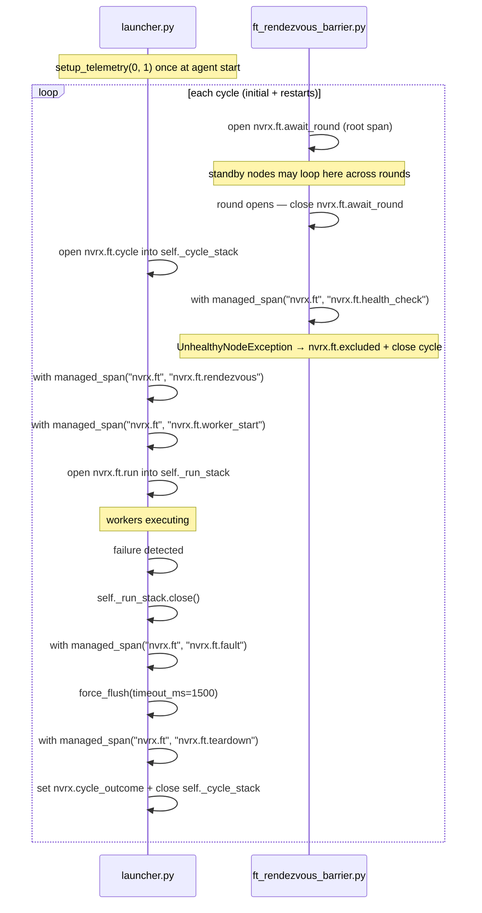
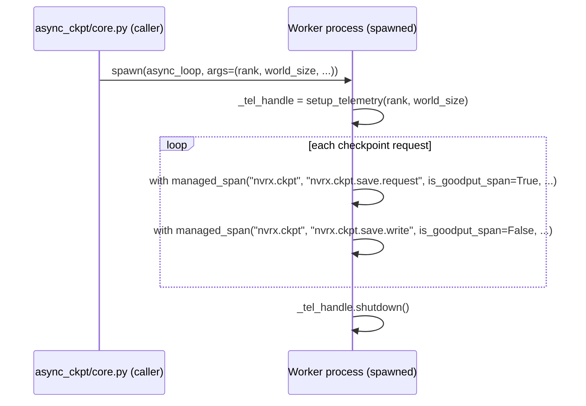

# nemo-lens Telemetry Integration

Optional [nemo-lens](https://pypi.org/project/nemo-lens/) OTel instrumentation for NVRx fault tolerance and async checkpointing. Telemetry is enabled and configured entirely through nemo-lens env vars (`NEMO_LENS_ENABLED`, `NEMO_LENS_SPAN_GROUPS`, etc.); NVRx adds no additional gates.

## Scope

1. **Fault tolerance restart cycle** — `fault_tolerance/launcher.py` and `fault_tolerance/ft_rendezvous_barrier.py`
2. **Async checkpoint worker** — `checkpointing/async_ckpt/core.py`

When nemo-lens is absent or disabled, all instrumentation is a silent no-op with no behavioral change.

## Module Structure



`fault_tolerance` and `checkpointing` have no knowledge of nemo-lens. The shim is the only file with a nemo-lens import.

## `shared_utils/telemetry.py`

Exports three names: `managed_span`, `setup_telemetry`, `force_flush`.

### NVRxSpanGroup

nemo-lens's base `SpanGroup.resolve()` only recognises its built-in groups. Without a subclass, `"nvrx.ft"` or `"nvrx.ckpt"` in `NEMO_LENS_SPAN_GROUPS` raises `ValueError`, and the base `"default"` preset emits no NVRx spans even with `NEMO_LENS_ENABLED=1`. `NVRxSpanGroup` adds FT and CKPT to the `"default"` preset so `NEMO_LENS_ENABLED=1` alone is sufficient.

```python
from nemo.lens import SpanGroup
from typing import ClassVar, Final

class NVRxSpanGroup(SpanGroup):
    FT   = "nvrx.ft"
    CKPT = "nvrx.ckpt"

    ALL_GROUPS: Final[frozenset] = SpanGroup.ALL_GROUPS | frozenset([FT, CKPT])
    _PRESETS: ClassVar[dict] = {
        **SpanGroup._PRESETS,
        "default": SpanGroup._PRESETS["default"] | frozenset([FT, CKPT]),
        "nvrx": frozenset([FT, CKPT]),
        "all": SpanGroup.ALL_GROUPS | frozenset([FT, CKPT]),
    }
```

### Implementation

The module-level `try/except` handles both the absent and the broken-install cases — a `ModuleNotFoundError` and any other import failure are both caught, so neither can prevent importing FT or checkpointing code.

`managed_span` suppresses exceptions from span entry and exit only — exceptions from the instrumented body always propagate. `setup_telemetry` catches all exceptions and degrades to a no-op handle with a warning. `ModuleNotFoundError` (nemo-lens simply not installed) is silent.

```python
import logging
from contextlib import contextmanager
from typing import ClassVar, Final

logger = logging.getLogger(__name__)

try:
    from nemo.lens import NemoLensConfig as _NemoLensConfig
    from nemo.lens import SpanGroup as _SpanGroup
    from nemo.lens import managed_span as _real_managed_span
    from nemo.lens import setup_telemetry as _setup_telemetry

    class _NVRxSpanGroup(_SpanGroup):
        FT   = "nvrx.ft"
        CKPT = "nvrx.ckpt"
        ALL_GROUPS: Final[frozenset] = _SpanGroup.ALL_GROUPS | frozenset([FT, CKPT])
        _PRESETS: ClassVar[dict] = {
            **_SpanGroup._PRESETS,
            "default": _SpanGroup._PRESETS["default"] | frozenset([FT, CKPT]),
            "nvrx": frozenset([FT, CKPT]),
            "all": _SpanGroup.ALL_GROUPS | frozenset([FT, CKPT]),
        }

    _NEMO_LENS_AVAILABLE = True

except ModuleNotFoundError:
    _NEMO_LENS_AVAILABLE = False
    _real_managed_span = None

except Exception:
    logger.warning("nemo-lens import failed, continuing without telemetry", exc_info=True)
    _NEMO_LENS_AVAILABLE = False
    _real_managed_span = None


@contextmanager
def managed_span(group, name, tracer=None, **attributes):
    if _real_managed_span is None:
        yield None
        return
    # Suppress entry/exit failures; body exceptions always propagate.
    try:
        cm = _real_managed_span(group, name, tracer=tracer, **attributes)
        span = cm.__enter__()
    except Exception:
        logger.debug("managed_span entry suppressed", exc_info=True)
        yield None
        return
    try:
        yield span
    except BaseException as exc:
        try:
            cm.__exit__(type(exc), exc, exc.__traceback__)
        except Exception:
            logger.debug("managed_span exit suppressed", exc_info=True)
        raise
    else:
        try:
            cm.__exit__(None, None, None)
        except Exception:
            logger.debug("managed_span exit suppressed", exc_info=True)


class _NoOpHandle:
    def shutdown(self, timeout_ms: int = 5000): pass


def setup_telemetry(rank: int, world_size: int):
    if not _NEMO_LENS_AVAILABLE:
        return _NoOpHandle()
    try:
        return _setup_telemetry(
            _NemoLensConfig.from_env(span_group_cls=_NVRxSpanGroup),
            rank,
            world_size,
        )
    except Exception:
        logger.warning("nemo-lens init failed, continuing without telemetry", exc_info=True)
        return _NoOpHandle()


def force_flush(timeout_ms: int = 1500) -> None:
    """Flush pending spans without shutting down providers. Safe to call mid-run."""
    try:
        from opentelemetry import trace
        trace.get_tracer_provider().force_flush(timeout_millis=timeout_ms)
    except Exception:
        pass
```

`world_size` is required by the upstream `nemo.lens.setup_telemetry` API for OTel resource attributes.



## Fault Tolerance Span Lifecycle

### Initialization

`setup_telemetry(rank=0, world_size=1)` is called once per launcher-agent process before the first rendezvous, at the start of `_invoke_run_with_any_failed_policy`. Each launcher agent is a distinct telemetry emitter; elastic `group_rank` and `group_world_size` are recorded on spans as attributes, not as the OTel resource identity. This avoids the single-rank export filter eliminating all but one node's spans.

`atexit.register(self._tel_handle.shutdown)` registers shutdown for clean process exits.

### Span lifecycle per cycle



**`await_round` is a root span** (parent of nothing, not nested inside `cycle`) that wraps the period from when rendezvous begins to when the node is assigned a round. Standby nodes may traverse multiple rounds, each emitting its own `await_round` span with outcome `standby`. When a node is selected as active, `await_round` closes and `cycle` opens. Implementing this requires `_barrier_state.perform_rendezvous()` to support an `on_round_open` notification callback, separate from the existing `pre_join_hook`.

**Long-lived spans** (`cycle`, `run`) are held in `ExitStack` instances on the agent instance so they survive across monitor loop iterations. nemo-lens PR #37's `_OpenSpanCloser` processor forcibly ends any spans still open at `shutdown()`, so spans are exported even if the process exits before explicit close.

### Flush and shutdown

`force_flush(timeout_ms=1500)` is called immediately after failure detection (before `_stop_workers`). This exports pending spans without terminating the SDK, allowing telemetry to continue for subsequent restarts.

`handle.shutdown()` is called only at process exit (via `atexit`). It is the terminal operation and must not be called between restart cycles.

`force_flush` is also called after worker termination and node exclusion to preserve spans before any SIGKILL sequence.

### Node exclusion

When `ensure_node_is_healthy()` raises `UnhealthyNodeException` inside the `health_check` span, the exclusion path must:
1. Emit `nvrx.ft.excluded` (an instantaneous marker span)
2. Call `force_flush(timeout_ms=1500)`
3. Set `nvrx.cycle_outcome = "excluded"` and close `self._cycle_stack`

This closes the cycle from the rendezvous exception path, not later in the monitor loop.

### Attribution telemetry

The attribution client already runs on a daemon thread. When the attribution result arrives, it should emit spans as children of the cycle span by attaching the cycle's OTel context:

```python
import opentelemetry.context as otel_ctx

# Before starting the attribution daemon thread, capture current context:
_attribution_ctx = otel_ctx.get_current()

def _attribution_poll():
    token = otel_ctx.attach(_attribution_ctx)
    try:
        with managed_span("nvrx.ft", "nvrx.ft.attribution"):
            ...
    finally:
        otel_ctx.detach(token)
```

The attribution context must be captured after `cycle` opens so `nvrx.ft.attribution` nests correctly.

## Span Attributes

All FT spans carry `nvrx.cycle`, `nvrx.node`, and `nvrx.rank` at open time.

| Attribute | Type | Spans | Notes |
|---|---|---|---|
| `nvrx.cycle` | int | all FT | restart cycle counter |
| `nvrx.node` | str | all FT | node hostname |
| `nvrx.rank` | int | all FT | elastic group rank (known after first rendezvous; 0 before) |
| `nvrx.membership` | str | `cycle`, `run` | `"active"` or `"standby"` |
| `nvrx.group_world_size` | int | `cycle` | number of active nodes |
| `nvrx.rdzv_run_id` | str | `cycle`, `rendezvous` | rendezvous run ID for cross-rank correlation |
| `nvrx.max_restarts` | int | `cycle` | configured restart budget |
| `nvrx.remaining_restarts` | int | `cycle` | set at close time |
| `nvrx.failures` | int | `cycle` | set at close time |
| `nvrx.active_nodes` | str | `cycle` | comma-separated active node addresses |
| `nvrx.standby_nodes` | str | `cycle` | comma-separated standby node addresses |
| `nvrx.cycle_outcome` | str | `cycle` | set at close time; see outcomes below |
| `nvrx.call_idx` | int | `nvrx.ckpt.save.request` | checkpoint call index for cross-rank join |
| `is_goodput_span` | bool | all | see below |

### Cycle outcomes

| Value | Condition |
|---|---|
| `succeeded` | `WorkerState.SUCCEEDED` — clean exit |
| `failed` | failure detected on this node |
| `peer_restart` | healthy node joined a peer-triggered restart |
| `excluded` | this node failed health check |
| `standby` | this node ended the round as a hot spare |
| `terminated` | job terminated by policy (attribution stop, no-progress, etc.) |
| `completed` | fallback for any other clean termination |

`remaining_restarts = 0` on the span communicates budget exhaustion; there is no separate outcome value for it.

### `is_goodput_span`

| Span | `is_goodput_span` | Rationale |
|---|---|---|
| `nvrx.ft.await_round` | `True` | standby wait is overhead |
| `nvrx.ft.cycle` | `True` | restart/recovery overhead |
| `nvrx.ft.health_check` | `True` | training blocked |
| `nvrx.ft.rendezvous` | `True` | training blocked |
| `nvrx.ft.worker_start` | `True` | training blocked |
| `nvrx.ft.run` | `False` | training is executing |
| `nvrx.ft.fault` | `True` | failure detection overhead |
| `nvrx.ft.teardown` | `True` | cleanup overhead |
| `nvrx.ft.excluded` | `True` | overhead |
| `nvrx.ckpt.save.request` | `True` | training blocks for D2H preload |
| `nvrx.ckpt.save.write` | `False` | write overlaps with training |

## Async Checkpoint Worker: Spawn Boundary

The persistent checkpoint worker is launched with `start_method="spawn"`. It inherits environment variables but no in-memory state, so it re-initializes telemetry at the top of `async_process_target`. `handle.shutdown()` is called in the `finally` block.

`rank` and `world_size` are passed as positional arguments to `async_loop` and `async_loop_for_daemon_worker`. The worker does not correlate with the launcher's OTel trace — it emits independent `nvrx.ckpt.*` spans identified by `nvrx.call_idx`.

**`warmup_persistent_caller` world_size fallback** — `warmup_persistent_caller(rank)` may be called before `torch.distributed` is initialized. `world_size` is resolved in order: explicit keyword argument → `torch.distributed.get_world_size()` if initialized → `int(os.environ["WORLD_SIZE"])` if set → `1`.

**Checkpoint bootstrap** — NVRx relies on environment variable inheritance for checkpoint worker telemetry configuration rather than passing an explicit bootstrap dict. This is a deliberate simplification: spawned processes inherit the parent's environment, so `NemoLensConfig.from_env()` reads the same configuration in the worker as in the trainer. Callers requiring explicit per-worker override can set env vars before spawning.



## Worker Environment Variables

The launcher injects these into each restarted worker cohort's environment so workers can self-identify and correlate with launcher telemetry:

| Variable | Value | Purpose |
|---|---|---|
| `NVRX_CYCLE` | cycle counter (int) | correlates worker spans with launcher cycle |
| `NVRX_MEMBERSHIP` | `"active"` or `"standby"` | identifies hot-spare nodes |
| `NVRX_INFRA_RANK` | node infrastructure rank (int) | stable physical identity across rescheduling |
| `NVRX_CYCLE_START_TIME` | epoch seconds (float) | shared time anchor for cross-process correlation |
| `NVRX_LAUNCH_TIME` | epoch seconds (float) | cohort launch anchor |

## Spans

| Span | Group | Source | `is_goodput_span` |
|---|---|---|---|
| `nvrx.ft.await_round` | `nvrx.ft` | `ft_rendezvous_barrier.py` | `True` |
| `nvrx.ft.cycle` | `nvrx.ft` | `launcher.py` | `True` |
| `nvrx.ft.health_check` | `nvrx.ft` | `ft_rendezvous_barrier.py` | `True` |
| `nvrx.ft.rendezvous` | `nvrx.ft` | `launcher.py` | `True` |
| `nvrx.ft.worker_start` | `nvrx.ft` | `launcher.py` | `True` |
| `nvrx.ft.run` | `nvrx.ft` | `launcher.py` | `False` |
| `nvrx.ft.fault` | `nvrx.ft` | `launcher.py` | `True` |
| `nvrx.ft.teardown` | `nvrx.ft` | `launcher.py` | `True` |
| `nvrx.ft.excluded` | `nvrx.ft` | `ft_rendezvous_barrier.py` | `True` |
| `nvrx.ckpt.save.request` | `nvrx.ckpt` | `async_ckpt/core.py` (worker) | `True` |
| `nvrx.ckpt.save.write` | `nvrx.ckpt` | `async_ckpt/core.py` (worker) | `False` |

## pyproject.toml

```toml
[tool.poetry.extras]
otel = ["nemo-lens"]

[tool.poetry.dependencies]
nemo-lens = {version = ">=0.2.0", extras = ["sdk"], optional = true}
```

`nemo-lens 0.2.0` is not yet on public PyPI (0.1.0 is the current release). The `otel` extra requires a private index or source install until 0.2.0 ships. The current nemo-lens source also requires Python ≥3.12; NVRx supports ≥3.10. Both must be resolved upstream before the extra is generally usable.

## Out of Scope

- **`pre_startup` / `nvrx.cold_start`** — SLURM queue and prolog timing. NVRx does not own this; the batch script or a separate launcher wrapper should emit these spans.
