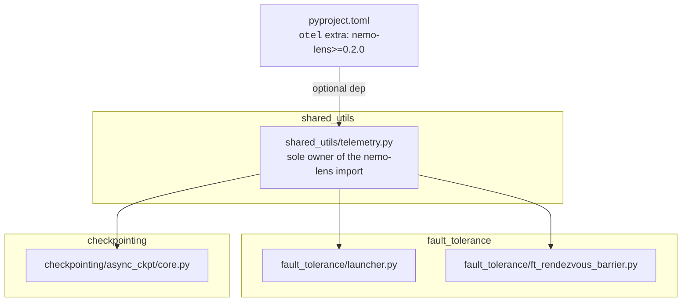
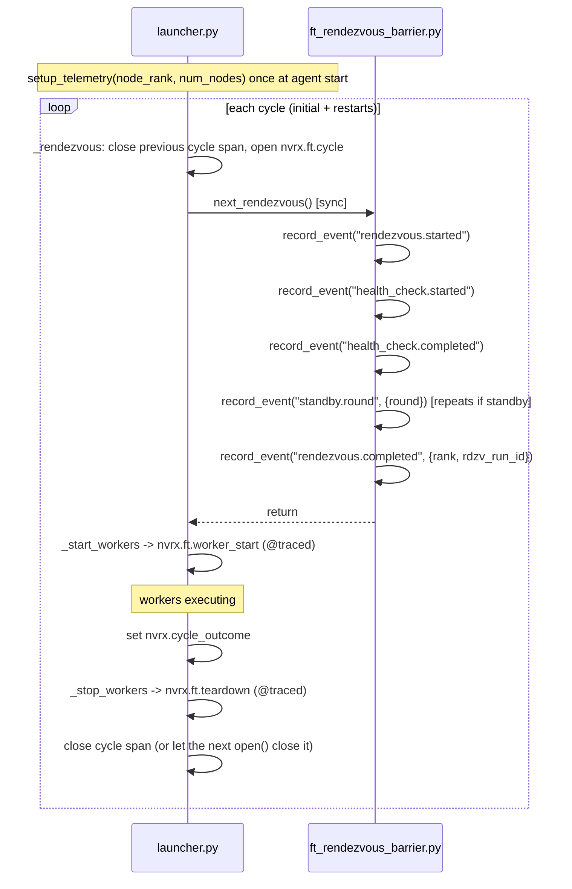
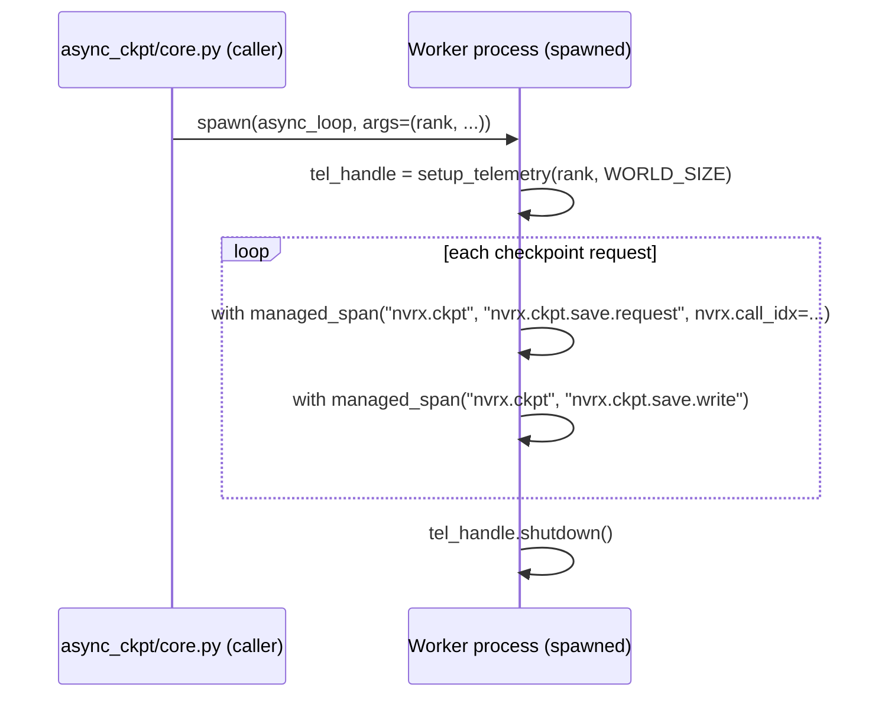

# nemo-lens Telemetry Integration

Optional [nemo-lens](https://github.com/nvidia-nemo/lens) OTel instrumentation for NVRx fault tolerance and async checkpointing. Telemetry is enabled and configured entirely through nemo-lens env vars (`NEMO_LENS_ENABLED`, `NEMO_LENS_SPAN_GROUPS`, etc.); NVRx adds no additional gates.

## Scope

1. **Fault tolerance restart cycle** — `fault_tolerance/launcher.py` and `fault_tolerance/ft_rendezvous_barrier.py`
2. **Async checkpoint worker** — `checkpointing/async_ckpt/core.py`

When nemo-lens is absent or disabled, all instrumentation is a silent no-op with no behavioral change.

## Module Structure



`fault_tolerance` and `checkpointing` have no knowledge of nemo-lens. The shim is the only file with a nemo-lens import.

## `shared_utils/telemetry.py`

Exports `managed_span`, `traced`, `ManualSpan`, `setup_telemetry`, `record_event`, and `set_span_attributes`.

### What the shim does and does not do

`managed_span` and `traced` are **re-exports** of `nemo.lens.managed_span` and `nemo.lens.trace_fn`. Upstream already gates on the span group, yields `None` when disabled, records exceptions, and ends the span in a `finally`. Span groups default to empty until `setup_telemetry` runs, so both are no-ops before (or without) initialization. There is nothing for the shim to re-implement, so it does not: the only fallbacks it defines are for the case where nemo-lens is not installed at all.

`record_event` and `set_span_attributes` operate on the current span via `opentelemetry.trace.get_current_span()`, which returns a non-recording span when nothing is active. Both are no-ops in that case.

`ManualSpan` is the one piece of real machinery: a span that is opened in one call and closed in another, for a lifetime that does not fit a `with` block. It owns the `ExitStack` bookkeeping and no-ops while nothing is open, so callers need no guards. It knows nothing about fault tolerance — the caller supplies the group, name, and every attribute key.

### NVRxSpanGroup

nemo-lens's base `SpanGroup.resolve()` only recognises its built-in groups. Without a subclass, `"nvrx.ft"` or `"nvrx.ckpt"` in `NEMO_LENS_SPAN_GROUPS` raises `ValueError`, and the stock presets emit no NVRx spans even with `NEMO_LENS_ENABLED=1`. `_NVRxSpanGroup` adds the NVRx groups to **every** preset, so `NEMO_LENS_ENABLED=1` alone is sufficient; the extra `nvrx` preset selects them alone.

### Export identity

`setup_telemetry(rank, world_size)` sets `dl.rank`, `dl.world_size`, and `service.instance.id` on the OTel resource, so these must differ per emitter or a backend cannot tell the processes apart.

Every launcher agent exports. Each node runs its own collector and we want per-node visibility, so the shim defaults `export_strategy` to `all_ranks` rather than relying on nemo-lens's `single_rank` default. An explicit `NEMO_LENS_EXPORT_STRATEGY` still wins, so volume stays tunable.

The launcher's identity is resolved before rendezvous, where no elastic rank exists yet: `get_infrastructure_rank()` (NVRx's stable node identity) and `SLURM_NNODES`, each falling back to `0` / `1`. The elastic `group_rank` is set on the cycle span once rendezvous assigns it.

## Fault Tolerance Span Lifecycle

### Spans vs events

`next_rendezvous()` is a single blocking call that internally mixes standby retries, health check, barrier join, and rank assignment. Producing child spans from that boundary would require invasive callbacks into the barrier internals. Instead, the rendezvous internals use OTel **events** — timestamped points attached to the current active span via `record_event()`. Events have timestamps, so durations between them (e.g. `health_check.started` → `health_check.completed`) are available in backends that support event-based analytics.

OTel propagates the active span implicitly via `contextvars`. Because `next_rendezvous()` is called synchronously from the launcher's main thread, `record_event()` calls inside `ft_rendezvous_barrier.py` automatically attach to the open `cycle` span with no reference passing.

**Spans** are used only where there are clear, code-controlled start/end boundaries. `worker_start` and `teardown` map exactly to `_start_workers` and `_stop_workers`, so they are `@traced` decorators rather than `with` blocks — the instrumented bodies are untouched. The `cycle` span is the only one that does not fit a block, so it is the only one using `ManualSpan`.

### Initialization

`setup_telemetry` is called once per launcher-agent process at the start of `_invoke_run_with_any_failed_policy`, before the first rendezvous. `atexit.register(self._tel_handle.shutdown)` registers the terminal flush.

nemo-lens's `_OpenSpanCloser` closes any span still open at that point, marking it `nemo.span.truncated`. NVRx relies on it for exactly one case — a cycle interrupted by a signal — rather than wrapping the monitor loop in a `try/finally` purely to relabel that span. A truncated cycle with no `nvrx.cycle_outcome` is a faithful description of what happened.

There is no per-cycle `force_flush`. Spans are exported by the batch processor on its own schedule while the agent keeps running, and flushed by `shutdown()` on exit; flushing synchronously on the restart path would only add latency to recovery.

### Lifecycle per cycle

The `cycle` span opens in the `_rendezvous` override and covers both the initial launch and every restart cycle. Standby-wait events attach to it naturally.



### Cycle close paths

The outcome is always recorded before the span closes. Terminal paths call `close({CYCLE_OUTCOME: ...})` after teardown. On the restart path the outcome is set first and the span is left open, so that `_stop_workers` records its teardown *inside* the cycle it belongs to; the next `open()` in `_rendezvous` closes it.

| Condition                                         | `cycle_outcome` | Closed by                                |
| ------------------------------------------------- | --------------- | ---------------------------------------- |
| `WorkerState.SUCCEEDED`                           | `succeeded`     | monitor loop                             |
| Local failure, restart granted                    | `failed`        | `_rendezvous`, when the next cycle opens |
| Local failure, restart budget exhausted           | `failed`        | monitor loop, after teardown             |
| Healthy node joins peer restart                   | `peer_restart`  | `_rendezvous`, when the next cycle opens |
| Health check exclusion (`UnhealthyNodeException`) | `excluded`      | `_rendezvous` exception handler          |
| Standby node: job ends                            | `standby`       | `_rendezvous` exception handler          |
| Attribution stop / peer no-restart                | `terminated`    | monitor loop, after teardown             |
| Signal                                            | *(none)*        | `_OpenSpanCloser` at shutdown            |

The exclusion and standby handlers live in `_rendezvous` itself, so they cover the first rendezvous as well as every restart.

## Span Attributes

| Attribute                 | Type | Spans                    | Notes                                                       |
| ------------------------- | ---- | ------------------------ | ----------------------------------------------------------- |
| `nvrx.cycle`              | int  | `cycle`, `worker_start`  | restart cycle counter                                       |
| `nvrx.node`               | str  | `cycle`, `worker_start`  | node hostname                                               |
| `nvrx.rank`               | int  | `cycle`                  | elastic group rank; set after rendezvous (initially absent) |
| `nvrx.group_world_size`   | int  | `cycle`                  | number of active nodes; set after rendezvous                |
| `nvrx.failures`           | int  | `cycle`                  | set on the `failed` outcome                                 |
| `nvrx.cycle_outcome`      | str  | `cycle`                  | see the close-path table above                              |
| `nvrx.call_idx`           | int  | `nvrx.ckpt.save.request` | checkpoint call index for cross-rank join                   |

### Events on the cycle span

Emitted via `record_event()` at the existing `ProfilingEvent` instrumentation points.

| Event name               | Source                     | Attributes                  |
| ------------------------ | -------------------------- | --------------------------- |
| `rendezvous.started`     | `ft_rendezvous_barrier.py` |                             |
| `health_check.started`   | `ft_rendezvous_barrier.py` |                             |
| `health_check.completed` | `ft_rendezvous_barrier.py` | elapsed_s                   |
| `standby.round`          | `ft_rendezvous_barrier.py` | round                       |
| `excluded`               | `ft_rendezvous_barrier.py` | reason                      |
| `rendezvous.completed`   | `ft_rendezvous_barrier.py` | nvrx.rank, nvrx.rdzv_run_id |

The launcher itself emits no events: every state it could report is already a `nvrx.cycle_outcome` value on the span it would have attached the event to.

## Async Checkpoint Worker: Spawn Boundary

The persistent checkpoint worker is launched with `start_method="spawn"`. It inherits environment variables but no in-memory state, so it re-initializes telemetry at the top of `async_process_target` and calls `handle.shutdown()` in the `finally` block.

The worker's `rank` is already a parameter; `world_size` is read from the inherited `WORLD_SIZE` environment variable rather than threaded through the call chain. Environment inheritance is also what carries the nemo-lens configuration across the spawn, so `NemoLensConfig.from_env()` reads the same values in the worker as in the trainer.

The worker does not correlate with the launcher's OTel trace — it emits independent `nvrx.ckpt.*` spans identified by `nvrx.call_idx`.



## Spans

| Span                     | Group       | Source                        | Covers                              |
| ------------------------ | ----------- | ----------------------------- | ----------------------------------- |
| `nvrx.ft.cycle`          | `nvrx.ft`   | `launcher.py`                 | one full restart cycle              |
| `nvrx.ft.worker_start`   | `nvrx.ft`   | `launcher.py`                 | `_start_workers`                    |
| `nvrx.ft.teardown`       | `nvrx.ft`   | `launcher.py`                 | `_stop_workers`                     |
| `nvrx.ckpt.save.request` | `nvrx.ckpt` | `async_ckpt/core.py` (worker) | preload + write for one request     |
| `nvrx.ckpt.save.write`   | `nvrx.ckpt` | `async_ckpt/core.py` (worker) | the write itself                    |

There is no separate span for the productive part of a cycle: it is the interval between the end of `worker_start` and the start of `teardown`, both of which are already recorded.

## pyproject.toml

```toml
[tool.poetry.extras]
otel = ["nemo-lens"]

[tool.poetry.dependencies]
nemo-lens = {version = ">=0.2.0", extras = ["sdk"], optional = true}
```

`nemo-lens 0.2.0` is not yet published (0.1.0 is the current release, and it predates the `_OpenSpanCloser` support this integration relies on). Until 0.2.0 ships, the `otel` extra cannot be resolved — `poetry lock` and `pip install .[otel]` both fail, though `poetry build` and a plain `pip install .` are unaffected. Install nemo-lens from source in the meantime. The published package also requires Python ≥3.13 while NVRx supports ≥3.10; that has to be resolved upstream before the extra is generally usable.

## Out of Scope

- **`pre_startup` / `nvrx.cold_start`** — SLURM queue and prolog timing. NVRx does not own this; the batch script or a separate launcher wrapper should emit these spans.
- **Attribution result correlation** — the attribution client runs on a long-lived daemon thread and results can arrive cycles after the failure they describe, so correlating them needs a span reference captured at submission time. Not implemented.
