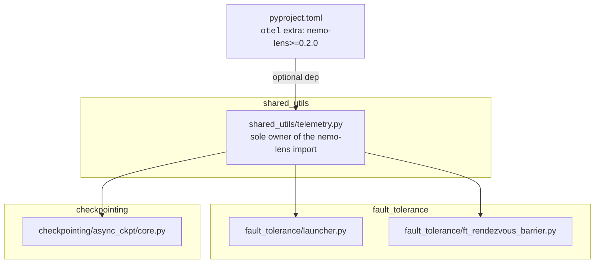
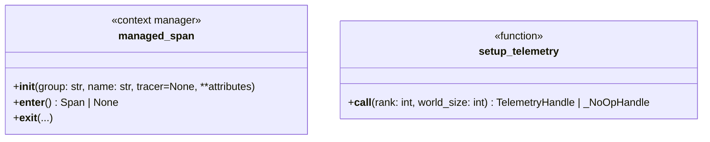
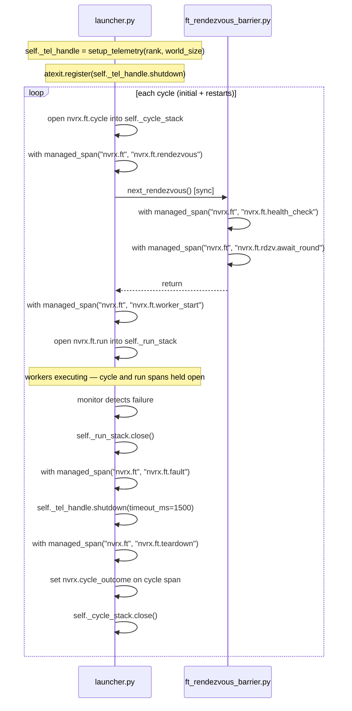
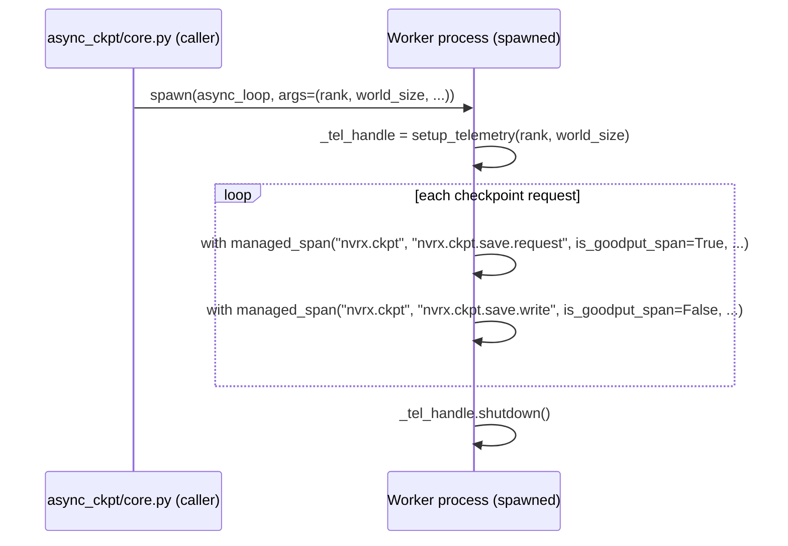

# nemo-lens Telemetry Integration

Optional [nemo-lens](https://pypi.org/project/nemo-lens/) OTel instrumentation for NVRx fault tolerance and async checkpointing. Telemetry is enabled and configured entirely through nemo-lens env vars (`NEMO_LENS_ENABLED`, `NEMO_LENS_SPAN_GROUPS`, etc.); NVRx adds no additional gates.

## Scope

1. **Fault tolerance restart cycle** — `fault_tolerance/launcher.py` and `fault_tolerance/ft_rendezvous_barrier.py`
2. **Async checkpoint worker** — `checkpointing/async_ckpt/core.py`

When nemo-lens is absent or disabled, all instrumentation is a silent no-op with no behavioral change.

## Module Structure



`fault_tolerance` and `checkpointing` have no knowledge of nemo-lens. The shim is the only file with a nemo-lens import.

## `shared_utils/telemetry.py`

### NVRxSpanGroup

nemo-lens's base `SpanGroup.resolve()` only recognises its built-in groups; `"nvrx.ft"` or `"nvrx.ckpt"` in `NEMO_LENS_SPAN_GROUPS` raises `ValueError` without a subclass. `NVRxSpanGroup` is passed to `NemoLensConfig.from_env(span_group_cls=NVRxSpanGroup)`.

```python
from nemo.lens import SpanGroup
from typing import ClassVar, Final

class NVRxSpanGroup(SpanGroup):
    FT   = "nvrx.ft"
    CKPT = "nvrx.ckpt"

    ALL_GROUPS: Final[frozenset] = SpanGroup.ALL_GROUPS | frozenset([FT, CKPT])
    _PRESETS: ClassVar[dict] = {
        **SpanGroup._PRESETS,
        "nvrx": frozenset([FT, CKPT]),
        "all": SpanGroup.ALL_GROUPS | frozenset([FT, CKPT]),
    }
```

### Lazy import and error containment

nemo-lens is imported lazily inside `setup_telemetry`. A broken or absent installation cannot prevent importing FT or checkpointing code.

`setup_telemetry` catches all exceptions and degrades to a no-op handle with a warning. `managed_span` suppresses all exceptions so live workloads are never disrupted by telemetry failures.

```python
import logging
from contextlib import contextmanager

logger = logging.getLogger(__name__)

_real_managed_span = None  # set by setup_telemetry


@contextmanager
def managed_span(group, name, tracer=None, **attributes):
    if _real_managed_span is None:
        yield None
        return
    try:
        with _real_managed_span(group, name, tracer=tracer, **attributes) as span:
            yield span
    except Exception:
        logger.debug("managed_span error suppressed", exc_info=True)
        yield None


class _NoOpHandle:
    def shutdown(self, timeout_ms: int = 5000): pass


def setup_telemetry(rank: int, world_size: int):
    global _real_managed_span
    try:
        from nemo.lens import NemoLensConfig, SpanGroup, managed_span as _ms
        from nemo.lens import setup_telemetry as _setup
        from typing import ClassVar, Final

        class NVRxSpanGroup(SpanGroup):
            FT   = "nvrx.ft"
            CKPT = "nvrx.ckpt"
            ALL_GROUPS: Final[frozenset] = SpanGroup.ALL_GROUPS | frozenset([FT, CKPT])
            _PRESETS: ClassVar[dict] = {
                **SpanGroup._PRESETS,
                "nvrx": frozenset([FT, CKPT]),
                "all": SpanGroup.ALL_GROUPS | frozenset([FT, CKPT]),
            }

        _real_managed_span = _ms
        return _setup(NemoLensConfig.from_env(span_group_cls=NVRxSpanGroup), rank, world_size)
    except Exception:
        logger.warning("nemo-lens telemetry setup failed, continuing without telemetry", exc_info=True)
        return _NoOpHandle()
```

`world_size` is required by the upstream `nemo.lens.setup_telemetry` API for OTel resource attributes. `NemoLensConfig` and `NVRxSpanGroup` are shim-internal; callers never see them.



## Fault Tolerance Span Lifecycle

The FT restart cycle runs synchronously on the launcher's main thread. OTel propagates span context implicitly via `contextvars`; child spans in `ft_rendezvous_barrier.py` nest automatically.

### Span structure per cycle

`nvrx.ft.cycle` covers every cycle end-to-end: initial startup, restart, success, and terminal failure. It opens at the start of `_rendezvous` (which is called for both initial and restart cycles via `_initialize_workers` and `_restart_workers`) and closes in the monitor loop once the outcome is known.

Long-lived spans (`cycle` and `run`) are held in `ExitStack` instances on the agent so they survive across monitor loop iterations.



### Shutdown and export reliability

nemo-lens PR #37 registers an `_OpenSpanCloser` span processor that forcibly ends any still-open spans in reverse order during `shutdown()`. This means spans left open when a process exits are exported rather than silently dropped.

`atexit` covers clean process exits. For failure scenarios where SIGKILL may follow:

- **Immediately after failure detection** (before `_stop_workers`): call `self._tel_handle.shutdown(timeout_ms=1500)`. This flushes and closes the open `run` and `cycle` spans before workers are killed.
- `atexit` remains as a backstop for all other exit paths.

The checkpoint worker calls `_tel_handle.shutdown()` in its `finally` block, which is sufficient since it exits cleanly.

## Span Attributes

All FT spans carry `nvrx.cycle`, `nvrx.node`, and `nvrx.rank` at open time. Additional attributes per span type:

| Attribute | Type | Spans | Notes |
|---|---|---|---|
| `nvrx.cycle` | int | all FT | restart cycle counter |
| `nvrx.node` | str | all FT | node hostname |
| `nvrx.rank` | int | all FT | group rank |
| `nvrx.membership` | str | `cycle`, `run` | `"active"` or `"standby"` |
| `nvrx.group_world_size` | int | `cycle` | number of active nodes |
| `nvrx.rdzv_run_id` | str | `cycle`, `rendezvous` | rendezvous run ID for cross-rank correlation |
| `nvrx.max_restarts` | int | `cycle` | configured restart budget |
| `nvrx.remaining_restarts` | int | `cycle` | set at close time |
| `nvrx.failures` | int | `cycle` | set at close time |
| `nvrx.cycle_outcome` | str | `cycle` | set at close time; see outcomes below |
| `nvrx.call_idx` | int | `nvrx.ckpt.save.request` | checkpoint call index for cross-rank join |
| `is_goodput_span` | bool | all | see below |

### Cycle outcomes

| Value | Condition |
|---|---|
| `succeeded` | `WorkerState.SUCCEEDED` — clean exit |
| `failed` | restart budget exhausted |
| `peer_restart` | healthy node joined a peer-triggered restart |
| `excluded` | node failed health check |
| `standby` | node entered standby (hot-spare) wait |
| `terminated` | job terminated by policy (attribution stop, no-progress, etc.) |

### `is_goodput_span`

| Span | `is_goodput_span` | Rationale |
|---|---|---|
| `nvrx.ft.cycle` | `True` | restart/recovery overhead |
| `nvrx.ft.rendezvous` | `True` | training blocked |
| `nvrx.ft.health_check` | `True` | training blocked |
| `nvrx.ft.rdzv.await_round` | `True` | training blocked |
| `nvrx.ft.worker_start` | `True` | training blocked |
| `nvrx.ft.run` | `False` | training is executing |
| `nvrx.ft.fault` | `True` | failure detection overhead |
| `nvrx.ft.teardown` | `True` | cleanup overhead |
| `nvrx.ckpt.save.request` | `True` | training blocks for D2H preload |
| `nvrx.ckpt.save.write` | `False` | write overlaps with training |

## Async Checkpoint Worker: Spawn Boundary

The persistent checkpoint worker is launched with `start_method="spawn"`. It inherits environment variables but no in-memory state, so it re-initializes telemetry at the top of `async_process_target`. `handle.shutdown()` is called in the `finally` block.

`rank` and `world_size` are passed as positional arguments to `async_loop` and `async_loop_for_daemon_worker`.

`warmup_persistent_caller` takes `world_size` as an optional keyword-only argument at the end of the signature, derived from `torch.distributed.get_world_size()` if omitted. This preserves compatibility with existing positional callers (Megatron-LM calls `warmup_persistent_caller(rank)`).



## Spans

| Span | Group | Source | `is_goodput_span` |
|---|---|---|---|
| `nvrx.ft.cycle` | `nvrx.ft` | `launcher.py` | `True` |
| `nvrx.ft.rendezvous` | `nvrx.ft` | `launcher.py` | `True` |
| `nvrx.ft.health_check` | `nvrx.ft` | `ft_rendezvous_barrier.py` | `True` |
| `nvrx.ft.rdzv.await_round` | `nvrx.ft` | `ft_rendezvous_barrier.py` | `True` |
| `nvrx.ft.worker_start` | `nvrx.ft` | `launcher.py` | `True` |
| `nvrx.ft.run` | `nvrx.ft` | `launcher.py` | `False` |
| `nvrx.ft.fault` | `nvrx.ft` | `launcher.py` | `True` |
| `nvrx.ft.teardown` | `nvrx.ft` | `launcher.py` | `True` |
| `nvrx.ckpt.save.request` | `nvrx.ckpt` | `async_ckpt/core.py` (worker) | `True` |
| `nvrx.ckpt.save.write` | `nvrx.ckpt` | `async_ckpt/core.py` (worker) | `False` |

## pyproject.toml

```toml
[tool.poetry.extras]
otel = ["nemo-lens"]

[tool.poetry.dependencies]
nemo-lens = {version = ">=0.2.0", extras = ["sdk"], optional = true}
```

`nemo-lens 0.2.0` is not yet on public PyPI (0.1.0 is the current release). The `otel` extra requires a private index or source install until 0.2.0 ships. The current nemo-lens source also requires Python ≥3.12; NVRx supports ≥3.10. Both must be resolved upstream before the extra is generally usable.

## Future: Cross-Thread Span Parenting

When an attribution poller thread is added, capture the OTel context before thread creation and attach it inside the thread:

```python
import opentelemetry.context as otel_ctx

ctx = otel_ctx.get_current()
def _attribution_poller():
    token = otel_ctx.attach(ctx)
    try:
        with managed_span("nvrx.ft", "nvrx.ft.attribution_poll"):
            ...
    finally:
        otel_ctx.detach(token)

threading.Thread(target=_attribution_poller, daemon=True).start()
```
