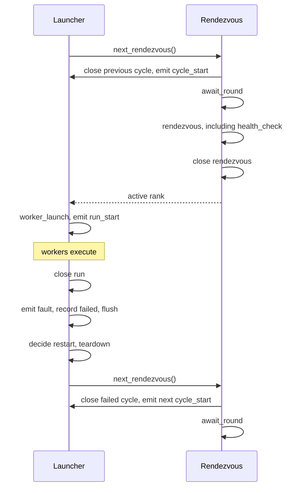

# NVRx Telemetry Contract

Optional [nemo-lens](https://github.com/nvidia-nemo/lens) instrumentation covers fault tolerance and async checkpointing. The `otel` extra supplies the dependencies. Lens is disabled by default. Enable it in NVRx-owned processes with `NEMO_LENS_ENABLED=1`; tracing and the span group must also be enabled.

## Rules

1. Do not change business APIs solely to carry telemetry data.
2. Keep spans within a function or `with` block where possible.
3. End spans when their operation ends. Use start anchors and backdated summaries for long phases.
4. Correlate processes through attributes, without passing span contexts over IPC. Preserve parent relationships within a process.
5. Missing telemetry packages or telemetry misconfiguration must not fail training.

## Adapter and groups

`shared_utils/telemetry.py` owns the Lens imports. Instrumented code calls this adapter without checking whether Lens is installed.

`span` and `trace_fn` cover blocks and functions. `Phase` emits a zero-duration `<name>_start` anchor at opening and a backdated `<name>` summary at closing. The anchor supplies the parent context; the summary is its child. Opening attributes go on both records; later updates affect only the summary. `Phase` must open and close on the same thread, in reverse nesting order.

Groups are registered at import so trainer instrumentation can use a provider initialized by the framework.

| Group              | Contents                                                |
| ------------------ | ------------------------------------------------------- |
| `nvrx.job`         | Process startup                                         |
| `nvrx.ft`          | Fault-tolerance operations                              |
| `nvrx.ckpt`        | Checkpoint scheduling, worker requests and finalization |
| `nvrx.ckpt.phases` | Checkpoint stages and completion synchronization        |

The `default` preset selects the first three groups. `per_step` and `profiling` select all four. Lens combines each library's registrations for the selected preset.

## Identity and attributes

Resource attributes describe a process and remain fixed after provider initialization. Span attributes describe an operation, including values that change within the process. Resource publication accepts scalar strings, booleans, integers and floats, encoded as strings in `OTEL_RESOURCE_ATTRIBUTES`. Span attributes also accept homogeneous arrays of those types.

| Process                      | `service.name`     | `service.instance.id` |
| ---------------------------- | ------------------ | --------------------- |
| Launcher agent               | `nvrx.ft_launcher` | `nvrx-agent-<node>`   |
| Persistent checkpoint worker | `nvrx.ckpt_worker` | `nvrx-ckpt<rank>`     |

These IDs can repeat across restarts. Job identity, such as `nv.dl.job.uuid`, comes from the launching environment or training framework. The launcher also records `nv.nvrx.ftl.node` on its Resource. The framework owns trainer identity.

### Worker resources

For each worker launch, the launcher extends the Resource environment captured when `telemetry.py` was imported. It overrides these keys without changing its own environment:

| Attribute                        | Value                                                               |
| -------------------------------- | ------------------------------------------------------------------- |
| `nv.nvrx.cycle.index`            | Rendezvous round at worker launch; fixed for that worker's lifetime |
| `nv.nvrx.ftl.membership`         | `active`                                                            |
| `nv.nvrx.ftl.infra.rank`         | Infrastructure rank, when known                                     |
| `nv.dl.launch.nnodes.active`     | Configured `min_nodes`                                              |
| `nv.dl.launch.nnodes.spare`      | Configured `max_nodes - min_nodes`                                  |
| `nv.nvrx.ftl.segment`            | Configured segment size, when segment awareness is enabled          |
| `nv.nvrx.ftl.infra.cluster_uuid` | Domain ID, when known and segment awareness is enabled              |

Infrastructure rank, segment and domain are also added to joined cycle summaries.

Persistent checkpoint workers inherit the trainer's current Resource environment at spawn. NVRx preserves existing values, supplies `nv.dl.rank` only if absent, and overrides `nv.dl.role` with `ckpt_worker` and `service.instance.id` with the value above. Scoped publication restores the parent's environment even if spawning fails. Publication scopes must not overlap across threads.

## Fault tolerance

### Lifecycle

Before each round wait, finish the previous cycle, then emit `cycle_start`. The cycle and `await_round` retain the counter values observed before the wait. Rendezvous and later operations take fresh snapshots:

- `nv.nvrx.ftl.rdzv.round`: observed rendezvous round.
- `nv.nvrx.ftl.profiling.cycle`: observed profiling counter.

The counters may disagree. NVRx records them as observed; it does not derive a common attempt index. Correlation across nodes uses these snapshots, timestamps, parent relationships and job/worker Resource identity. Spans describe the emitting node, without repeating the full membership roster.

Cycle children share the start anchor's trace and retain their nesting. The cycle summary is a child of that anchor and keeps its opening counter values. Joining adds membership, group rank/world size, placement and restart-budget attributes to the summary.

The run uses the same anchor/summary pattern. It starts after worker initialization and ends when completion, failure or restart handling begins. Cycle duration minus run duration includes waiting, initialization, restart decisions and teardown.

Local failure followed by a restart:

Successful completion closes run and cycle before the exit barrier. Standby, late-joiner and stale-round retries close their current cycle without starting workers.

Attribution spans run on the poller's daemon thread, without the launcher's parent context. Each root span covers polling for a pending request, including retries, until the request finishes or the poller exits. It records `nv.nvrx.ftl.node`; it does not record the analyzed cycle.

### Spans

Names below have the prefix `nv.nvrx.ftl.`.

| Suffix           | Group      | Covers                                                    |
| ---------------- | ---------- | --------------------------------------------------------- |
| `python.startup` | `nvrx.job` | Process creation to the launcher's import-start timestamp |
| `python.imports` | `nvrx.job` | The launcher's timed import block                         |
| `cycle_start`    | `nvrx.ft`  | Instant: cycle opened                                     |
| `cycle`          | `nvrx.ft`  | Cycle duration, emitted at close                          |
| `await_round`    | `nvrx.ft`  | Waiting for a round to open                               |
| `rendezvous`     | `nvrx.ft`  | Joining an open round                                     |
| `health_check`   | `nvrx.ft`  | Pre-join node health checks                               |
| `worker_launch`  | `nvrx.ft`  | `_start_workers`                                          |
| `run_start`      | `nvrx.ft`  | Instant: worker initialization completed                  |
| `run`            | `nvrx.ft`  | Run duration, emitted at close                            |
| `fault`          | `nvrx.ft`  | Instant: local worker failure detected                    |
| `teardown`       | `nvrx.ft`  | `_stop_workers`                                           |
| `attribution`    | `nvrx.ft`  | Pending-request polling                                   |

The fault mark records detection before the restart decision and teardown. The cycle summary carries `nv.nvrx.ftl.cycle.state` and `nv.nvrx.ftl.cycle.failures` on local failure; the fault mark also carries the failure count.

### Cycle outcomes

`nv.nvrx.cycle.outcome` is recorded on the cycle summary.

| Outcome        | Recorded when                                                         |
| -------------- | --------------------------------------------------------------------- |
| `completed`    | Workers succeed                                                       |
| `failed`       | Local worker failure or unhealthy state is detected                   |
| `peer_restart` | A healthy node follows a peer restart, or a stale-round join retries  |
| `excluded`     | The pre-join health check rejects the node                            |
| `standby`      | A standby/late joiner retries, or rendezvous closes                   |
| `terminated`   | The monitor observes attribution STOP or a peer's no-restart decision |

Final cleanup preserves any recorded outcome; otherwise it may be absent. A local no-progress stop preserves the preceding `failed` or `peer_restart` outcome.

## Checkpointing

Queue and worker spans are in `async_ckpt/core.py`; shared-memory staging spans are in `async_ckpt/filesystem_async.py`. Scheduling, finalization and completion synchronization cover both caller modes. Worker request/preload/write spans and the trainer's preload wait cover the persistent-caller path.

With the persistent caller, `FileSystemWriterAsync` stages CPU/GPU tensors in shared CPU buffers in the trainer when `cpu_shm_mode=True`. With this mode disabled, its preload callback performs required device-to-host copies in the worker.

Names below have the prefix `nv.nvrx.ckpt.save.`.

| Suffix            | Group              | Process               | Covers                                                                       |
| ----------------- | ------------------ | --------------------- | ---------------------------------------------------------------------------- |
| `schedule`        | `nvrx.ckpt`        | Trainer               | `schedule_async_call`, including worker startup and preload wait when needed |
| `stage_wait`      | `nvrx.ckpt.phases` | Trainer               | Waiting for persistent-worker preload                                        |
| `shm_drain`       | `nvrx.ckpt.phases` | Trainer, CPU-shm mode | Draining writes before reusing shared buffers                                |
| `stage`           | `nvrx.ckpt.phases` | Trainer, CPU-shm mode | Shared-buffer allocation and tensor copying                                  |
| `request`         | `nvrx.ckpt`        | Persistent worker     | Processing a dequeued request                                                |
| `preload`         | `nvrx.ckpt.phases` | Persistent worker     | Preload callback, including device-to-host copies in GPU-IPC mode            |
| `write`           | `nvrx.ckpt.phases` | Persistent worker     | Async write callback                                                         |
| `completion_sync` | `nvrx.ckpt.phases` | Trainer               | Distributed completion check                                                 |
| `finalize`        | `nvrx.ckpt`        | Trainer               | Finalize callbacks and optional rank synchronization                         |

The schedule, request and finalize spans carry the same queue-assigned `nv.nvrx.ckpt.call_idx`. Stage spans retain their parent relationships but do not automatically inherit this attribute. Ambient context determines trace boundaries.

The framework can record the index returned by `schedule_async_request` on its own spans using `CKPT_CALL_IDX` from `shared_utils/semconv.py`. Indices are local to a queue and restart with a new queue. Correlation therefore also needs job and worker-attempt context, including `nv.nvrx.cycle.index`.

## Initialization and shutdown

| Process                      | Setup owner/location                                         | Shutdown              |
| ---------------------------- | ------------------------------------------------------------ | --------------------- |
| Launcher agent               | NVRx, in `LocalElasticAgent.run()` before rendezvous         | That method's cleanup |
| Persistent checkpoint worker | NVRx, in `async_process_target()` before processing requests | That method's cleanup |
| Trainer                      | Training framework                                           | Training framework    |

Missing dependencies or import failures leave NVRx span instrumentation inert. Setup failure logs a warning and disables subsequent NVRx span creation in that process. Exceptions from instrumented application code propagate.

The checkpoint worker converts SIGTERM to `SystemExit`, allowing cleanup to run. NVRx waits up to two seconds for background telemetry shutdown. The launcher also flushes after recording a detected fault, before restart handling.

Shutdown and flush are best effort. Ending a span does not guarantee export; buffered anchors and child spans can be lost on exit. If a phase never closes, it has no duration summary.
