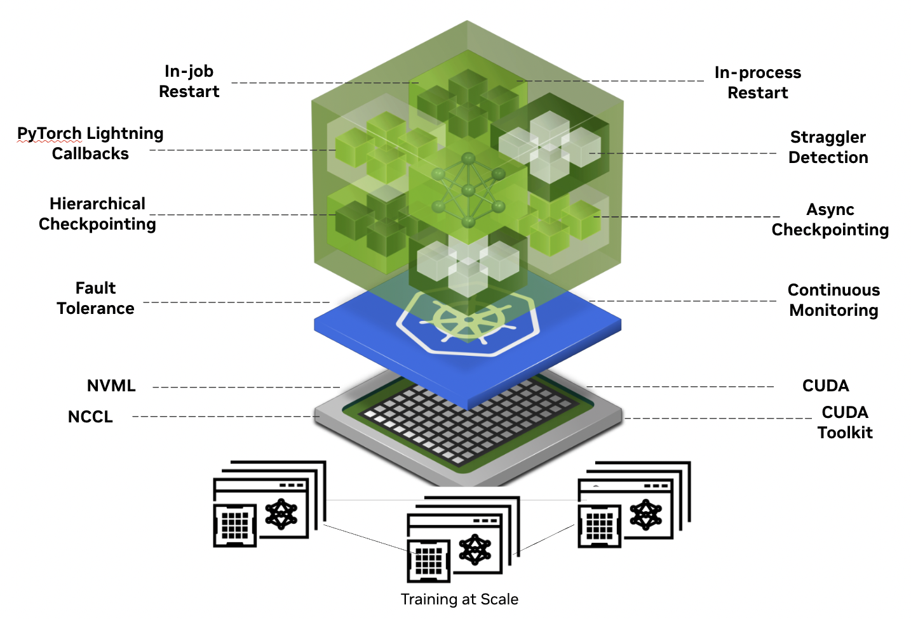

nvidia-resiliency-ext
=====================

**nvidia-resiliency-ext** is a set of tools developed by NVIDIA to improve large-scale distributed training resiliency.

Features
--------

* `Hang detection and automatic in-job restarting <https://github.com/NVIDIA/nvidia-resiliency-ext/blob/main/docs/source/fault_tolerance/index.rst>`_
* `In-process restarting <https://github.com/NVIDIA/nvidia-resiliency-ext/blob/main/docs/source/inprocess/index.rst>`_
* `Async checkpointing <https://github.com/NVIDIA/nvidia-resiliency-ext/blob/main/docs/source/checkpointing/async/index.rst>`_
* `Local checkpointing <https://github.com/NVIDIA/nvidia-resiliency-ext/blob/main/docs/source/checkpointing/local/index.rst>`_
* `Straggler (slower ranks) detection <https://github.com/NVIDIA/nvidia-resiliency-ext/blob/main/docs/source/straggler_det/index.rst>`_

.. toctree::
   :maxdepth: 3
   :caption: Documentation contents:

   fault_tolerance/index
   inprocess/index
   checkpointing/async/index
   checkpointing/local/index
   straggler_det/index
