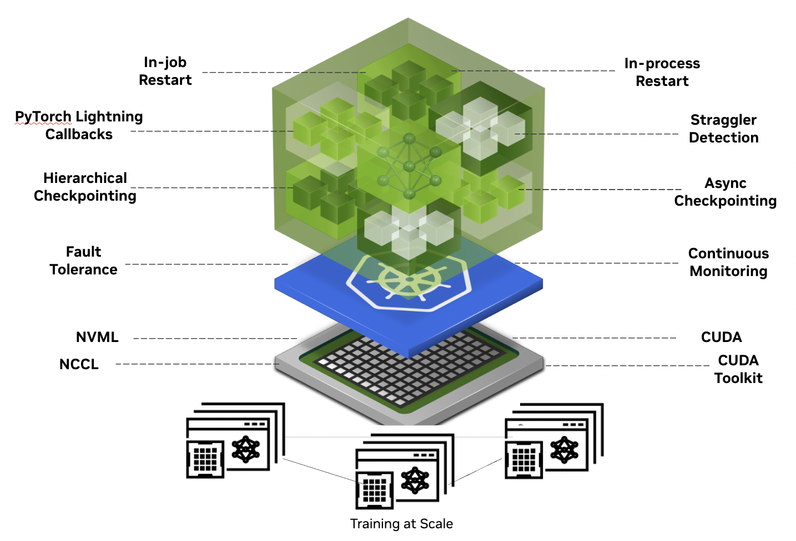

nvidia-resiliency-ext v0.4.0
=============================

**nvidia-resiliency-ext** is a set of tools developed by NVIDIA to improve large-scale distributed training resiliency.

Features
--------

* `Hang detection and automatic in-job restarting <fault_tolerance/index.html>`_
* `In-process restarting <inprocess/index.html>`_
* `Async checkpointing <checkpointing/async/index.html>`_
* `Local checkpointing <checkpointing/local/index.html>`_
* `Straggler (slower ranks) detection <straggler_det/index.html>`_

.. toctree::
   :maxdepth: 3
   :caption: Documentation contents:

   fault_tolerance/index
   inprocess/index
   checkpointing/async/index
   checkpointing/local/index
   straggler_det/index
