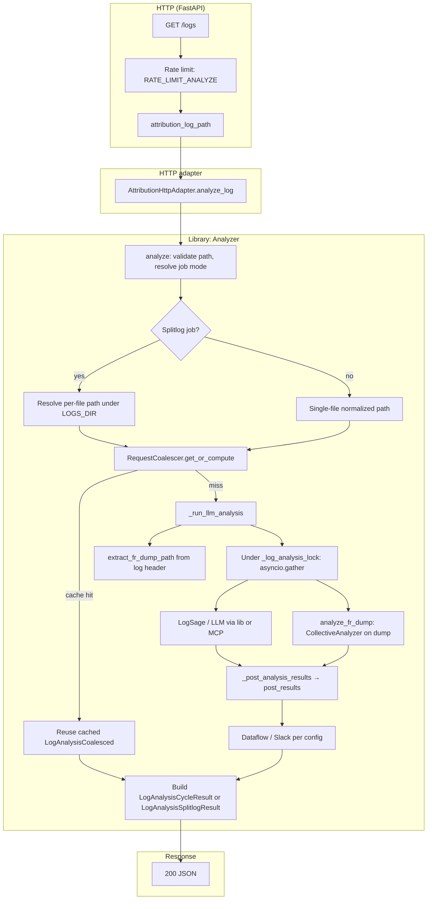

================================================================================
NVRX ATTRIBUTION SERVICE — TECHNICAL SPEC (HTTP & SERVICE CONTRACT)
================================================================================

This document defines **service-level behavior**: HTTP API, modes, configuration
surface, startup/shutdown, and pointers to the library. It intentionally avoids
duplicating **implementation detail** covered in code and in **ARCHITECTURE.md**.

TABLE OF CONTENTS
--------------------------------------------------------------------------------
  Scope & library reference
  1.  Overview (modes, terminology, deployment)
  2.  Project structure
  3.  Configuration
  4.  Startup / shutdown
  5.  Data shapes (JSON; no mirrored Python)
  6.  HTTP API
  7.  Error responses
  8.  Path validation
  9.  POST flow
  10. GET flow
  11. Background poll
  12–13. Library: LLM & markers (pointers)
  14–17. Splitlog (condensed)
  18. Cleanup
  19. Concurrency (pointer)
  20. `/stats` shape
  21. Dataflow & Slack (optional)
  22–25. Logging, dependencies, testing, deployment (pointers)
  Appendix A. Glossary

--------------------------------------------------------------------------------
LIBRARY REFERENCE (NOT HTTP — IMPLEMENTATION DETAIL)
--------------------------------------------------------------------------------

Authoritative documentation for **`nvidia_resiliency_ext.attribution`**:

    ../../src/nvidia_resiliency_ext/attribution/ARCHITECTURE.md

That document covers: package layout, `LogAnalyzerConfig` and `AnalysisPipelineMode`
(default `LOG_AND_TRACE` for typical deployments), MCP vs in-process LogSage,
LogSage result dicts, scheduler vs workload terminology, multi-cycle splitting,
caching, concurrency, and diagrams. **Prefer it** over restating library internals
here.

================================================================================
                                  FOUNDATION
================================================================================

1. OVERVIEW
--------------------------------------------------------------------------------

HTTP attribution service: **POST /logs** registers a job output path; **GET /logs**
returns analysis; a **background poll** handles pending jobs, splitlog discovery,
and cleanup.

**Operating modes**

| Mode      | When |
|-----------|------|
| PENDING   | File missing or too small — poll rechecks until ready or TTL |
| SINGLE    | No `job_id`, or no `LOGS_DIR` — analyze job output file directly |
| SPLITLOG  | `job_id` + `LOGS_DIR` found — analyze files under that directory |

**Terminology (sched vs workload restarts)**  
Scheduler restarts: `<< START PATHS >>` blocks in the job output; workload restarts:
`Cycle: N` markers inside log files. Full hierarchy and naming: **ARCHITECTURE.md §5**.

**Content splitting (Cycle chunks, single-chunk fallback)**  
**ARCHITECTURE.md §6**.

**Deployment**  
Single instance per cluster (no shared in-memory state across instances). Optional
processed-files ledger (`CACHE_FILE`) — see §3.7. **README.md** for runbooks.

================================================================================

2. PROJECT STRUCTURE
--------------------------------------------------------------------------------

Two layers: **library** (`nvidia_resiliency_ext.attribution`) and **service**
(`services/attrsvc/` — FastAPI, `Settings`, rate limits, `AttributionHttpAdapter`).

| Layer | See |
|-------|-----|
| Library layout, pipelines, types | **ARCHITECTURE.md**, `log_analyzer/types.py`, `log_analyzer/analysis_pipeline.py` |
| Service files, deploy scripts | **README.md** (`deploy/`, `app.py`, `service.py`, `config.py`) |

================================================================================

3. CONFIGURATION
--------------------------------------------------------------------------------

**3.1 Environment variables** — Full table and defaults: **README.md** (source of truth).

Summary:
- Prefix **`NVRX_ATTRSVC_`** for service settings (see README for exceptions: LLM
  API key, Slack tokens, optional `LLM_API_KEY_FILE` / file paths in `api_keys.py`).
- **`LLM_API_KEY`** / **`LLM_API_KEY_FILE`**: required for attribution (or default key files);
  validated by `AttributionController` at startup — **empty/missing → log error and startup failure**.
  Slack is optional.
- LLM-related env vars are optional; unset → library defaults (`LogAnalyzerConfig`).
- Rate limits: slowapi, `RATE_LIMIT_SUBMIT` / `RATE_LIMIT_ANALYZE` / `RATE_LIMIT_PREVIEW`.

**3.2 Constants** (library `log_analyzer/config.py` — single source)

| Kind | Examples |
|------|-----------|
| TTL | `TTL_PENDING_SECONDS`, `TTL_TERMINATED_SECONDS`, `TTL_MAX_JOB_AGE_SECONDS` |
| Intervals | `POLL_INTERVAL_SECONDS`, `DEFAULT_COMPUTE_TIMEOUT_SECONDS` |
| Limits | `MAX_JOBS`, `MIN_FILE_SIZE_KB` |
| Health thresholds | ~20% degraded, ~50% fail (compute / dataflow error rates in health) |

**3.3 Markers** (mode detection)

- `<< START PATHS >>`, `<< END PATHS >>`, `LOGS_DIR=...`

**3.4 Enums** (conceptual — exact definitions in code)

- `JobMode`: pending | single | splitlog  
- `ErrorCode`: invalid_path, outside_root, not_found, not_readable, not_regular,
  empty_file, logs_dir_not_readable, job_limit_reached, internal_error  
- `HealthStatus`: ok | degraded | fail  
- Success paths return `LogAnalysisCycleResult` / `LogAnalysisSplitlogResult`; failures return
  `LogAnalyzerError` at the library boundary.

**3.5 Error → HTTP** — See **§7**.

**3.6 Path-based `job_id` extraction** (GET-without-POST, best-effort)

Patterns tried in order (scheduler-agnostic where possible): `_(\d+)_date_`,
`job_(\d+)`, `slurm-(\d+)\.(out|err|log)`, etc. User: often `"unknown"`.

**3.7 Processed-files ledger (optional cache persistence)**

- Env: `NVRX_ATTRSVC_CACHE_FILE`, `NVRX_ATTRSVC_CACHE_GRACE_PERIOD_SECONDS` (see README).
- Purpose: avoid duplicate LLM/analysis work after restarts when clients resubmit.
- Behavior summary: grace period without `stat`; after grace, validate `(mtime, size)`;
  eviction of stale entries; import/export on startup/shutdown. **Full semantics:**
  `RequestCoalescer` / coalescing docs in **ARCHITECTURE.md** and library source.

================================================================================

4. STARTUP / SHUTDOWN
--------------------------------------------------------------------------------

**Startup (conceptual)**  
Load `Settings` → configure logging → construct `AttributionHttpAdapter` /
**`AttributionController`** / **`Analyzer`**. Controller startup validates the LLM
API key and wires postprocessing (poster, dataflow index, Slack) before analysis
begins. Then background poll → Uvicorn. Optional cache import.

**Shutdown**  
Drain HTTP → stop poll → export cache (if configured) → exit. Job map is not
persisted; ledger/cache persistence behavior is implementation-defined in the
coalescer (see library).

================================================================================

5. DATA SHAPES (JSON)
--------------------------------------------------------------------------------

Do **not** mirror Python dataclasses or Pydantic models here — they drift.

| Concept | Canonical location |
|---------|-------------------|
| `Job`, `FileInfo`, jobs dict | `log_analyzer/job.py` |
| `LogAnalysisCycleResult`, `LogAnalysisSplitlogResult`, `LogAnalyzerError` | `attribution/log_analyzer/types.py` |
| HTTP request/response models | `app.py` (FastAPI / Pydantic) |
| Per-file LLM result shape (`cycles`, …) | Produced by analyzer; **ARCHITECTURE.md §7–8** |

**Analysis result (per workload chunk)** — illustrative keys only:

```json
{
  "cycles": [{"cycle": 0, "analysis": {}}],
  "file_path": "/path/to/log",
  "analyzed_at": 1234567890.123
}
```

================================================================================
                               HTTP INTERFACE
================================================================================

6. HTTP API
--------------------------------------------------------------------------------

**Authentication:** None at the app layer — use network controls; rate limiting
mitigates abuse.

**Endpoints (quick reference)**

| Method | Path | Purpose |
|--------|------|---------|
| GET | /healthz | Health (`status`, `issues`); optional `?pretty=true` |
| GET | /stats | Counters + gauges (library + dataflow + slack) — **§20** |
| GET | /jobs | Paginated job dump (`mode`, `limit`, `offset`) |
| GET | /print | First 4KB preview (`log_path`) |
| GET | /inflight | In-flight analyses |
| POST | /logs | Register job (`log_path`, `user`, optional `job_id`) |
| GET | /logs | Analyze / return results (`log_path`, optional `file`, `wl_restart`, `all_files`) |

**GET /healthz**  
Uses cumulative compute stats (errors + timeouts vs total) and dataflow failure rate
when dataflow posting is active. Thresholds: ~20% → degraded, ~50% → fail (see service
implementation). Worst issue wins. MCP connectivity may add issues when backend is `mcp`.

**GET /stats**  
Merges `Analyzer.get_stats()` (coalescer, splitlog folder stats, detection,
deferred, permission errors, …) with **dataflow** counters and **Slack** stats.
**`dataflow`** holds `total_posts`, `total_successful`, `total_failed`.

**POST /logs** body

```json
{ "log_path": "/abs/path/to/job.out", "user": "owner", "job_id": "optional" }
```

Response: `{ "mode": "pending" | "single" | "splitlog" }`.

**GET /logs**  
Returns single-file or splitlog-shaped JSON; optional `file` selects a file in
splitlog mode; `wl_restart` selects a chunk; `all_files` returns completed files.
Exact fields match library serializers — see **`types.py`** and OpenAPI **`/docs`**.
Responses include a normalized `recommendation` object:
`{ "action": "STOP" | "RESTART" | "CONTINUE" | "UNKNOWN" | "TIMEOUT", "reason": str,
"source": str }`. Clients should branch on `recommendation.action`; raw backend
output remains under `result` for debugging and backward compatibility.

**6.1 GET /logs — processing flow (implementation)**



Notes: Coalescer key is the normalized log file path. `ANALYSIS_BACKEND` (`NVRX_ATTRSVC_ANALYSIS_BACKEND`) defaults to
`mcp` (set `lib` for in-process LogSage and FR); legacy `NVRX_ATTRSVC_LOG_ANALYSIS_BACKEND` is accepted. See **ARCHITECTURE.md §7**. Splitlog: with `file=`, key is the per-file path.

**curl / examples** — **README.md** (avoid duplicating here).

================================================================================

7. ERROR RESPONSES
--------------------------------------------------------------------------------

| Condition | HTTP | Code |
|-----------|------|------|
| Path not absolute | 400 | INVALID_PATH |
| Outside allowed root | 403 | OUTSIDE_ROOT |
| File not found | 404 | NOT_FOUND |
| Not readable | 403 | NOT_READABLE |
| Not a regular file | 400 | NOT_REGULAR |
| Empty file (GET) | 400 | EMPTY_FILE |
| LOGS_DIR not readable | 403 | LOGS_DIR_NOT_READABLE |
| Job limit | 503 | JOB_LIMIT_REACHED |
| Internal | 500 | INTERNAL_ERROR |

Analysis failures surface as `LogAnalyzerError` with appropriate codes. Invalid `file=`
→ NOT_FOUND. Empty file allowed on POST (pending); rejected on GET.

================================================================================
                             VALIDATION & FLOWS
================================================================================

8. PATH VALIDATION
--------------------------------------------------------------------------------

1. Absolute path.  
2. `os.path.realpath` (symlinks, `..`).  
3. Resolved path must be under `ALLOWED_ROOT` (`commonpath` check).  
4. Client path string remains the job key; operations use resolved path.

Edge cases: symlinks crossing root → 403; broken symlink → 404; non-regular → 400.
Small/empty file: POST → pending; GET empty → EMPTY_FILE.

9. POST FLOW
--------------------------------------------------------------------------------

Validate path → classify mode (markers, `job_id`, `LOGS_DIR` readability) → register
or update job → return mode. **Sequence detail:** library **`Analyzer`** + **§6.1**
diagram.

10. GET FLOW
--------------------------------------------------------------------------------

Validate → locate job → trigger analysis via coalescer (single-flight) → serialize
result. Coalescing: concurrent GETs on same key share one compute — **ARCHITECTURE.md**
(coalescing section).

11. BACKGROUND POLL
--------------------------------------------------------------------------------

Periodic: pending promotion, splitlog file discovery, cleanup, stuck in-flight
handling. Interval: `POLL_INTERVAL_SECONDS`. **Detail:** library splitlog tracker +
coalescer.

================================================================================
                         LIBRARY TOPICS (POINTERS ONLY)
================================================================================

12. LLM ANALYSIS  
Availability, retries, timeouts, MCP vs lib — **ARCHITECTURE.md §7–9**, `LogAnalyzerConfig`,
`RequestCoalescer.compute_timeout`.

13. LOG FILE MARKER PARSING  
Algorithms and edge cases — **ARCHITECTURE.md** and `log_analyzer` / splitlog modules.

================================================================================
                            SPLITLOG (CONDENSED)
================================================================================

14–17. **Activation:** `job_id` + `LOGS_DIR` readable. **Tracker:** discovers files,
sorts (cycle / timestamp / mtime per implementation), triggers analysis, coordinates
with poll thread. **GET:** `file` / `wl_restart` / `all_files` query params.  
**Full behavior:** **ARCHITECTURE.md**, `splitlog_tracker`, `attribution/analyzer/engine.py` (`Analyzer`).

================================================================================

18. CLEANUP
--------------------------------------------------------------------------------

TTL-based removal of pending, terminated, abandoned jobs; coalescer eviction rules.
Constants in **§3.2**.

================================================================================

19. CONCURRENCY
--------------------------------------------------------------------------------

Thread/async model, locks, poll thread vs asyncio, `_in_flight` futures — **ARCHITECTURE.md**
and inline comments in **`Analyzer`** / `RequestCoalescer`. Do not duplicate here.

================================================================================

20. `/stats` SHAPE
--------------------------------------------------------------------------------

`GET /stats` aggregates:

- **Library** (`Analyzer.get_stats`): coalescer stats (hits/misses, compute,
  submissions, …), splitlog folder stats under the `splitlog` key, `detection`,
  `deferred`, `permission_errors`, poll gauges, etc. — **exact keys per implementation**.
- **Controller/adapter** (`AttributionController.get_stats`, exposed by
  `AttributionHttpAdapter.get_stats`): adds **`dataflow`** (ES/dataflow post
  attempts) and **`slack`** (attempts, successes, failures, user lookup stats when enabled).

Refer to live **`GET /stats`** response or OpenAPI for the current JSON shape.

================================================================================

21. DATAFLOW & SLACK (OPTIONAL)
--------------------------------------------------------------------------------

Postprocessing posts results when `DATAFLOW_INDEX` / cluster env configured; Slack
when `SLACK_BOT_TOKEN` set or token fallback files are present. Wiring:
`Settings` → `AttributionControllerConfig` → `AttributionController`. Record build:
`build_dataflow_record`; backend: `postprocessing/post_backend.py`. Retry behavior in
implementation.

================================================================================
                         OPERATIONS & DEVELOPMENT (POINTERS)
================================================================================

22. LOGGING  
Structured text default; levels per `LOG_LEVEL` (`DEBUG` / `INFO` / `WARNING`). No duplicated template table.

23. DEPENDENCIES  
The root package owns service entry points and extras in **pyproject.toml**.

24. TESTING  
Layout and strategies are not normative for the HTTP contract; see repo **`tests/`**
and CI. Mock LLM, use `tmp_path` for files.

25. DEPLOYMENT  
Docker / Kubernetes / scripts: **`deploy/`** and **README.md** (resource hints,
graceful degradation at a high level).

================================================================================
                                   APPENDIX
================================================================================

A. GLOSSARY (SHORT)

| Term | Meaning |
|------|---------|
| Attribution | Root-cause analysis of job logs via LLM (+ optional FR) |
| Coalescing | Single-flight compute per cache key; shared result for waiters |
| job output file | Slurm stdout or equivalent — primary tracking key (`log_path`) |
| Mode | pending / single / splitlog |
| Splitlog | Separate `LOGS_DIR` per job; multiple per-scheduler log files |
| Scheduler restart | New allocation segment (`<< START PATHS >>`) |
| Workload restart | `Cycle: N` within a file |
| Terminated | Job received a successful GET; subject to TTL cleanup |

================================================================================

*End of specification.*
