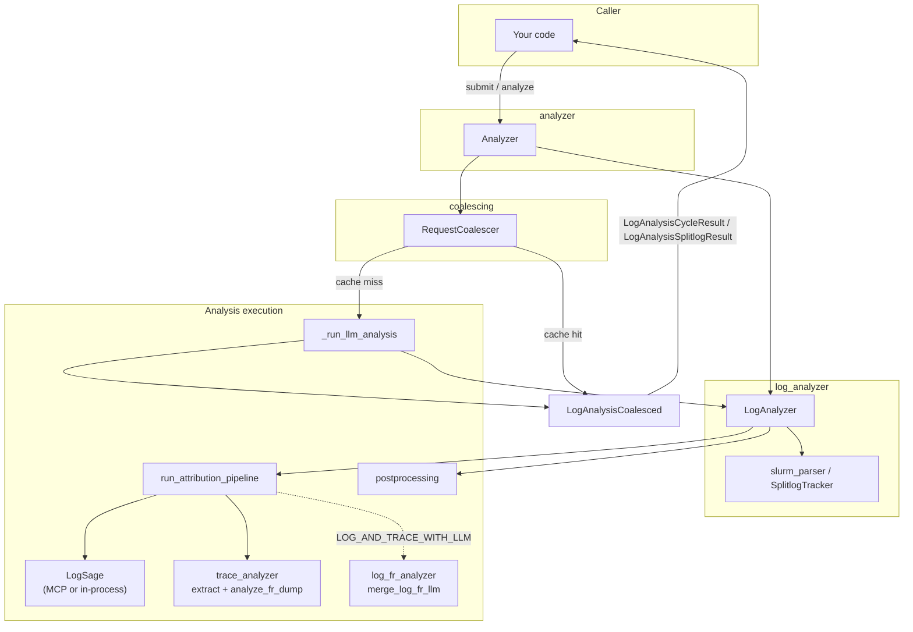
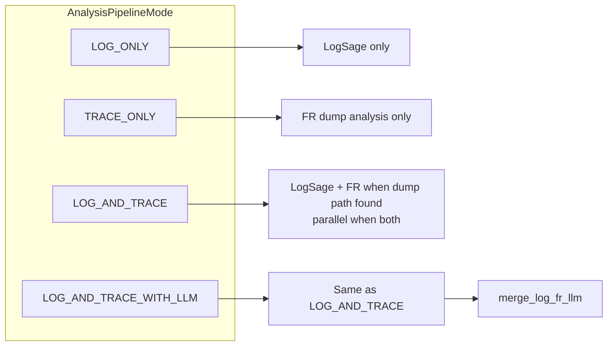
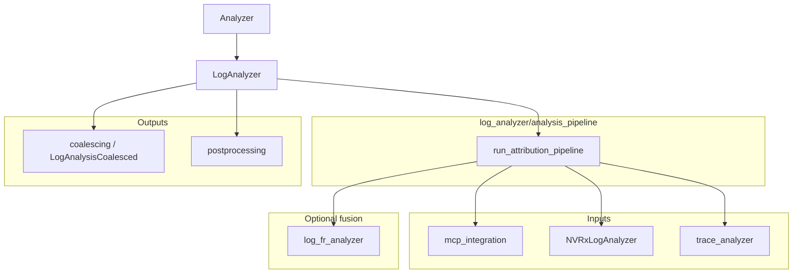
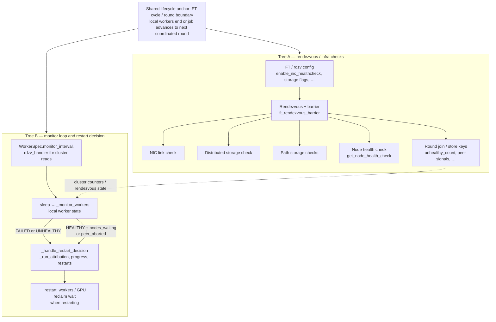

# Attribution library architecture

This document describes how `nvidia_resiliency_ext.attribution` is structured and how its pieces fit together.

---

## 1. Scope

The package is **library-only**: no HTTP server. The usual entry point is **`Analyzer`** (`analyzer/engine.py`): request coalescing, `submit` / `analyze`, and delegation to **`LogAnalyzer`**. You can also embed **`LogAnalyzer`** directly if you do not need the coalescer. Path validation, job tracking, LLM calls, and optional posting hooks are expressed as Python APIs.

---

## 2. Diagrams

### 2.1 End-to-end flow

How a typical `analyze` path moves through the library (cache miss shown).



### 2.2 Pipeline modes

`LogAnalyzer.analysis_pipeline_mode` (on the **`LogAnalyzer`** instance) selects what `run_attribution_pipeline` runs.



### 2.3 Major modules (dependency view)



### 2.4 Fault tolerance: rendezvous health checks vs monitor / `_handle_restart_decision`

When analyzing **FT launcher** logs, it helps to keep two **separate control-flow trees** in mind. They share configuration (for example `rdzv_configs` / barrier flags) and can influence each other only indirectly (for example cluster counters visible to the launcher, or workers exiting after a rendezvous failure). They are **not** a single pipeline like “run all health checks, then call `_handle_restart_decision`.”

**What they share:** both are anchored to the same **fault-tolerance cycle / round** model. A **workload cycle** ends when local worker processes exit or the job moves to the next coordinated round; **Tree A** runs (or re-runs) as nodes **enter or advance rendezvous** for that next step—so health checks often appear in logs **around cycle boundaries** when the stack is re-syncing. **Tree B** is a **continuous** monitor loop, but **`_handle_restart_decision`** is reached when that loop observes a **post-cycle** local outcome (**FAILED** / **UNHEALTHY** after workers stop) or **HEALTHY** workers reacting to **cluster signals** that also stem from other nodes finishing or aborting a cycle. Same “turn of the crank” in the job; different code paths implementing different responsibilities.

- **Rendezvous / barrier tree** (`fault_tolerance/ft_rendezvous_barrier.py`): optional **NIC**, **distributed storage**, **path storage**, and **node health** checks run in the rendezvous / round-join path. Outcomes affect whether nodes participate in rounds, `unhealthy_count`, early termination, and related store keys.
- **Launcher monitor tree** (`fault_tolerance/launcher.py`): `time.sleep(monitor_interval)` → **`_monitor_workers`** (local worker / subprocess state via `PContext.wait`, not those rendezvous checks) → on **FAILED / UNHEALTHY** or on **HEALTHY** with **`num_nodes_waiting` / `peer_aborted_count`**, **`_handle_restart_decision`**. That path runs **`_run_attribution()`** (this package’s LogSage flow), progress checks, restart budget, then optionally **`_open_rendezvous_for_restart`** and **`_restart_workers`** (which may wait for **GPU memory reclaim** after a restart—not the same as NIC/storage checks above).



---

## 3. Major subsystems

| Area | Responsibility |
|------|------------------|
| **`analyzer/`** | **`Analyzer`** (`engine.py`): path policy, `RequestCoalescer`, `submit` / `analyze`, splitlog branches; delegates heavy lifting to **`LogAnalyzer`**. Re-exports pipeline symbols from `log_analyzer.analysis_pipeline` for convenience. |
| **`log_analyzer/`** | **`LogAnalyzer`**, `Job` / `FileInfo`, SLURM parsing, splitlog polling, LogSage (`NVRxLogAnalyzer`), **`run_attribution_pipeline`** / **`AnalysisPipelineMode`** (`analysis_pipeline.py`), `LogAnalyzerConfig` and result dataclasses (`types.py`), path validation, wire keys (`RESP_*`) |
| **`coalescing/`** | `RequestCoalescer`: dedupe concurrent analysis for the same path; cache entries as `LogAnalysisCoalesced` (LogSage dict + optional FR fields + optional LLM merge summary) |
| **`trace_analyzer/`** | Flight-recorder dump discovery/analysis (`extract_fr_dump_path`, `analyze_fr_dump`, `CollectiveAnalyzer`, etc.) |
| **`combined_log_fr/`** | **log + FR LLM fusion** (`CombinedLogFR`); MCP tool **`log_fr_analyzer`**; shared `merge_log_fr_llm()` for `LOG_AND_TRACE_WITH_LLM` |
| **`postprocessing/`** | Build records, optional Elasticsearch post, Slack; `post_analysis_items` / `post_results` after analysis |
| **`mcp_integration/`** | Subprocess MCP client/server so LogSage can run isolated from the caller (see `mcp_integration/README.md`) |

---

## 4. Analysis pipeline (conceptual)

1. **Submit / classify** (`Analyzer.submit` → `LogAnalyzer.submit`): validate path under `allowed_root`, parse job output for `LOGS_DIR` and modes (`PENDING` → `SINGLE` / `SPLITLOG`).
2. **Analyze** (`Analyzer.analyze`): resolve job mode, file + optional `wl_restart`; on cache hit return from `RequestCoalescer`; on miss call **`_run_llm_analysis`** → **`LogAnalyzer.run_attribution_for_path`**.
3. **`run_attribution_for_path`** loads log text via **MCP** or **in-process** LogSage (`LogSageExecutionConfig.use_lib_log_analysis`), then runs **`run_attribution_pipeline`**:
   - **`LogAnalyzer.analysis_pipeline_mode`** selects log-only, trace-only, log+trace, or log+trace+LLM merge. The default **`Analyzer`** constructs **`LogAnalyzer`** with **`LOG_AND_TRACE`**; override by passing a custom **`log_analyzer`** (or embed **`LogAnalyzer`** directly).
4. **Validate** LogSage-shaped dict (unless trace-only); **post** per-cycle items through `postprocessing.post_analysis_items` (and FR-only path when there are no cycles but FR data exists).
5. **Return** `LogAnalysisCoalesced` to the coalescer; callers receive `LogAnalysisCycleResult` / `LogAnalysisSplitlogResult`.

---

## 5. Terminology: scheduler vs workload restarts

These concepts drive `Job`, `FileInfo`, and HTTP query parameters such as `wl_restart`.

| Concept | Meaning | How it appears |
|--------|---------|----------------|
| **Scheduler restart** (`sched_restart`) | External orchestrator (SLURM, Kubernetes, …) re-runs the job | `<< START PATHS >>` in the job output file; new file in `LOGS_DIR` in splitlog setups |
| **Workload restart** (`wl_restart`) | Framework restarts *inside* the same allocation | `Cycle: N` in log content, or `_cycleN` in filenames |

Hierarchy (conceptual): **Job** → scheduler-restart blocks → within each, one or more **workload** cycles in the same file or across files.

Implementation details: `log_analyzer/job.py`, `splitlog.py`, `slurm_parser.py`.

---

## 6. Content splitting (multi-cycle files)

For logs with multiple workload cycles in one file, analysis uses chunking (e.g. `chunk_logs_strict` in `log_analyzer`) guided by **`Cycle: N`** markers (pattern such as `profiling.py:.*Cycle: N`):

1. Find all cycle markers in the file.
2. Take lines from `Cycle: N` to `Cycle: N+1` (or EOF).
3. Analyze each chunk; combine results in the output.

If no markers are found, the whole file is treated as a single cycle.

---

## 7. Configuration: `Analyzer` ctor vs `LogAnalyzerConfig` vs `LogSageExecutionConfig`

Do **not** conflate the bundled type **`LogAnalyzerConfig`** (`log_analyzer/types.py`) with the **`Analyzer`** constructor. They overlap conceptually but are wired differently.

### 7.1 `Analyzer` (`analyzer/engine.py`)

Constructed with **keyword and positional arguments**, not `config=...`:

- **`allowed_root`** (required): absolute path prefix for validation.
- **`use_lib_log_analysis`** (default `False`): lib vs MCP when **`log_sage`** is omitted; ignored when **`log_sage`** is provided (then use `log_sage.use_lib_log_analysis`).
- **`log_sage`** (optional): a **`LogSageExecutionConfig`** (`log_analyzer/config.py`) — LLM knobs, MCP log level, lib/MCP switch. If omitted, defaults are built from **`use_lib_log_analysis`** only.
- **`compute_timeout`**, **`grace_period_seconds`**: passed into **`RequestCoalescer`** when you do not inject a custom **`coalescer`**.
- Optional DI: **`coalescer`**, **`log_analyzer`**, **`trace_analyzer`**.

The default **`Analyzer`** builds a **`LogAnalyzer`** with **`analysis_pipeline_mode=LOG_AND_TRACE`**. To use another mode, supply your own **`log_analyzer`** constructed with the desired **`analysis_pipeline_mode`**.

**Example** mapping from a **`LogAnalyzerConfig`** instance `cfg` (same file as the dataclass):

```python
Analyzer(
    allowed_root=cfg.allowed_root,
    log_sage=cfg.log_sage_execution(),
    compute_timeout=...,
    grace_period_seconds=...,
)
```

`cfg.analysis_pipeline_mode` is **not** applied unless you build **`LogAnalyzer(..., analysis_pipeline_mode=cfg.analysis_pipeline_mode)`** and pass it as **`log_analyzer=`**.

### 7.2 `LogAnalyzerConfig` (`log_analyzer/types.py`)

A **documentation / aggregation** dataclass: `allowed_root`, LLM defaults, `use_lib_log_analysis`, **`analysis_pipeline_mode`**. Its **`log_sage_execution()`** method returns **`LogSageExecutionConfig`** for **`LogAnalyzer`** / **`Analyzer(log_sage=...)`**. It is **not** passed wholesale into **`Analyzer`**.

### 7.3 `LogSageExecutionConfig` (`log_analyzer/config.py`)

The subset that **`LogSageRunner`** / **`LogAnalyzer`** actually consume for LogSage and MCP: **`use_lib_log_analysis`**, **`mcp_server_log_level`**, **`llm_model`**, **`llm_base_url`**, **`llm_temperature`**, **`llm_top_p`**, **`llm_max_tokens`**.

### 7.4 LogSage backends

**MCP (Model Context Protocol):** stdio subprocess to the MCP server in `mcp_integration/`; the client calls the `log_analyzer` tool with `log_path` and LLM parameters. No separate network server for MCP itself. Details: `mcp_integration/README.md`.

**In-process:** same LogSage logic without a subprocess; `LogAnalyzer` holds the analyzer under a lock.

---

## 8. LogSage output shape and parsing

**Parsing structured text:** `log_analyzer.llm_output.parse_llm_response` → `ParsedLLMResponse` (`auto_resume`, `auto_resume_explanation`, `attribution_text`, `checkpoint_saved_flag`). Expected LLM layout includes a first-line decision, explanation, `Attribution:` section, and checkpoint flag.

**Typical success dict** from the log analyzer module (MCP or lib), simplified:

```text
{
  "module": "log_analyzer",
  "state": "complete" | "CONTINUE" | "STOP" | ...   # see live code for exact strings
  "result": [ ["<raw_llm_text>", ...metadata...], ... ]   # per cycle
}
```

**Timeout / error** may set `"state": "timeout"` or `"error"` with `"result": []` and an `"error"` message.

Exact state strings and HTTP semantics for clients are specified in the **service** document; the library returns these dicts to `LogAnalyzer` and postprocessing.

---

## 9. File size and concurrent writes

- No hard max file size in the library; very large files are read fully into memory for analysis (context window still limits effective LLM input).
- **While writer is active:** reads are single snapshot; UTF-8 with `errors='ignore'`; optional minimum size checks (`MIN_FILE_SIZE_KB` in `log_analyzer/config.py`).
- Splitlog timing (analyze after next file appears, etc.) interacts with **service** polling; the library reads whatever path it is given.

---

## 10. Caching and concurrency

- **Request coalescing**: One in-flight compute per cache key (file path); concurrent waiters share the same `asyncio` future.
- **Result cache**: `RequestCoalescer` stores `LogAnalysisCoalesced` with optional file `mtime`/`size` validation after a configurable grace period; optional persistence when the coalescer is configured with a cache file path.
- **`_log_analysis_lock`**: Serializes LogSage execution per process when using the lib or MCP path to avoid overlapping LLM calls on shared client state.

**Retries:** No automatic retry of failed LLM calls inside the library; failed/cached outcomes are a **service** concern for TTL and re-submission (see attrsvc spec).

---

## 11. Directory layout (current)

```
attribution/
├── ARCHITECTURE.md          ← this file
├── README.md
├── analyzer/
│   ├── engine.py            # Analyzer (coalescing, submit/analyze, delegates to LogAnalyzer)
│   └── __init__.py          # re-exports pipeline + result types for convenience
├── api_keys.py
├── base.py
├── combined_log_fr/         # CombinedLogFR + merge_log_fr_llm
├── coalescing/              # RequestCoalescer, LogAnalysisCoalesced, coalesced_cache
├── log_analyzer/            # LogAnalyzer, analysis_pipeline, job, splitlog, slurm_parser, nvrx_logsage, types, …
├── mcp_integration/         # MCP client/server (see mcp_integration/README.md)
├── postprocessing/          # Dataflow record, poster, Slack
├── trace_analyzer/          # FR dumps, collective analysis
└── straggler/               # Profiling utilities; separate from LogAnalyzer attribution
```

---

## 12. Further reading

| Document | Content |
|----------|---------|
| `mcp_integration/README.md` | MCP transport and server layout |
